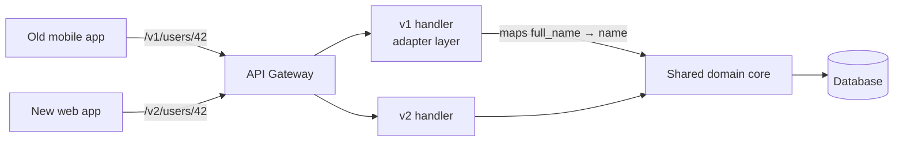

# 2026-07-10 — API Versioning Strategies

> Evolve your API without breaking existing clients — choose a versioning scheme before you need it, because retrofitting one is a breaking change itself.

## Problem

You need to rename `user.name` to `user.full_name` in an API response. Mobile apps in the field parse `name` — they can't be force-updated. Shipping the change breaks thousands of installed clients; not shipping it means the debt compounds with every new field.

Versioning is not about the URL — it's about a contract lifecycle: how you introduce, run in parallel, and retire incompatible behavior.

## Constraints

- **Compatibility:** Old clients keep working for 12+ months after a new version ships
- **Cost:** Supporting N versions must not mean N codebases
- **Discoverability:** Clients must know which version they're using and when it sunsets
- **Additive by default:** Most changes should not need a new version at all

## Architecture



Diagram source: [`diagrams/2026-07-10-api-versioning-strategies.mmd`](../diagrams/2026-07-10-api-versioning-strategies.mmd)

### Versioning schemes

| Scheme | Example | Pros | Cons |
|--------|---------|------|------|
| **URL path** | `/v2/users` | Visible, cacheable, easy routing | Version applies to whole API, not one resource |
| **Header** | `Accept: application/vnd.api+json;version=2` | Clean URLs; per-request granularity | Invisible in logs/browsers; harder to test manually |
| **Query param** | `/users?version=2` | Easy to test | Pollutes cache keys; easy to omit |
| **Date-based** | `Stripe-Version: 2026-07-01` | Granular; pin-on-first-use | Requires version transformation pipeline |

URL path versioning wins for public APIs on simplicity. Stripe's date-based scheme is the gold standard for high-change APIs but requires serious tooling.

### Breaking vs non-breaking changes

**Non-breaking (no new version needed):**
- Adding a response field
- Adding an optional request parameter
- Adding a new endpoint
- Relaxing validation

**Breaking (version required):**
- Removing or renaming a field
- Changing a field's type or format
- Making an optional parameter required
- Changing error response structure or status codes

Rule: clients must follow the **tolerant reader** pattern — ignore unknown fields — so additive changes stay safe.

### One codebase, N versions — the adapter approach

```typescript
// Domain core returns the current shape
interface User { id: string; fullName: string; }

// v1 adapter maps current shape to legacy contract
function toV1(user: User) {
  return { id: user.id, name: user.fullName };
}

function toV2(user: User) {
  return { id: user.id, full_name: user.fullName };
}

// Controller picks the adapter by version
@Get(['v1/users/:id', 'v2/users/:id'])
async getUser(@Param('id') id: string, @Req() req) {
  const user = await this.users.findById(id);
  return req.path.startsWith('/v1') ? toV1(user) : toV2(user);
}
```

Business logic lives once in the core. Versions are thin serialization adapters at the edge — this is what keeps N versions from becoming N codebases.

### Deprecation lifecycle

```
1. Announce   — changelog, email, Deprecation + Sunset response headers
2. Dual-run   — v1 and v2 both live; dashboards track v1 usage by client
3. Nudge      — warnings in responses; contact remaining v1 consumers
4. Brownout   — v1 returns 410 for 1 hour windows to flush unknown clients
5. Sunset     — v1 removed; 410 Gone with migration link
```

```http
HTTP/1.1 200 OK
Deprecation: true
Sunset: Sat, 31 Jan 2027 23:59:59 GMT
Link: <https://api.example.com/docs/migrate-v2>; rel="deprecation"
```

## Trade-offs

| Choice | Pros | Cons |
|--------|------|------|
| **Version everything** (`/v1` prefix) | One clear contract per era | Big-bang migrations for clients |
| **Version per resource** | Granular evolution | Version matrix complexity |
| **Never version, only add** | Simplest ops | Fields you can never remove; naming debt accumulates |
| **Date-pinned (Stripe)** | Clients migrate on their schedule | Transformation chain maintenance |

## When to use

- ✅ URL path versioning for public REST APIs — boring and predictable wins
- ✅ Additive-only evolution inside a version — most changes never need v2
- ✅ Sunset headers and usage dashboards before removing anything

- ❌ Don't create v2 for additive changes — tolerant readers make them free
- ❌ Don't fork the codebase per version — use serialization adapters over a shared core
- ❌ Don't remove a version without usage metrics proving it's dead

## References

- [Stripe — API versioning](https://stripe.com/blog/api-versioning)
- [RFC 8594 — Sunset HTTP header](https://www.rfc-editor.org/rfc/rfc8594)
- [Microsoft REST API Guidelines — versioning](https://github.com/microsoft/api-guidelines/blob/vNext/Guidelines.md#12-versioning)

---

**Tags:** `#api-design` `#versioning` `#rest` `#backwards-compatibility` `#deprecation`
