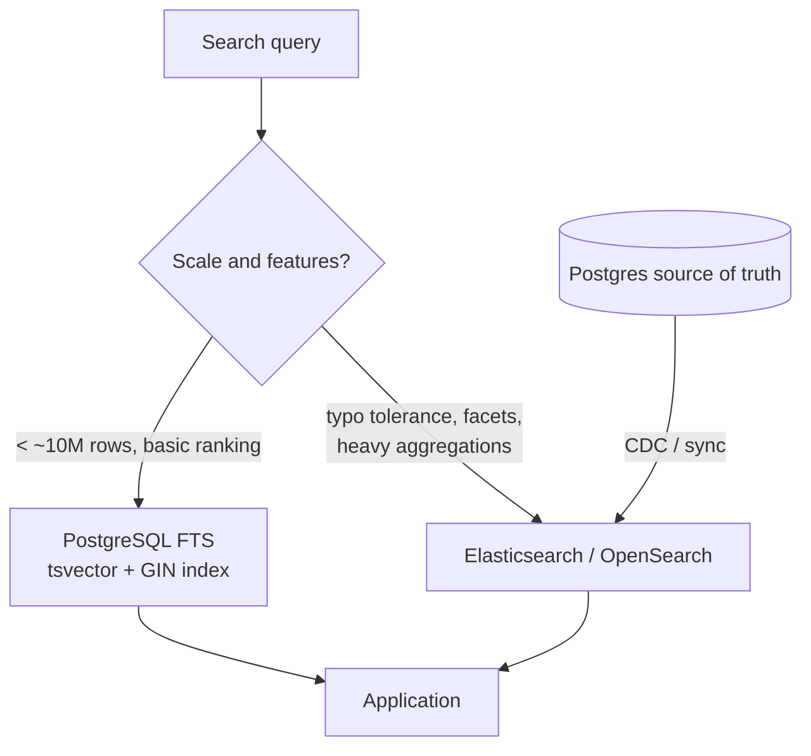

# 2026-07-11 — Full-Text Search: PostgreSQL vs Elasticsearch

> Most products don't need Elasticsearch on day one — Postgres full-text search handles millions of rows. Know where the crossover point actually is.

## Problem

Users need to search products by name and description with typo tolerance and ranked results. The team's first instinct is "add Elasticsearch" — which means a new cluster, a sync pipeline, consistency drift, and an on-call surface, all before validating that search even matters to users.

Meanwhile, `WHERE description ILIKE '%wireles%'` returns nothing (typo), scans the whole table, and can't rank.

## Constraints

- **Scale:** 2M products today; 20M in two years
- **Latency:** Search p99 < 200ms
- **Features:** Prefix matching, ranking, typo tolerance eventually
- **Ops budget:** Small team — every new stateful system costs real attention

## Architecture



Diagram source: [`diagrams/2026-07-11-full-text-search-postgres-elasticsearch.mmd`](../diagrams/2026-07-11-full-text-search-postgres-elasticsearch.mmd)

### PostgreSQL FTS — the 80% solution

```sql
-- Generated column + GIN index; stays in sync automatically
ALTER TABLE products ADD COLUMN search_vector tsvector
  GENERATED ALWAYS AS (
    setweight(to_tsvector('english', coalesce(name, '')), 'A') ||
    setweight(to_tsvector('english', coalesce(description, '')), 'B')
  ) STORED;

CREATE INDEX idx_products_search ON products USING GIN (search_vector);

-- Ranked search
SELECT id, name, ts_rank(search_vector, query) AS rank
FROM products, websearch_to_tsquery('english', 'wireless headphones') query
WHERE search_vector @@ query
ORDER BY rank DESC
LIMIT 20;
```

`websearch_to_tsquery` accepts Google-style input (`"exact phrase" -excluded`). `setweight` ranks name matches above description matches.

### Typo tolerance in Postgres — pg_trgm

```sql
CREATE EXTENSION pg_trgm;
CREATE INDEX idx_products_name_trgm ON products USING GIN (name gin_trgm_ops);

-- 'wireles' finds 'wireless'
SELECT name, similarity(name, 'wireles') AS sml
FROM products
WHERE name % 'wireles'
ORDER BY sml DESC LIMIT 10;
```

Trigram similarity covers fuzzy matching and `LIKE '%term%'` acceleration — the two things people think they need Elasticsearch for.

### Feature comparison

| | PostgreSQL FTS | Elasticsearch |
|--|---------------|---------------|
| **Stemming, stop words** | ✅ Built-in per language | ✅ Richer analyzers |
| **Ranking** | ✅ `ts_rank` | ✅ BM25 (better relevance) |
| **Typo tolerance** | ⚠️ pg_trgm (decent) | ✅ Native fuzziness |
| **Faceted search / aggregations** | ⚠️ GROUP BY (slow at scale) | ✅ First-class, fast |
| **Autocomplete** | ⚠️ Prefix + trigram | ✅ Completion suggesters |
| **Synonyms** | ⚠️ Manual thesaurus config | ✅ Managed synonym sets |
| **Consistency with source data** | ✅ Same transaction | ❌ Sync pipeline + drift |
| **Extra infra** | ✅ None | ❌ Cluster + sync + monitoring |
| **Scale ceiling** | ~10M docs comfortably | Billions |

### The crossover checklist

Move to Elasticsearch when at least two are true:

- Search queries measurably degrade past p99 targets despite GIN indexes
- Product needs facets/aggregations on search results (filters with live counts)
- Relevance tuning matters commercially (e-commerce conversion)
- Corpus is heading past ~10M documents or multi-language analysis

### If you do adopt Elasticsearch

Sync via CDC (Debezium → Kafka → ES sink), never dual-write from the app. Treat the index as disposable — rebuildable from Postgres at any time. Alias indexes (`products_v3` behind alias `products`) so reindexing is a zero-downtime alias swap.

## Trade-offs

| Choice | Pros | Cons |
|--------|------|------|
| **Postgres FTS** | Zero infra, transactional consistency, one system | Relevance and facets hit limits at scale |
| **Elasticsearch** | Best-in-class search features | Sync pipeline, drift, cluster ops, JVM tuning |
| **Managed search** (Algolia, Typesense Cloud) | Great DX, instant results | Cost at volume; data leaves your infra |

## When to use

- ✅ Start with Postgres FTS + pg_trgm for any product under ~10M searchable rows
- ✅ Elasticsearch when facets, aggregations, or revenue-critical relevance arrive
- ✅ CDC-based sync and aliased indexes if you graduate

- ❌ Don't add Elasticsearch before users have validated that search matters
- ❌ Don't dual-write to Postgres and Elasticsearch from application code
- ❌ Don't use `ILIKE '%term%'` without pg_trgm — it's a sequential scan every time

## References

- [PostgreSQL — Full Text Search docs](https://www.postgresql.org/docs/current/textsearch.html)
- [PostgreSQL — pg_trgm](https://www.postgresql.org/docs/current/pgtrgm.html)
- [Elasticsearch — Index aliases](https://www.elastic.co/guide/en/elasticsearch/reference/current/aliases.html)

---

**Tags:** `#search` `#postgresql` `#elasticsearch` `#full-text-search` `#architecture-decisions`
