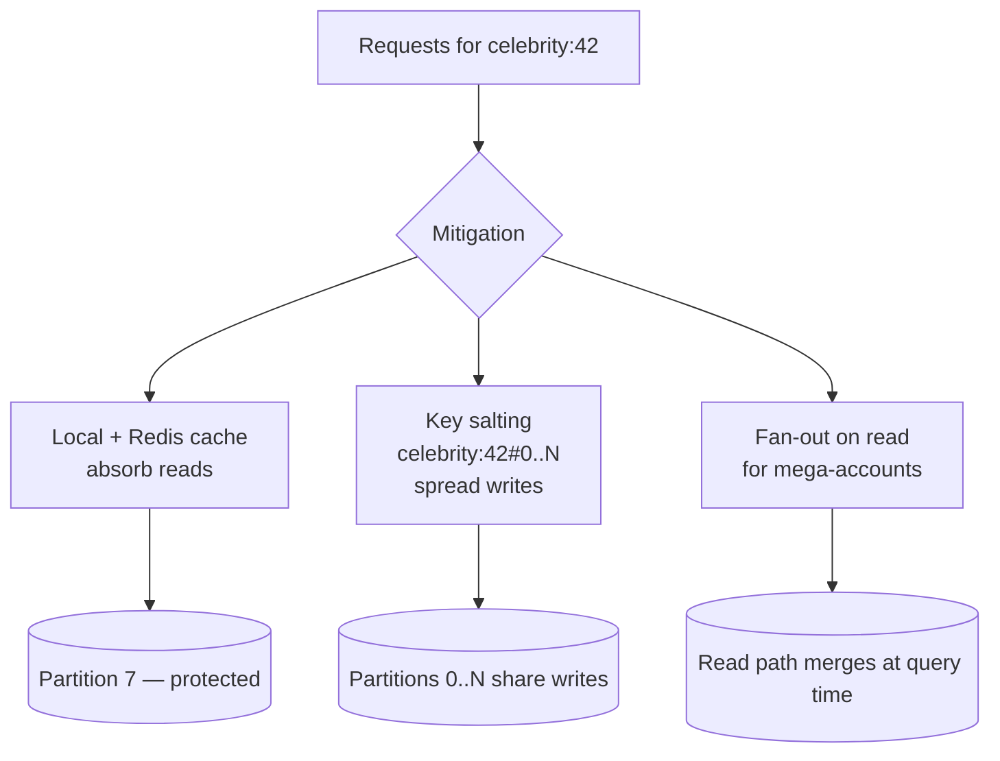

# 2026-07-12 — Hot Partitions and the Celebrity Problem

> Sharding spreads load evenly only if keys are accessed evenly — one viral user or hot tenant can melt a single partition while the rest of the cluster idles.

## Problem

A social platform shards by `user_id`. Load is beautifully even — until a celebrity with 80M followers posts:

- Every follower fetch hits **one partition** holding that user's data
- Kafka: all events for that user land on **one partition** → one consumer lags hours behind
- DynamoDB: the hot key exceeds per-partition throughput → throttling errors for everyone sharing that partition

Uniform key distribution ≠ uniform access distribution. Real-world traffic is Zipfian: a tiny fraction of keys receive most of the traffic.

## Constraints

- **Scale:** 99.9% of keys fit normal capacity; top 0.1% spike 1000×
- **Latency:** Hot-key reads must stay < 50ms p99 during spikes
- **Correctness:** Counters and feeds must not lose updates while mitigating
- **Detection:** Hot keys must be identified in minutes, not postmortems

## Architecture



Diagram source: [`diagrams/2026-07-12-hot-partitions-celebrity-problem.mmd`](../diagrams/2026-07-12-hot-partitions-celebrity-problem.mmd)

### Mitigation toolbox

| Technique | How it works | Cost |
|-----------|-------------|------|
| **Cache the hot key** | Reads never reach the partition; local cache + Redis | Staleness window |
| **Key salting** | Split `key` into `key#0..key#9`; writes spread across N sub-keys | Reads must aggregate N sub-keys |
| **Fan-out on read** | Don't precompute celebrity feeds; merge at read time | Higher read latency for followers |
| **Dedicated capacity** | Isolate hot tenants on their own shard/table | Operational overhead; still a ceiling |
| **Request coalescing** | Collapse concurrent identical reads (singleflight) | Only helps reads |

### Key salting for write-heavy counters

```typescript
const SALT_BUCKETS = 10;

// Write: spread increments across salted sub-keys
async function incrementLikes(postId: string) {
  const salt = Math.floor(Math.random() * SALT_BUCKETS);
  await redis.incr(`likes:${postId}#${salt}`);
}

// Read: aggregate all sub-keys
async function getLikes(postId: string): Promise<number> {
  const keys = Array.from({ length: SALT_BUCKETS }, (_, i) => `likes:${postId}#${i}`);
  const counts = await redis.mget(...keys);
  return counts.reduce((sum, c) => sum + Number(c ?? 0), 0);
}
```

Write throughput multiplies by the bucket count; reads pay one `MGET`. Only salt keys that are actually hot — salting everything makes every read N× more expensive.

### The hybrid feed approach (what Twitter/X actually does)

```
Normal user posts   → fan-out on write: push post ID to each
                      follower's precomputed timeline (fast reads)

Celebrity posts     → fan-out on read: followers' timelines merge
                      "celebrity posts since last read" at query time

Threshold           → accounts above ~100k followers switch strategies
```

One strategy can't serve both: fan-out on write for a celebrity means 80M timeline writes per post; fan-out on read for everyone makes every timeline query expensive.

### Detecting hot keys

- **Redis:** `redis-cli --hotkeys` (LFU policy), or sample `MONITOR` in bursts
- **Kafka:** per-partition consumer lag divergence — one partition lagging while siblings are current
- **DynamoDB:** CloudWatch `ThrottledRequests` + Contributor Insights per-key traffic
- **App-level:** sampled counter of top-K keys (count-min sketch) exported to metrics

## Trade-offs

| Choice | Pros | Cons |
|--------|------|------|
| **Salting** | Direct fix for write hotness | Read aggregation; must pick N upfront |
| **Caching** | Cheap, immediate for reads | Doesn't help writes; invalidation |
| **Hybrid fan-out** | Optimal per account class | Two code paths to maintain |
| **Re-sharding** | Fixes skewed key ranges | Doesn't fix a single hot key at all |

The critical insight: **re-sharding cannot fix a single hot key.** A hotter hash function still maps `celebrity:42` to exactly one partition. You must change the access pattern (cache, salt, fan-out) — not the partition count.

## When to use

- ✅ Salting for write-hot counters (likes, views, rate-limit buckets)
- ✅ Cache + coalescing for read-hot keys (viral content, hot tenant config)
- ✅ Hybrid fan-out when follower/subscriber distributions are heavy-tailed

- ❌ Don't shard by a key with known whales (tenant ID in B2B) without an isolation plan
- ❌ Don't salt preemptively everywhere — it taxes every read for keys that never get hot
- ❌ Don't assume even key distribution means even load — measure access, not cardinality

## References

- [DynamoDB — Choosing the right partition key](https://aws.amazon.com/blogs/database/choosing-the-right-dynamodb-partition-key/)
- [Twitter — Timelines at scale (InfoQ)](https://www.infoq.com/presentations/Twitter-Timeline-Scalability/)
- [Designing Data-Intensive Applications — Ch. 6, skewed workloads](https://dataintensive.net/)

---

**Tags:** `#sharding` `#hot-partition` `#scaling` `#kafka` `#dynamodb` `#caching`
