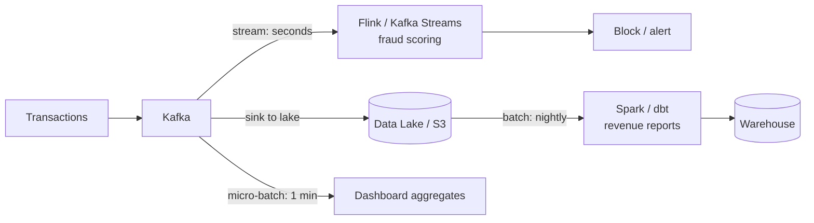

# 2026-07-13 — Batch vs Stream Processing

> Process data in scheduled bulk jobs or as an unbounded flow of events — the choice sets your latency floor, cost profile, and failure semantics.

## Problem

Finance needs daily revenue reports. Fraud detection needs to block a stolen card **within seconds** of the first suspicious transaction. The dashboard team wants "near real-time" order counts.

One team builds everything as nightly Spark jobs — fraud alerts arrive 12 hours late. Another builds everything on Kafka Streams — the finance report requires reprocessing three weeks of events to fix one bug, and nobody can reconcile numbers with the ledger.

Batch and streaming are different tools with different guarantees, not old vs new.

## Constraints

- **Fraud path:** Decision latency < 2 seconds from transaction event
- **Finance path:** Exact, auditable, reproducible numbers — recomputable from source
- **Dashboards:** Freshness of ~1 minute is fine; approximations acceptable
- **Cost:** Streaming infra runs 24/7; batch pays only during the job window

## Architecture



Diagram source: [`diagrams/2026-07-13-batch-vs-stream-processing.mmd`](../diagrams/2026-07-13-batch-vs-stream-processing.mmd)

### Comparison

| | Batch | Streaming |
|--|-------|-----------|
| **Data model** | Bounded dataset (a day, a table) | Unbounded event flow |
| **Latency** | Minutes to hours | Milliseconds to seconds |
| **Throughput efficiency** | High — columnar scans, bulk I/O | Lower per-record overhead cost |
| **Correctness model** | Recompute from scratch; deterministic | Incremental state; watermarks for late data |
| **Failure recovery** | Re-run the job | Checkpoint/restore operator state |
| **Cost profile** | Pay per job window | Always-on cluster |
| **Reprocessing (bugfix)** | Trivial — re-run over source | Replay from log; state migration pain |
| **Typical tools** | Spark, dbt, BigQuery, Airflow | Flink, Kafka Streams, Kinesis |

### The hard part of streaming: time

Events arrive out of order. A transaction at 11:59:58 might reach the processor at 12:00:05 — after the 12:00 window closed.

```
Event time    — when it happened (in the payload)
Processing time — when the processor saw it

Watermark     — "I believe all events up to time T have arrived"
                windows close when the watermark passes their end

Late events   — arrive after the watermark; route to a side
                output or update the window result (allowed lateness)
```

Batch avoids all of this: by the time the nightly job runs, yesterday's data is complete. This is *the* reason batch results are easier to trust for finance.

### Windowed aggregation (Flink-style)

```java
transactions
  .keyBy(tx -> tx.getCardId())
  .window(SlidingEventTimeWindows.of(Time.minutes(5), Time.seconds(30)))
  .aggregate(new TxCountAndSum())
  .filter(agg -> agg.count > 10 || agg.sum > 5_000)
  .addSink(fraudAlertSink);
```

Per-card sliding window: more than 10 transactions or $5k within 5 minutes fires an alert — impossible in batch, where the fraud has hours of head start.

### Micro-batch — the pragmatic middle

Spark Structured Streaming and most dashboard pipelines run tiny batches every 30–60 seconds. You keep batch's simple semantics (each micro-batch is bounded and re-runnable) at near-real-time freshness. It's the right default for dashboards and most "real-time-ish" asks.

### Lambda vs Kappa

| Architecture | Idea | Catch |
|--------------|------|-------|
| **Lambda** | Stream for speed + batch for truth; merge at query | Two pipelines, two codebases, reconciliation |
| **Kappa** | One streaming pipeline; reprocess = replay the log | Replaying years of events is slow; state migrations |

Modern practice: keep the event log (Kafka → lake), stream what needs low latency, batch what needs auditability — without pretending it's one framework.

## Trade-offs

| Choice | Pros | Cons |
|--------|------|------|
| **Batch** | Simple, cheap, reproducible, easy to debug | Latency floor = schedule interval |
| **Streaming** | Seconds-level reactions; incremental cost per event | State, watermarks, exactly-once complexity |
| **Micro-batch** | Batch semantics at ~minute freshness | Not sub-second; still a scheduler |

## When to use

- ✅ **Streaming** when the business value decays in seconds: fraud, alerting, live pricing
- ✅ **Batch** for financial reporting, ML training sets, backfills, anything audited
- ✅ **Micro-batch** for dashboards and freshness targets of about a minute

- ❌ Don't build streaming infra because "real-time" sounds better — ask what decision changes with sub-minute data
- ❌ Don't run finance-grade numbers off incremental stream state — recompute from source
- ❌ Don't ignore late events — a watermark strategy is mandatory, not optional

## References

- [Streaming 101 — Tyler Akidau](https://www.oreilly.com/radar/the-world-beyond-batch-streaming-101/)
- [Apache Flink — Event time and watermarks](https://nightlies.apache.org/flink/flink-docs-stable/docs/concepts/time/)
- [Questioning the Lambda Architecture — Jay Kreps](https://www.oreilly.com/radar/questioning-the-lambda-architecture/)

---

**Tags:** `#streaming` `#batch` `#kafka` `#flink` `#data-engineering` `#architecture-decisions`
