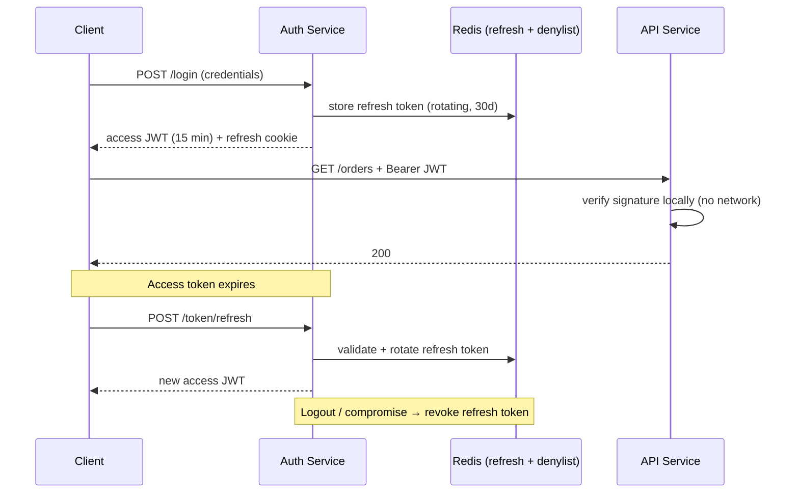

# 2026-07-14 — JWT vs Server-Side Sessions

> Stateless tokens scale reads but can't be revoked; server sessions revoke instantly but need shared state — most production systems end up with a hybrid.

## Problem

An admin discovers a compromised account and clicks "log out everywhere." With server-side sessions: delete the session rows, done — attacker is out in milliseconds. With pure JWTs: the stolen token remains valid until it expires, and there is **nothing you can do** short of rotating the signing key and logging out every user on the platform.

Meanwhile, the sessions team has its own pain: every request from 50 pods hits Redis to load the session, and cross-service auth means every microservice needs session-store access.

## Constraints

- **Scale:** 100k RPS across 12 services; auth check must add < 5ms
- **Revocation:** Compromised credentials cut off within seconds
- **Cross-service:** Services verify identity without calling a central store per request
- **Token size:** Cookies/headers stay small; no PII in client-readable tokens

## Architecture



Diagram source: [`diagrams/2026-07-14-jwt-vs-sessions.mmd`](../diagrams/2026-07-14-jwt-vs-sessions.mmd)

### Comparison

| | Server-side sessions | JWT (stateless) |
|--|---------------------|-----------------|
| **Auth check** | Store lookup per request | Local signature verification |
| **Revocation** | ✅ Instant — delete the session | ❌ Valid until expiry |
| **Cross-service** | All services need store access | Any service with the public key |
| **Horizontal scale** | Shared store is a dependency | Nothing shared |
| **Payload** | Server-side, any size | Client-carried, keep tiny |
| **Logout everywhere** | ✅ Trivial | ❌ Requires denylist or key rotation |
| **Typical size** | Cookie: ~32-byte ID | 300–1000+ bytes per request |

### The hybrid that most systems converge on

**Short-lived access JWT (5–15 min) + server-tracked refresh token.**

- API services verify the JWT locally — no store lookup, scales to any RPS
- Revocation happens at the refresh boundary — a compromised account is locked out within the access-token lifetime
- "Log out everywhere" = delete the user's refresh tokens

```typescript
// NestJS guard — local verification, zero network calls
@Injectable()
export class JwtGuard implements CanActivate {
  canActivate(ctx: ExecutionContext): boolean {
    const req = ctx.switchToHttp().getRequest();
    const token = req.headers.authorization?.replace('Bearer ', '');
    // RS256: verify with public key; auth service holds the private key
    req.user = jwt.verify(token, PUBLIC_KEY, { algorithms: ['RS256'] });
    return true;
  }
}
```

```typescript
// Refresh with rotation — reuse detection catches stolen refresh tokens
async function refresh(oldToken: string) {
  const record = await redis.get(`refresh:${hash(oldToken)}`);
  if (!record) {
    // Token already rotated — possible theft; kill the whole family
    await revokeAllUserSessions(decode(oldToken).sub);
    throw new UnauthorizedException();
  }
  await redis.del(`refresh:${hash(oldToken)}`);
  return issueNewPair(record.userId);
}
```

### JWT hygiene rules

| Rule | Why |
|------|-----|
| **RS256/EdDSA over HS256** in microservices | Services get the public key only; one leaked service can't mint tokens |
| **Always validate `alg`, `iss`, `aud`, `exp`** | `alg: none` and cross-audience replay are classic attacks |
| **Keep claims minimal** (`sub`, `role`, `exp`) | Tokens travel on every request; no PII, no permissions lists |
| **httpOnly + Secure + SameSite cookies** for browsers | localStorage is readable by any XSS payload |
| **Key rotation via JWKS with `kid`** | Rotate signing keys without a global logout |

### When sessions alone are still right

A single monolith (or a couple of services) behind one load balancer, with Redis already in the stack: session lookups add ~1ms, revocation is free, and there is no token plumbing. Don't add JWT machinery to an architecture that doesn't need statelessness.

## Trade-offs

| Choice | Pros | Cons |
|--------|------|------|
| **Pure sessions** | Instant revocation; simple; small cookie | Store lookup per request; store is a scaling dependency |
| **Pure JWT (long-lived)** | No shared state at all | Effectively unrevocable — don't do this |
| **Hybrid (short JWT + refresh)** | Local verification + bounded revocation window | Two token flows to implement correctly |
| **JWT + denylist** | Revocation for JWTs | Reintroduces the store lookup JWT was avoiding |

## When to use

- ✅ **Hybrid** for microservices, mobile apps, and anything multi-service
- ✅ **Sessions** for monoliths and server-rendered apps with Redis handy
- ✅ Refresh rotation with reuse detection — it converts token theft into detection

- ❌ Don't issue JWTs valid for days — the revocation gap is the whole risk
- ❌ Don't store tokens in localStorage — httpOnly cookies for browser clients
- ❌ Don't put roles/permissions snapshots in long-lived tokens — they go stale and become privilege-escalation bugs

## References

- [RFC 9700 — Best Current Practice for OAuth 2.0 Security](https://www.rfc-editor.org/rfc/rfc9700)
- [OWASP — JWT Cheat Sheet](https://cheatsheetseries.owasp.org/cheatsheets/JSON_Web_Token_for_Java_Cheat_Sheet.html)
- [Auth0 — Refresh token rotation](https://auth0.com/docs/secure/tokens/refresh-tokens/refresh-token-rotation)

---

**Tags:** `#authentication` `#jwt` `#sessions` `#security` `#microservices` `#api-design`
