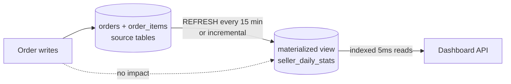

# 2026-07-15 — Materialized Views

> Precompute expensive aggregations into a stored, indexable result — turn a 30-second analytics query into a 5ms index lookup, at the price of staleness.

## Problem

The seller dashboard runs this on every page load:

```sql
SELECT seller_id, date_trunc('day', created_at) AS day,
       count(*) AS orders, sum(total) AS revenue
FROM orders
JOIN order_items USING (order_id)
WHERE created_at > now() - interval '90 days'
GROUP BY 1, 2;
```

At 50M orders it takes 20–30 seconds, holds memory for hash aggregates, and runs **thousands of times a day producing identical results**. Caching in Redis helps, but the query still has to run to warm the cache, and invalidation is guesswork.

## Constraints

- **Read latency:** Dashboard p99 < 100ms
- **Freshness:** Sellers tolerate data up to ~15 minutes old
- **Write path:** Order inserts must not slow down — no triggers on the hot path
- **Consistency:** Numbers must be internally consistent (one snapshot, not mixed)

## Architecture



Diagram source: [`diagrams/2026-07-15-materialized-views.mmd`](../diagrams/2026-07-15-materialized-views.mmd)

### PostgreSQL basics

```sql
CREATE MATERIALIZED VIEW seller_daily_stats AS
SELECT seller_id, date_trunc('day', created_at) AS day,
       count(*) AS orders, sum(total) AS revenue
FROM orders JOIN order_items USING (order_id)
GROUP BY 1, 2;

-- Unlike a regular view, this is a real table — index it
CREATE UNIQUE INDEX ON seller_daily_stats (seller_id, day);

-- Refresh without blocking readers (requires the unique index)
REFRESH MATERIALIZED VIEW CONCURRENTLY seller_daily_stats;
```

A regular view re-runs the query on every read. A materialized view stores the result — reads are plain indexed table scans.

`CONCURRENTLY` matters: without it, `REFRESH` takes an exclusive lock and every dashboard read blocks for the duration of the recompute. With it, Postgres diffs the new result against the old under a weaker lock — readers never wait.

### Scheduling refreshes

```sql
-- pg_cron inside the database
SELECT cron.schedule('refresh-seller-stats', '*/15 * * * *',
  'REFRESH MATERIALIZED VIEW CONCURRENTLY seller_daily_stats');
```

Or trigger from the app/scheduler after meaningful events (end of a batch import) rather than on a timer.

### The full-recompute problem and incremental alternatives

`REFRESH` recomputes the **entire view** even if one row changed. At 50M source rows every 15 minutes, that's a lot of repeated work. Options, in order of increasing machinery:

| Approach | How | Freshness |
|----------|-----|-----------|
| **Full refresh + pg_cron** | Built-in, dead simple | Minutes; fine for most dashboards |
| **Summary table + upsert** | App/trigger increments aggregates on write | Seconds; you own the correctness |
| **pg_ivm extension** | Incremental view maintenance in Postgres | Near-real-time; extension dependency |
| **Streaming materialization** (Materialize, Flink, ksqlDB) | CDC feeds incremental compute | Sub-second; whole new system |

The summary-table pattern is the classic middle ground:

```sql
-- On each order insert (app-level, after commit — not a hot-path trigger)
INSERT INTO seller_daily_stats (seller_id, day, orders, revenue)
VALUES ($1, date_trunc('day', now()), 1, $2)
ON CONFLICT (seller_id, day)
DO UPDATE SET orders = seller_daily_stats.orders + 1,
              revenue = seller_daily_stats.revenue + EXCLUDED.revenue;
```

Real-time freshness, no full recompute — but now the aggregate can drift from source (missed events, retries), so schedule a nightly reconciliation job that recomputes yesterday from the source tables.

### Materialized view vs cache

| | Materialized view | Redis cache |
|--|-------------------|-------------|
| **Queryable** | ✅ SQL, joins, indexes, filters | ❌ Get/set by exact key |
| **Consistency** | One snapshot per refresh | Per-key, mixed vintages |
| **Warm-up** | Always warm | Cold after eviction/deploy |
| **Best for** | Aggregations queried many ways | Exact-key hot object lookups |

## Trade-offs

| Choice | Pros | Cons |
|--------|------|------|
| **Materialized view** | Simple, indexable, consistent snapshot | Staleness; full recompute cost |
| **Summary table** | Real-time, cheap reads | Drift risk; reconciliation needed |
| **Query cache (Redis)** | No DB changes | Invalidation guesswork; not queryable |
| **Streaming (Materialize)** | Sub-second, incremental | New infrastructure to operate |

## When to use

- ✅ Dashboards and reports where minutes of staleness is acceptable
- ✅ Expensive joins/aggregations read far more often than source data changes
- ✅ CQRS-style read models without leaving PostgreSQL

- ❌ Don't use for data that must reflect the last write — read the source
- ❌ Don't `REFRESH` without `CONCURRENTLY` on a view that serves live traffic
- ❌ Don't let summary tables run without reconciliation — drift is silent and compounds

## References

- [PostgreSQL — Materialized views](https://www.postgresql.org/docs/current/rules-materializedviews.html)
- [pg_ivm — Incremental View Maintenance](https://github.com/sraoss/pg_ivm)
- [Materialize — Streaming materialized views](https://materialize.com/docs/)

---

**Tags:** `#postgresql` `#materialized-views` `#performance` `#analytics` `#cqrs` `#caching`
