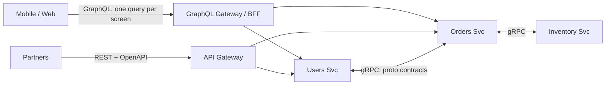

# 2026-07-16 — gRPC vs REST vs GraphQL

> Three API styles solve three different problems — service-to-service performance, universal compatibility, and flexible client-driven queries. Teams get in trouble using one for all three.

## Problem

A platform has three API consumers with conflicting needs:

- **Internal microservices** call each other 50k times/sec — JSON serialization and HTTP/1.1 overhead measurably burn CPU
- **Public partners** integrate from every language and toolchain imaginable — anything unusual multiplies support tickets
- **Mobile and web frontends** assemble screens from 6 resources — either 6 round-trips or bloated "screen-shaped" endpoints that change every sprint

One API style forced on all three produces slow internal calls, confused partners, or an endpoint zoo.

## Constraints

- **Internal:** p99 < 10ms per hop; strict contracts between teams
- **Public:** Zero-friction onboarding; curl-able; cacheable
- **Frontend:** One round-trip per screen; no over-fetching on mobile data
- **Ops:** Each additional API style costs gateway config, auth plumbing, and expertise

## Architecture



Diagram source: [`diagrams/2026-07-16-grpc-rest-graphql.mmd`](../diagrams/2026-07-16-grpc-rest-graphql.mmd)

### Comparison

| | REST | gRPC | GraphQL |
|--|------|------|---------|
| **Transport** | HTTP/1.1 or 2, JSON | HTTP/2, Protobuf (binary) | HTTP POST, JSON |
| **Contract** | OpenAPI (optional, drifts) | .proto (enforced, codegen) | Schema (enforced, introspectable) |
| **Payload size** | Verbose | ~3–10× smaller | Exact fields requested |
| **Streaming** | SSE bolt-on | ✅ Bidirectional native | Subscriptions (WebSocket) |
| **Browser support** | ✅ Native | ⚠️ Needs grpc-web proxy | ✅ Native |
| **HTTP caching** | ✅ GET + ETag/CDN | ❌ | ❌ (POST; needs app-level cache) |
| **Learning curve** | Everyone knows it | Protobuf + tooling | Resolvers, N+1, query costing |
| **Best at** | Public APIs, CRUD | Internal service mesh | Client-driven aggregation |

### gRPC — internal service-to-service

```protobuf
service OrderService {
  rpc GetOrder(GetOrderRequest) returns (Order);
  rpc WatchOrderStatus(GetOrderRequest) returns (stream OrderStatus);
}

message Order {
  string id = 1;
  string user_id = 2;
  int64 total_cents = 3;   // field numbers = wire contract
}
```

Codegen gives every team typed clients; breaking a contract fails at compile time, not in production. Binary encoding and HTTP/2 multiplexing are where the 10ms budgets are won. The cost: humans can't curl it, and browsers need a translation proxy.

### REST — the public default

Predictable resources (`GET /orders/42`), standard status codes, CDN and proxy caching for free, and every language ships an HTTP client. For a partner-facing API, boring is a feature. Publish OpenAPI, version the URL, and never surprise anyone.

### GraphQL — client-shaped aggregation

```graphql
query OrderScreen($id: ID!) {
  order(id: $id) {
    total
    items { name price }
    user { name avatarUrl }
    shipment { eta carrier }
  }
}
```

One round-trip replaces four; mobile clients fetch exactly the fields they render. The costs are real: resolvers hide N+1 query explosions, arbitrary client queries need depth/cost limits, and caching moves from HTTP infrastructure into application code (persisted queries help).

### The pragmatic combination

```
Internal east-west   → gRPC (contracts + performance)
Public north-south   → REST (compatibility + caching)
Frontend aggregation → GraphQL BFF over internal gRPC services
                       (owned by the frontend team, not a shared bottleneck)
```

Each style where its strengths matter, translated at well-defined boundaries. The BFF (backend-for-frontend) pattern keeps GraphQL's flexibility from leaking into the service layer.

## Trade-offs

| Choice | Pros | Cons |
|--------|------|------|
| **One style everywhere** | Single toolchain | Wrong fit for at least one consumer class |
| **gRPC internal + REST public** | Right tool per boundary | Contract translation layer to maintain |
| **GraphQL as the only public API** | Ultimate client flexibility | Query costing, cache complexity for partners who wanted curl |

## When to use

- ✅ **gRPC** for internal microservice calls, streaming, and polyglot teams needing enforced contracts
- ✅ **REST** for public APIs, webhooks, and anything that benefits from HTTP caching
- ✅ **GraphQL** when frontends aggregate many resources per screen and iterate weekly

- ❌ Don't expose gRPC directly to browsers or partners without a compelling reason
- ❌ Don't adopt GraphQL without query depth limits, cost analysis, and DataLoader-style batching
- ❌ Don't build "REST" endpoints shaped for one screen — that's GraphQL's job done badly

## References

- [gRPC — Core concepts](https://grpc.io/docs/what-is-grpc/core-concepts/)
- [GraphQL — Best practices](https://graphql.org/learn/best-practices/)
- [Backends for Frontends pattern — Sam Newman](https://samnewman.io/patterns/architectural/bff/)

---

**Tags:** `#api-design` `#grpc` `#rest` `#graphql` `#microservices` `#architecture-decisions`
