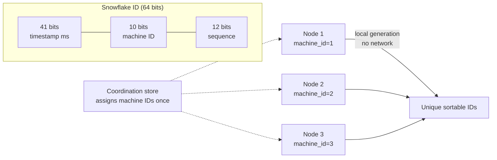

# 2026-07-17 — Distributed ID Generation

> Generate unique, roughly-sortable IDs from many nodes without a central sequence — auto-increment doesn't survive sharding, and random UUIDs wreck index locality.

## Problem

A sharded system can't use `BIGSERIAL` — two shards would both issue ID 1001. The team switches to random UUIDv4 and creates two new problems:

- **Index fragmentation:** random keys insert into random B-tree pages; at 50M rows, inserts touch cold pages, the working set exceeds RAM, and write throughput drops ~3–5×
- **No ordering:** `ORDER BY id` no longer approximates creation time; cursor pagination needs a separate indexed timestamp column

What's needed: globally unique, generated locally on any node, and **time-ordered** so B-trees append instead of scatter.

## Constraints

- **Uniqueness:** Across all shards and services, forever — no coordination per ID
- **Ordering:** Lexicographic order ≈ creation order (index locality + natural cursors)
- **Throughput:** 100k+ IDs/sec per node without a network hop
- **Size:** Fits in 64 or 128 bits; URL-safe representation

## Architecture



Diagram source: [`diagrams/2026-07-17-distributed-id-generation.mmd`](../diagrams/2026-07-17-distributed-id-generation.mmd)

### The options

| Scheme | Bits | Sortable | Coordination | Notes |
|--------|------|----------|--------------|-------|
| **Auto-increment** | 64 | ✅ | ❌ Central DB | Doesn't shard; leaks row counts |
| **UUIDv4** | 128 | ❌ | None | Random; index fragmentation |
| **UUIDv7** | 128 | ✅ | None | Timestamp-prefixed; the new default |
| **ULID** | 128 | ✅ | None | UUIDv7 predecessor; Crockford base32 |
| **Snowflake** | 64 | ✅ | Machine ID assignment | Twitter's design; half the storage |
| **Ticket server** | 64 | ✅ | Central (batched) | Flickr-style; simple, one hot spot |

### Snowflake layout (64 bits)

```
| 1 bit | 41 bits              | 10 bits    | 12 bits  |
| sign  | ms since custom epoch| machine ID | sequence |

41 bits of ms  → ~69 years from your epoch
10 bits        → 1024 concurrent generators
12 bits        → 4096 IDs/ms/node = 4M IDs/sec/node
```

```typescript
class SnowflakeGenerator {
  private sequence = 0;
  private lastTs = -1n;

  constructor(private machineId: number, private epoch = 1735689600000n) {}

  next(): bigint {
    let ts = BigInt(Date.now()) - this.epoch;
    if (ts === this.lastTs) {
      this.sequence = (this.sequence + 1) & 0xfff;
      if (this.sequence === 0) {
        while (BigInt(Date.now()) - this.epoch <= this.lastTs) {} // spin to next ms
        ts = BigInt(Date.now()) - this.epoch;
      }
    } else {
      this.sequence = 0;
    }
    this.lastTs = ts;
    return (ts << 22n) | (BigInt(this.machineId) << 12n) | BigInt(this.sequence);
  }
}
```

Two operational sharp edges:
- **Machine ID collisions** — two nodes with the same ID silently generate duplicates. Assign IDs from a coordination store (etcd lease, k8s StatefulSet ordinal), never hardcode.
- **Clock rollback** — NTP stepping time backwards can re-issue timestamps. Refuse to generate until the clock catches up, and persist `lastTs` across restarts.

### UUIDv7 — the default answer since RFC 9562

```
| 48 bits: unix ms | 4: ver | 12: rand | 2: var | 62 bits: random |
```

Time-prefixed like Snowflake, but the 62 random bits remove all coordination — no machine IDs, no clock-rollback bookkeeping. Postgres 18 ships `uuidv7()` natively; every major language has a library.

```sql
CREATE TABLE orders (
  id uuid PRIMARY KEY DEFAULT uuidv7(),  -- sequential-ish inserts, happy B-tree
  ...
);
```

Benchmarks consistently show UUIDv7 insert throughput close to `bigserial` and far ahead of UUIDv4 at scale, because new rows land on the same hot index pages.

### Choosing

```
Need 64-bit ints (storage, existing schema)  → Snowflake
Otherwise                                     → UUIDv7
Human-facing short codes (order #, invite)   → separate display code,
                                               never the primary key
```

One caveat for both: time-ordered IDs leak creation time (and Snowflake leaks approximate volume). For public tokens where that matters, use random IDs at the edge mapped to internal sortable keys.

## Trade-offs

| Choice | Pros | Cons |
|--------|------|------|
| **UUIDv7** | Zero coordination; sortable; standard | 128 bits; leaks timestamp |
| **Snowflake** | 64 bits; sortable; huge throughput | Machine ID ops; clock discipline |
| **UUIDv4** | Zero coordination; no info leak | Index fragmentation; unsortable |
| **DB sequence** | Simplest possible | Single point; blocks sharding |

## When to use

- ✅ UUIDv7 as the default primary key for new services
- ✅ Snowflake when 64-bit keys are required or you're minting millions/sec
- ✅ Coordination-store-assigned machine IDs, never manual config

- ❌ Don't use UUIDv4 as a clustered/primary key on large, write-heavy tables
- ❌ Don't expose sequential IDs where enumeration is a risk — pair with opaque public tokens
- ❌ Don't ignore clock rollback in Snowflake implementations — it's the classic duplicate-ID incident

## References

- [RFC 9562 — UUIDv7](https://www.rfc-editor.org/rfc/rfc9562)
- [Twitter Snowflake — announcement](https://blog.twitter.com/engineering/en_us/a/2010/announcing-snowflake)
- [Shopify — UUIDv7 in production](https://shopify.engineering/)

---

**Tags:** `#distributed-systems` `#id-generation` `#uuid` `#snowflake` `#database` `#sharding`
