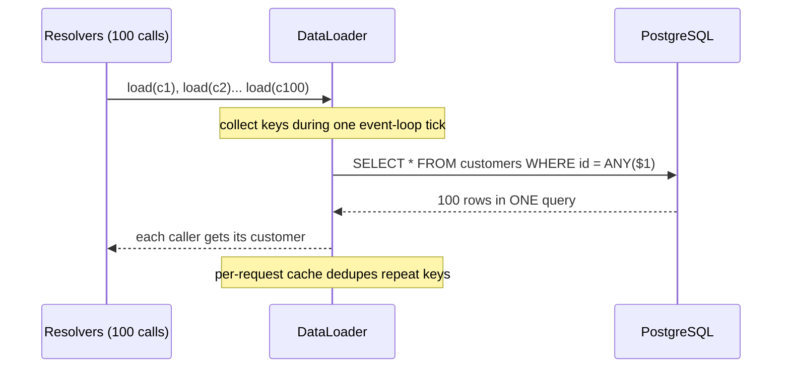

# 2026-07-18 — N+1 Queries and DataLoader Batching

> The most common performance bug in ORM and GraphQL codebases: one query for the list, then one query per item — 101 round-trips where 2 would do.

## Problem

An endpoint returns 100 orders with customer names:

```typescript
const orders = await orderRepo.find({ take: 100 });        // 1 query
for (const order of orders) {
  order.customer = await customerRepo.findOne(order.customerId); // 100 queries
}
```

1 + 100 = **101 round-trips**. At 1ms each that's 100ms of pure latency — before any real work. It passes code review because each line looks innocent; it passes staging because staging has 5 orders. Production has 100, and list endpoints fan out further (orders → customers → their companies).

GraphQL makes it worse by design: each resolver runs independently, so `orders { customer { name } }` triggers the per-item pattern automatically.

## Constraints

- **Latency:** List endpoints p99 < 100ms at 100+ items
- **DB load:** Round-trips per request bounded and independent of item count
- **DX:** Fix must not force hand-written SQL for every screen
- **GraphQL:** Resolvers stay independent — batching must happen transparently

## Architecture



Diagram source: [`diagrams/2026-07-18-n-plus-one-queries-dataloader.mmd`](../diagrams/2026-07-18-n-plus-one-queries-dataloader.mmd)

### Fix 1 — JOIN or eager loading (classic ORM)

```typescript
// TypeORM: one query with a JOIN
const orders = await orderRepo.find({
  take: 100,
  relations: { customer: true },
});
```

Right answer when the access pattern is static and known upfront. Watch for **cartesian explosion** when eager-loading multiple one-to-many relations in one query — rows multiply (`orders × items × shipments`); ORMs like Prisma and Hibernate split into per-relation queries for this reason.

### Fix 2 — batch + IN query (the pattern behind DataLoader)

```typescript
const orders = await orderRepo.find({ take: 100 });                 // query 1
const ids = [...new Set(orders.map(o => o.customerId))];
const customers = await customerRepo.findBy({ id: In(ids) });       // query 2
const byId = new Map(customers.map(c => [c.id, c]));
orders.forEach(o => (o.customer = byId.get(o.customerId)!));
```

Two queries regardless of N. This is what you write manually in REST services.

### Fix 3 — DataLoader (GraphQL / resolver architectures)

```typescript
// One loader per request — never share across requests
const customerLoader = new DataLoader<string, Customer>(async (ids) => {
  const rows = await customerRepo.findBy({ id: In([...ids]) });
  const byId = new Map(rows.map(c => [c.id, c]));
  return ids.map(id => byId.get(id) ?? new Error(`not found: ${id}`));
});

// Resolver stays naive — batching is transparent
@ResolveField()
customer(@Parent() order: Order, @Context() ctx) {
  return ctx.loaders.customer.load(order.customerId);
}
```

DataLoader collects every `load()` call made during one event-loop tick, fires a single batched query, and distributes results. Two rules the batch function must obey: **return results in the same order as input keys**, and **return an Error (not null) for missing keys**.

Per-request instantiation matters: a shared loader's cache leaks data across users and serves stale rows forever.

### Detecting N+1 before production

| Method | How |
|--------|-----|
| **Query logging in dev** | Log SQL with a per-request counter; alert > ~10 queries/request |
| **APM traces** | Datadog/OpenTelemetry waterfall shows the 100 staircase spans |
| **Test assertion** | Wrap the endpoint in a query-count assertion (`expect(queryCount).toBeLessThan(5)`) |
| **Load test with realistic list sizes** | Staging with 5 rows hides everything |

## Trade-offs

| Choice | Pros | Cons |
|--------|------|------|
| **JOIN / eager load** | One query; simplest mental model | Cartesian blowup on multiple to-many; over-fetches when relation unused |
| **Batch + IN** | Two queries; explicit and portable | Manual wiring per endpoint |
| **DataLoader** | Transparent; composes across nested resolvers; dedupes | Per-request lifecycle discipline; ordering contract |
| **Denormalize** | Zero joins at read time | Write-path complexity; consistency upkeep |

## When to use

- ✅ DataLoader for every relation resolver in a GraphQL server — it's not optional there
- ✅ Eager loading when the endpoint always needs the relation
- ✅ Query-count assertions in integration tests for list endpoints

- ❌ Don't await queries inside a loop over query results — the canonical smell
- ❌ Don't share DataLoader instances across requests
- ❌ Don't fix N+1 by caching the N queries — you've hidden the bug, not fixed it

## References

- [graphql/dataloader — README and source](https://github.com/graphql/dataloader)
- [Prisma — Query optimization guide](https://www.prisma.io/docs/orm/prisma-client/queries/query-optimization-performance)
- [Use The Index, Luke — Joins](https://use-the-index-luke.com/sql/join)

---

**Tags:** `#performance` `#orm` `#graphql` `#dataloader` `#database` `#n-plus-one`
