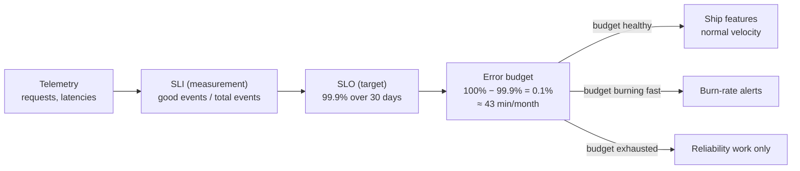

# 2026-07-19 — SLIs, SLOs, and Error Budgets

> Define what "reliable enough" means in numbers — then let the error budget decide when to ship features and when to stop and fix reliability.

## Problem

Engineering and product argue in circles:

- Ops wants to freeze deploys after every incident; product wants to ship daily
- "The API is slow" — for whom? Which endpoint? Compared to what promise?
- The team chases 100% uptime nobody asked for, at enormous cost, while users actually suffer from slow checkout p99 that nobody measures

Without an explicit target, every reliability conversation is opinion versus opinion.

## Constraints

- **Measurable:** Targets computed from real telemetry, not vibes
- **User-centric:** Measure what users experience, not what servers report
- **Actionable:** A breached budget must trigger a defined, pre-agreed response
- **Realistic:** 100% is not a target — every extra nine multiplies cost

## Architecture



Diagram source: [`diagrams/2026-07-19-sli-slo-error-budgets.mmd`](../diagrams/2026-07-19-sli-slo-error-budgets.mmd)

### The three terms

| Term | Definition | Example |
|------|-----------|---------|
| **SLI** (indicator) | A ratio: good events / total events | Requests < 300ms and non-5xx / all requests |
| **SLO** (objective) | Internal target for the SLI over a window | 99.9% over rolling 30 days |
| **SLA** (agreement) | External contract with penalties | 99.5% or customer gets credits |

SLA is always looser than SLO — the SLO is your early-warning line, the SLA is the legal one.

### Choosing SLIs that reflect users

```
Availability : non-5xx responses / all responses
Latency      : responses faster than 300ms / all responses
Quality      : checkouts completed / checkouts started
Freshness    : dashboard reads served from data < 5 min old / all reads
```

Measure at the load balancer or client, not inside the service — a pod that's "healthy" behind a broken ingress is still down for users. Define latency SLIs as a ratio under a threshold, not "p99 < 300ms": the ratio form composes over windows and drives budget math directly.

### Error budget math

```
SLO 99.9%, 30-day window, 100M requests/month

Budget = 0.1% of 100M = 100,000 failed requests
       ≈ 43 minutes of full downtime
       ≈ or 0.1% degraded forever — your choice how to "spend" it
```

The budget reframes the deploy-freeze argument: deploys are allowed **while budget remains**. A risky migration, a flaky dependency, planned maintenance — all spend from the same account. When it's empty, the pre-agreed policy kicks in (feature freeze, reliability sprint), and nobody has to argue.

### Burn-rate alerting (the part most teams get wrong)

Alerting on "SLO violated" fires when it's too late. Alert on **burn rate** — how fast the budget is being consumed:

```
burn rate = observed error ratio / budget ratio

Fast burn:  14.4× over 1 hour  → page immediately
            (empties a 30-day budget in ~2 days)
Slow burn:  3× over 6 hours    → ticket, business hours
```

```yaml
# Prometheus — fast-burn page
- alert: ErrorBudgetFastBurn
  expr: |
    (1 - sum(rate(http_requests_total{code!~"5.."}[1h]))
       / sum(rate(http_requests_total[1h]))) > 14.4 * 0.001
  labels: { severity: page }
```

Multi-window burn-rate alerts replace symptom noise ("CPU high", "one pod restarted") with exactly one question: *are we breaking our promise to users faster than we can afford?*

## Trade-offs

| Choice | Pros | Cons |
|--------|------|------|
| **SLO + error budget** | Objective ship/freeze decisions; aligned incentives | Requires telemetry investment and political buy-in |
| **Chasing max uptime** | Feels safe | Each nine ~10× cost; velocity dies for reliability nobody needs |
| **No explicit targets** | No upfront work | Every incident becomes a negotiation |

## When to use

- ✅ Any service with users and an on-call rotation — start with one availability SLO
- ✅ Burn-rate alerts as the primary page; demote cause-based alerts to tickets
- ✅ Error budget policy agreed with product **before** the first breach

- ❌ Don't set 99.99% because it sounds professional — derive it from user tolerance and cost
- ❌ Don't measure SLIs from inside the service — users live on the other side of the network
- ❌ Don't define SLOs without a written policy for what happens when the budget hits zero

## References

- [Google SRE Book — Service Level Objectives](https://sre.google/sre-book/service-level-objectives/)
- [Google SRE Workbook — Alerting on SLOs](https://sre.google/workbook/alerting-on-slos/)
- [OpenSLO — SLO-as-code spec](https://openslo.com/)

---

**Tags:** `#sre` `#slo` `#observability` `#reliability` `#alerting` `#error-budget`
