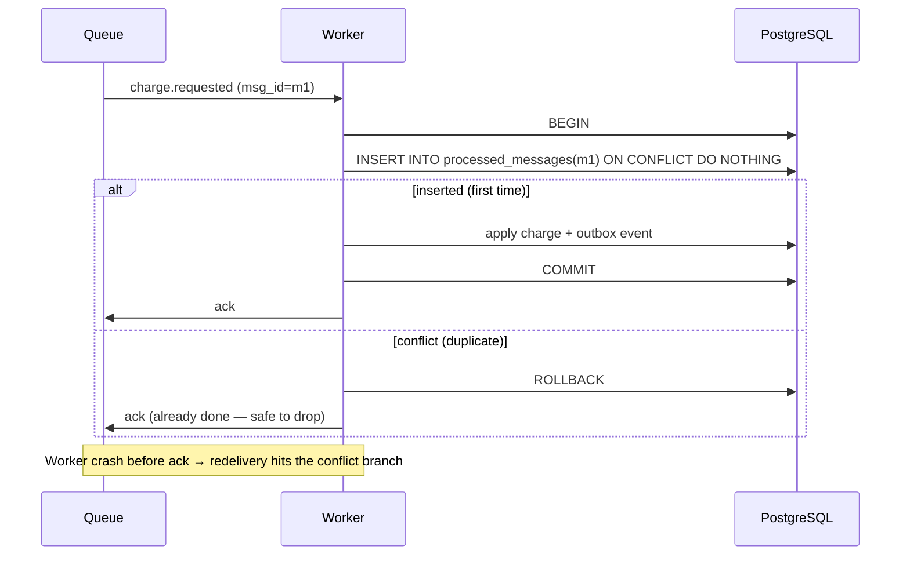

# 2026-07-20 — Exactly-Once Delivery and Message Deduplication

> Networks can only promise at-least-once or at-most-once delivery — "exactly-once" is something you build at the processing layer with idempotency and deduplication.

## Problem

A payment worker consumes `charge.requested` from a queue. It charges the card, then crashes **before acknowledging** the message. The broker — correctly — redelivers. The card is charged twice.

The naive fixes both fail:
- **Ack before processing** (at-most-once): crash after ack, before charge → charge lost
- **Ack after processing** (at-least-once): crash after charge, before ack → duplicate

The two-generals problem makes delivery-level exactly-once impossible over an unreliable network. What's achievable — and what every "exactly-once" system actually implements — is **at-least-once delivery + exactly-once processing effects**.

## Constraints

- **Correctness:** A duplicate delivery must never produce a duplicate side effect
- **Throughput:** Dedup check adds < 5ms per message at 10k msg/sec
- **Retention:** Dedup memory bounded — can't remember every message forever
- **End-to-end:** Guarantees must hold across producer, broker, and consumer

## Architecture



Diagram source: [`diagrams/2026-07-20-exactly-once-delivery.mmd`](../diagrams/2026-07-20-exactly-once-delivery.mmd)

### Where duplicates come from

| Source | Mechanism |
|--------|-----------|
| **Producer retry** | Timeout after broker persisted the publish → re-publish |
| **Consumer redelivery** | Crash/timeout between processing and ack |
| **Rebalance** | Partition reassigned while old consumer still finishing |
| **Upstream replay** | Backfills, DLQ redrives, CDC re-snapshots |

Design assumption: **every message will eventually arrive at least twice.**

### The core pattern — transactional dedup

Store the message ID in the **same database transaction** as the side effect:

```typescript
async function handleCharge(msg: Message) {
  await db.transaction(async (tx) => {
    const inserted = await tx.query(
      `INSERT INTO processed_messages (message_id, handler, processed_at)
       VALUES ($1, 'charge', now())
       ON CONFLICT (message_id, handler) DO NOTHING`,
      [msg.id],
    );
    if (inserted.rowCount === 0) return;          // duplicate — no-op

    await tx.query(/* apply the charge */);
    await tx.query(/* insert outbox event */);    // downstream publish, same tx
  });
  await msg.ack();                                 // crash before this → safe redelivery
}
```

Atomicity does the work: dedup record and business effect commit together or not at all. A dedup check in Redis *before* a Postgres write reintroduces the gap you're trying to close.

Prune `processed_messages` past the broker's maximum redelivery horizon (days, not forever).

### Layer support

| Layer | What it gives you | What it doesn't |
|-------|-------------------|-----------------|
| **Kafka idempotent producer** | No broker-side duplicates from producer retries | Nothing about your consumer |
| **Kafka transactions / EOS** | Exactly-once for consume→transform→produce *within Kafka* | Effects outside Kafka (DB writes, HTTP calls) |
| **SQS FIFO dedup** | 5-minute content-based dedup window | Replays and redrives beyond 5 min |
| **Consumer-side transactional dedup** | End-to-end exactly-once *effects* | Requires a transactional store |

Kafka's "exactly-once semantics" is real but scoped: the moment your consumer touches an external system, you're back to needing your own idempotency.

### Natural idempotency — sometimes free

```
UPDATE orders SET status = 'shipped' WHERE id = $1        -- idempotent
INSERT ... ON CONFLICT (natural_key) DO NOTHING            -- idempotent
balance = balance + 100                                    -- NOT idempotent
SET balance = 500 (absolute state, versioned)              -- idempotent
```

Prefer absolute-state messages ("set inventory to 40") over deltas ("decrement by 2") — they make redelivery harmless without any dedup table.

## Trade-offs

| Choice | Pros | Cons |
|--------|------|------|
| **Transactional dedup table** | True end-to-end guarantee | One indexed insert per message; pruning job |
| **Broker EOS (Kafka)** | No app code for in-Kafka pipelines | Stops at Kafka's edge; throughput cost |
| **Content-based dedup (SQS FIFO)** | Zero app code | 5-min window only; FIFO throughput limits |
| **Natural idempotency** | Free, no state | Only fits some operations |

## When to use

- ✅ Transactional dedup for money, inventory, notifications — anything users notice twice
- ✅ Absolute-state message design wherever the domain allows
- ✅ Kafka EOS for pure stream-processing topologies

- ❌ Don't ack before the side effect is durable — that's silent message loss
- ❌ Don't dedup in a different store than the side effect — the atomicity gap is the bug
- ❌ Don't rely on "the broker guarantees exactly-once" — read exactly what layer it covers

## References

- [Kafka — Exactly-once semantics design](https://www.confluent.io/blog/exactly-once-semantics-are-possible-heres-how-apache-kafka-does-it/)
- [You Cannot Have Exactly-Once Delivery — Tyler Treat](https://bravenewgeek.com/you-cannot-have-exactly-once-delivery/)
- [AWS — SQS FIFO deduplication](https://docs.aws.amazon.com/AWSSimpleQueueService/latest/SQSDeveloperGuide/using-messagededuplicationid-property.html)

---

**Tags:** `#messaging` `#exactly-once` `#idempotency` `#kafka` `#queues` `#distributed-systems`
