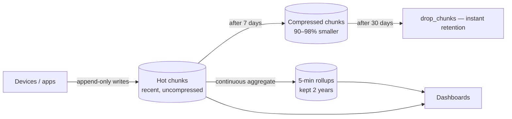

# 2026-07-21 — Time-Series Data Storage

> Metrics, IoT readings, and event telemetry are append-only, time-keyed, and queried in ranges — a schema and storage layout built for that beats a generic table by orders of magnitude.

## Problem

A fleet of 10,000 devices reports metrics every 10 seconds — 86M rows/day into a plain Postgres table. Within a month:

- The table hits 2.5B rows; every index no longer fits in RAM
- `DELETE FROM metrics WHERE time < now() - '90 days'` runs for hours and bloats the table
- Dashboard queries ("avg CPU per device, 5-min buckets, last 24h") scan hundreds of millions of rows
- Autovacuum can't keep up with the append rate

Time-series data has a specific shape — recent data hot, old data cold, writes append-only, queries time-bounded aggregates — that generic OLTP storage doesn't exploit.

## Constraints

- **Ingest:** 100k+ rows/sec sustained, without degrading reads
- **Queries:** Time-bucketed aggregates over recent windows in < 100ms
- **Retention:** Raw data 30 days; aggregates kept 2 years; deletion must be cheap
- **Cost:** Old data compressed or tiered — not on NVMe forever

## Architecture



Diagram source: [`diagrams/2026-07-21-time-series-data-storage.mmd`](../diagrams/2026-07-21-time-series-data-storage.mmd)

### Why generic tables lose

| Property of TS data | What specialized storage does with it |
|---------------------|----------------------------------------|
| Append-only, time-ordered | Partition by time ("chunks"); writes always hit the newest, RAM-resident chunk |
| Old data rarely updated | Compress closed chunks columnar-style (90%+ reduction) |
| Queries are time-ranged | Partition pruning skips irrelevant chunks entirely |
| Retention by age | `DROP` a whole chunk — instant, no vacuum — instead of row deletes |
| Same-metric values similar | Delta + Gorilla encoding: timestamps and floats compress extremely well |

### TimescaleDB — Postgres-native path

```sql
CREATE TABLE metrics (
  time        timestamptz NOT NULL,
  device_id   text NOT NULL,
  cpu         double precision,
  mem_used    double precision
);

SELECT create_hypertable('metrics', by_range('time', INTERVAL '1 day'));

-- Columnar compression for chunks older than 7 days
ALTER TABLE metrics SET (timescaledb.compress,
  timescaledb.compress_segmentby = 'device_id');
SELECT add_compression_policy('metrics', INTERVAL '7 days');

-- Retention: drop whole chunks past 30 days
SELECT add_retention_policy('metrics', INTERVAL '30 days');
```

The table stays SQL — joins to device metadata, standard drivers, one database to operate.

### Continuous aggregates — the dashboard workhorse

```sql
CREATE MATERIALIZED VIEW metrics_5m
WITH (timescaledb.continuous) AS
SELECT time_bucket('5 minutes', time) AS bucket,
       device_id,
       avg(cpu) AS cpu_avg, max(cpu) AS cpu_max
FROM metrics
GROUP BY bucket, device_id;

SELECT add_continuous_aggregate_policy('metrics_5m',
  start_offset => INTERVAL '1 hour', end_offset => INTERVAL '5 minutes',
  schedule_interval => INTERVAL '5 minutes');
```

Incrementally maintained rollups: dashboards read pre-bucketed 5-minute rows instead of scanning raw data. Keep rollups for years while raw data expires in 30 days — retention and resolution decouple.

### Downsampling strategy

```
0–7 days    raw 10s resolution   (hot, uncompressed)
7–30 days   raw, compressed
30 days–2y  5-min aggregates only
> 2 years   1-hour aggregates or gone
```

Every zoom level a human actually looks at survives; storage stays bounded.

### Choosing an engine

| Engine | Model | Fit |
|--------|-------|-----|
| **TimescaleDB** | Postgres extension, SQL | App metrics/IoT next to relational data; small team |
| **Prometheus + Thanos/Mimir** | Pull-based, PromQL | Infrastructure monitoring specifically |
| **ClickHouse** | Columnar OLAP | Massive analytics, billions of rows, heavy aggregation |
| **InfluxDB** | Purpose-built TSDB | Standalone metrics platform |
| **Plain Postgres partitions** | pg_partman | Modest volume; no new dependency |

## Trade-offs

| Choice | Pros | Cons |
|--------|------|------|
| **TimescaleDB** | Full SQL + joins; one system | Single-node write ceiling (~100k+/s is fine; millions/s isn't) |
| **ClickHouse** | Fastest aggregates at extreme scale | Eventual-consistency inserts; separate system; no OLTP |
| **Prometheus stack** | Ecosystem standard for infra | Not for business/app domain data |
| **Plain Postgres** | Zero new tech | You hand-build chunking, compression, rollups |

## When to use

- ✅ Metrics, IoT telemetry, clickstreams, price histories — anything append-only and time-keyed
- ✅ Time partitioning + chunk-drop retention from day one, even in plain Postgres
- ✅ Continuous aggregates the moment a dashboard scans more than a few million raw rows

- ❌ Don't store high-volume telemetry in a generic OLTP table with row-by-row DELETE retention
- ❌ Don't keep raw resolution forever — decide the downsampling ladder upfront
- ❌ Don't reach for a separate TSDB when TimescaleDB keeps it in the database you already run

## References

- [TimescaleDB — Hypertables and chunks](https://docs.timescale.com/use-timescale/latest/hypertables/)
- [Gorilla: Facebook's fast, scalable in-memory TSDB (paper)](https://www.vldb.org/pvldb/vol8/p1816-teller.pdf)
- [ClickHouse — Time-series best practices](https://clickhouse.com/docs/en/guides/best-practices)

---

**Tags:** `#time-series` `#timescaledb` `#postgresql` `#metrics` `#iot` `#data-engineering`
