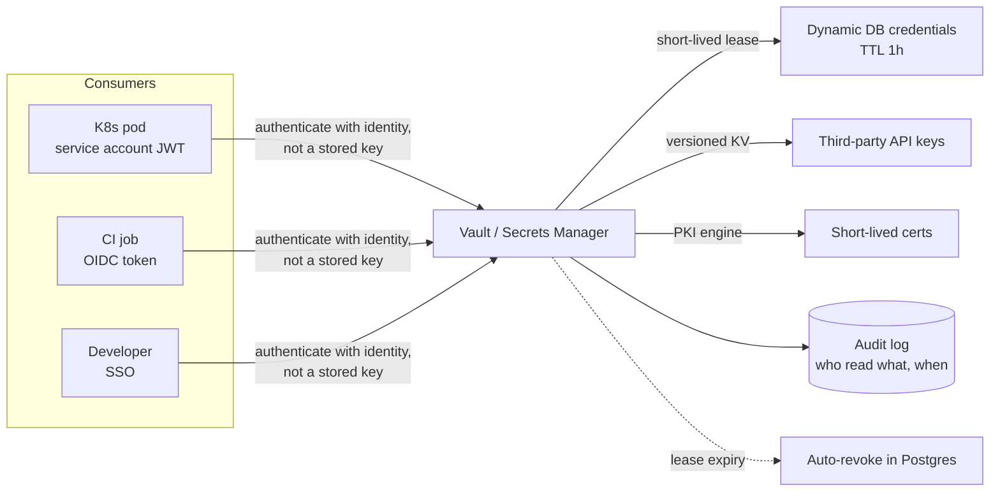

# 2026-07-22 — Secrets Management

> Database passwords, API keys, and signing certs don't belong in env files and CI variables — centralize them, lease them, rotate them, and audit every read.

## Problem

An engineer leaves the company. The offboarding checklist asks: *which secrets did they have access to?* Nobody knows. The database password is in 14 places — `.env` files, CI variables, a Slack thread from 2024, three Kubernetes Secrets, and two laptops. Rotating it means a coordinated multi-team deploy, so it hasn't been rotated in two years.

Then a dependency with a postinstall script exfiltrates `process.env` from CI, and every one of those static, long-lived credentials is in an attacker's hands at once.

## Constraints

- **Blast radius:** A leaked credential must expire on its own — hours, not years
- **Audit:** Every secret read attributable to an identity, queryable after an incident
- **Rotation:** Zero-coordination rotation — no "rotate the password" deploy trains
- **No secret zero sprawl:** Authentication to the secret store itself must not be another static key

## Architecture



Diagram source: [`diagrams/2026-07-22-secrets-management.mmd`](../diagrams/2026-07-22-secrets-management.mmd)

### Maturity ladder

| Level | Practice | Failure mode |
|-------|----------|--------------|
| 0 | Secrets in code / `.env` in git | Everything leaks with the repo |
| 1 | CI/platform env variables | Readable by any code in the process; no audit; never rotated |
| 2 | Central store (Vault, AWS/GCP Secrets Manager), static secrets | Better audit; still long-lived credentials |
| 3 | **Dynamic secrets + identity-based auth** | Credentials self-expire; leak window = TTL |

Most teams sit at level 1. The jump that matters is to level 3 — not just *where* secrets live, but *how long they live*.

### Dynamic secrets — credentials that don't exist until asked

```hcl
# Vault: Postgres role that mints per-service credentials
resource "vault_database_secret_backend_role" "orders" {
  name    = "orders-service"
  db_name = "postgres-main"
  creation_statements = [
    "CREATE ROLE \"{{name}}\" WITH LOGIN PASSWORD '{{password}}' VALID UNTIL '{{expiration}}';",
    "GRANT SELECT, INSERT, UPDATE ON orders TO \"{{name}}\";"
  ]
  default_ttl = 3600   # 1 hour, auto-renewed while pod lives
}
```

Each pod gets its **own** database user, created on demand, revoked on lease expiry. A leaked credential is dead within the hour; an incident's audit trail shows exactly which instance's credential was used.

### Solving "secret zero" with platform identity

The store itself must not require a stored API key — that just moves the problem. Authenticate with identity the platform already proves:

```
Kubernetes  → service account JWT, validated by Vault's k8s auth method
AWS         → IAM role of the instance/lambda
CI          → OIDC token from GitHub Actions / GitLab (aud + repo claims)
Developers  → SSO through the IdP
```

No static token anywhere in the chain — CI jobs get secrets scoped to the exact repo and branch that's running, and a fork PR gets nothing.

### Delivery into workloads

| Method | Notes |
|--------|-------|
| **Injected file via sidecar/CSI** | App reads a file; agent renews leases and rewrites it |
| **External Secrets Operator** | Syncs store → K8s Secrets; familiar but secrets rest in etcd |
| **App-level SDK fetch** | Most control; ties app code to the store |

Whichever path: the app must handle **credential refresh** (re-read the file / reconnect on auth failure) or rotation breaks it at the first TTL.

### What belongs where

```
Dynamic (DB, cloud creds)     → secrets engine, TTL ≤ hours
Third-party API keys           → versioned KV + scheduled rotation job
TLS / signing                  → PKI engine, certs valid days not years
Config that isn't secret       → plain config; don't clog the vault with log levels
```

## Trade-offs

| Choice | Pros | Cons |
|--------|------|------|
| **Vault (self-hosted)** | Dynamic secrets, every backend, portable | You operate an HA security-critical system |
| **Cloud secrets manager** | Managed, IAM-native | Weaker dynamic-secret story; per-cloud lock-in |
| **Sealed/SOPS-encrypted in git** | GitOps-friendly, simple | Static; rotation is still manual |
| **K8s Secrets alone** | Built-in | Base64 ≠ encryption; no rotation, weak audit |

## When to use

- ✅ Dynamic credentials for databases and cloud access — the highest-value upgrade
- ✅ OIDC/platform identity for CI and workloads — kill static tokens in pipelines
- ✅ TTLs and audit on everything; alert on reads from unexpected identities

- ❌ Don't commit `.env` files — add them to `.gitignore` before the first commit, not after the leak
- ❌ Don't give services one shared "app" credential — per-service identity or the audit log is noise
- ❌ Don't deploy rotation without testing that apps survive a credential swap mid-flight

## References

- [HashiCorp Vault — Dynamic secrets](https://developer.hashicorp.com/vault/docs/secrets/databases)
- [GitHub Actions — OIDC hardening](https://docs.github.com/en/actions/deployment/security-hardening-your-deployments/about-security-hardening-with-openid-connect)
- [OWASP — Secrets Management Cheat Sheet](https://cheatsheetseries.owasp.org/cheatsheets/Secrets_Management_Cheat_Sheet.html)

---

**Tags:** `#security` `#secrets` `#vault` `#kubernetes` `#devops` `#zero-trust`
