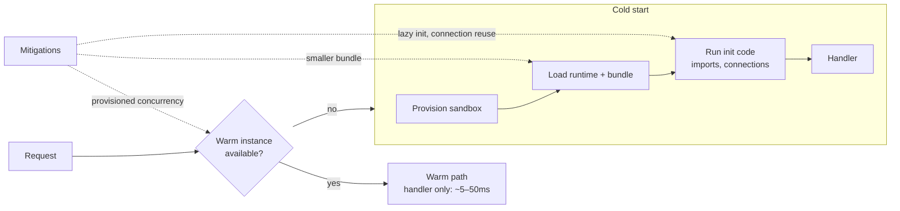

# 2026-07-23 — Serverless Cold Starts

> Functions that scale to zero must sometimes scale from zero — and the user paying for that first request sees hundreds of milliseconds of runtime boot before your code even runs.

## Problem

A checkout API runs on AWS Lambda. Load tests look great — until traffic goes quiet for 20 minutes and the next customer's request takes **2.8 seconds**: no warm instance existed, so the platform had to provision a sandbox, load the runtime, download a 40MB bundle, and run all module-level initialization (importing an ORM, opening DB connections, reading secrets) before handling one request.

Worse, a traffic spike doesn't hit one cold start — every **concurrent** request beyond the warm pool spawns its own cold instance. A burst of 50 parallel requests can mean 50 simultaneous cold starts.

## Constraints

- **Latency:** Checkout p99 < 500ms including the unlucky first request
- **Cost:** Scale-to-zero economics are the reason serverless was chosen — don't quietly buy back an always-on fleet
- **Spiky traffic:** 10× bursts within seconds; batch jobs that fan out wide
- **Dependencies:** Postgres with limited connections sits behind the functions

## Architecture



Diagram source: [`diagrams/2026-07-23-serverless-cold-starts.mmd`](../diagrams/2026-07-23-serverless-cold-starts.mmd)

### Anatomy of the delay

| Phase | Typical cost | You control it? |
|-------|-------------|-----------------|
| Sandbox provisioning | 50–200ms | No |
| Runtime boot | Node/Python ~50–100ms; JVM/.NET 400ms–2s+ | Runtime choice |
| Code download + parse | Scales with bundle size | ✅ Fully |
| **Init code (module scope)** | Whatever you wrote | ✅ Fully |
| VPC networking (historical) | Now ~negligible on AWS | No |

The two biggest levers are the ones in your repo: bundle size and initialization code.

### Mitigation 1 — shrink and defer

```typescript
// ❌ Module scope: pays on every cold start, needed or not
import { S3Client } from '@aws-sdk/client-s3';
import { PDFGenerator } from 'heavy-pdf-lib';        // 15MB, used by 1% of requests
const pdf = new PDFGenerator();

// ✅ Cache clients across invocations, lazy-load the rare path
let s3: S3Client | undefined;
const getS3 = () => (s3 ??= new S3Client({}));

async function generatePdf(data: Order) {
  const { PDFGenerator } = await import('heavy-pdf-lib');  // only when hit
  ...
}
```

Bundle with tree-shaking (esbuild), ship only production deps, and keep functions single-purpose — a 5MB focused function cold-starts several times faster than a 100MB do-everything one.

### Mitigation 2 — pay for warmth where it matters

| Option | Mechanism | Cost model |
|--------|-----------|-----------|
| **Provisioned concurrency** (Lambda) | N instances always initialized | Pay for N warm instances |
| **Min instances** (Cloud Run) | Container never scales below N | Same idea |
| **SnapStart** (Lambda JVM/.NET) | Restore from a memory snapshot instead of booting | Near-free; runtime-specific |
| **Scheduled pings** | Cron invokes the function | Fragile — keeps *one* instance warm, does nothing for bursts |

Apply provisioned concurrency surgically: the user-facing checkout path gets it; the nightly report generator doesn't care about 2 seconds.

### Mitigation 3 — the database connection trap

Every cold instance opening its own Postgres connection means a burst of 200 Lambdas exhausts `max_connections` and takes down the database for everyone.

```
Functions → RDS Proxy / PgBouncer → PostgreSQL
```

A connection proxy multiplexes hundreds of function instances over a small pooled set. This isn't a cold-start optimization — it's what makes serverless + relational databases survivable at all.

### When cold starts genuinely don't matter

Async event processing (queues, S3 events, scheduled jobs) has no human waiting. A 2-second cold start on a message consumer is invisible. Optimize the synchronous, user-facing paths; leave the rest alone.

## Trade-offs

| Choice | Pros | Cons |
|--------|------|------|
| **Accept cold starts** | Full scale-to-zero economics | p99 spikes on quiet or bursty routes |
| **Provisioned concurrency** | Predictable latency | Paying for idle — partially unwinds the model |
| **Containers (Cloud Run/Fargate min=1)** | No cold starts at floor | Always-on baseline cost |
| **Move hot paths off serverless** | Right tool per path | Two deployment models to run |

## When to use

- ✅ Serverless for spiky, async, or low-duty-cycle workloads — cold starts mostly amortize away
- ✅ Provisioned concurrency / min instances on the few user-facing synchronous routes
- ✅ Connection pooling proxy from day one when functions talk to relational databases

- ❌ Don't put a latency-critical, steady-traffic API on bare scale-to-zero functions and hope
- ❌ Don't do work at module scope that only some invocations need — lazy-load it
- ❌ Don't benchmark warm and extrapolate — load-test the cold path and concurrent bursts

## References

- [AWS Lambda — Execution environment lifecycle](https://docs.aws.amazon.com/lambda/latest/dg/lambda-runtime-environment.html)
- [AWS — Operating Lambda: performance optimization](https://aws.amazon.com/blogs/compute/operating-lambda-performance-optimization-part-1/)
- [Lambda SnapStart](https://docs.aws.amazon.com/lambda/latest/dg/snapstart.html)

---

**Tags:** `#serverless` `#lambda` `#cold-start` `#performance` `#aws` `#architecture-decisions`
