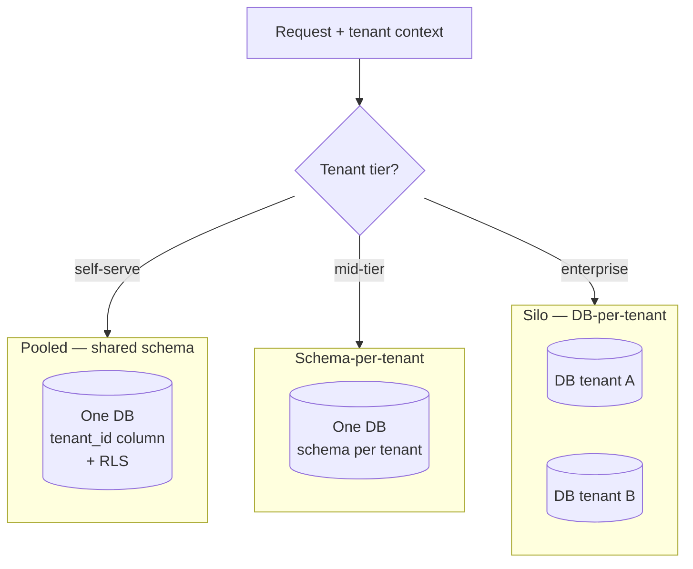

# 2026-07-24 — Multi-Tenancy Data Isolation Models

> One codebase, many customers — the choice of how tenants share (or don't share) databases decides your security posture, cost floor, and how painful enterprise deals become.

## Problem

A B2B SaaS lands its first enterprise customer, and the security questionnaire asks: *"Is our data physically isolated?"* The honest answer is "every tenant is a `tenant_id` column in shared tables" — and the deal stalls.

Meanwhile the engineering reality of that shared model has its own scars: a missing `WHERE tenant_id = $1` in one report query leaked customer names across tenants, one tenant's analytics workload slows everyone's queries, and per-tenant backup restore ("we deleted our data, can you roll *us* back?") is effectively impossible.

## Constraints

- **Security:** Cross-tenant leakage is existential — defense must not depend on every developer remembering a WHERE clause
- **Cost:** 5,000 small tenants can't cost a database each; 5 enterprise tenants can
- **Operations:** Migrations, backups, and noisy-neighbor handling scale with the model chosen
- **Sales reality:** Some customers will pay specifically for stronger isolation

## Architecture



Diagram source: [`diagrams/2026-07-24-multi-tenancy-isolation-models.mmd`](../diagrams/2026-07-24-multi-tenancy-isolation-models.mmd)

### The three models

| | Pooled (shared schema) | Schema-per-tenant | Silo (DB-per-tenant) |
|--|------------------------|-------------------|----------------------|
| **Isolation** | Logical only (`tenant_id`) | Namespace-level | Physical |
| **Cost per tenant** | ~zero marginal | Low | Full instance/DB |
| **Tenant count ceiling** | Millions | Thousands (migration time × N schemas) | Dozens–hundreds |
| **Migrations** | Once | N times, drift risk | N times, tooling mandatory |
| **Per-tenant restore** | Painful (extract rows) | Moderate | Trivial |
| **Noisy neighbor** | Worst | Shared instance still | Contained |
| **Enterprise checkbox** | ❌ | Partial | ✅ |

### Pooled + Row-Level Security — make the database enforce it

The fatal flaw of pooled tenancy is relying on application discipline. PostgreSQL RLS moves enforcement into the database:

```sql
ALTER TABLE orders ENABLE ROW LEVEL SECURITY;
ALTER TABLE orders FORCE ROW LEVEL SECURITY;   -- applies to table owner too

CREATE POLICY tenant_isolation ON orders
  USING (tenant_id = current_setting('app.tenant_id')::uuid);
```

```typescript
// Set tenant context per request — on the transaction, not the pool
await db.transaction(async (tx) => {
  await tx.query(`SET LOCAL app.tenant_id = $1`, [ctx.tenantId]);
  return tx.query(`SELECT * FROM orders WHERE status = 'open'`); // no tenant_id needed
});
```

A forgotten WHERE clause now returns zero rows instead of another customer's data. Two sharp edges: `SET LOCAL` must be transaction-scoped (connection pools recycle sessions), and the app must **not** connect as a role with `BYPASSRLS`.

### The hybrid that B2B SaaS converges on

```
Self-serve tier    → pooled + RLS         (thousands of tenants, near-zero marginal cost)
Enterprise tier    → silo DB              (isolation as a paid feature)
Tenant catalog     → control-plane DB mapping tenant → tier, connection, region
```

The tenant catalog is the keystone: request middleware resolves the tenant (subdomain, JWT claim), looks up its placement, and routes to the right pool or database. Moving a growing tenant from pooled to silo becomes a data migration, not a re-architecture — **but only if the schema carried `tenant_id` everywhere from day one.**

### Beyond the database

| Layer | Pooled-world control |
|-------|----------------------|
| **Compute** | Per-tenant rate limits and query timeouts (noisy neighbor) |
| **Cache** | Key prefix `tenant:{id}:` — a shared Redis has the same leakage risks |
| **Search/queues** | Tenant field in every document/message + filtered access |
| **Blob storage** | Prefix per tenant + IAM conditions, or bucket-per-enterprise-tenant |
| **Encryption** | Per-tenant keys (envelope encryption) — crypto-shredding on offboarding |

## Trade-offs

| Choice | Pros | Cons |
|--------|------|------|
| **Pooled + RLS** | Cheapest, one migration, scales to huge tenant counts | Shared blast radius; RLS session discipline |
| **Schema-per-tenant** | Middle ground; per-tenant restore feasible | Migration × N; catalog bloat at scale — the worst of both at the extremes |
| **Silo** | Real isolation; per-tenant everything | Cost floor; fleet automation required |
| **Hybrid by tier** | Isolation becomes a priced feature | Two paths to test and operate |

## When to use

- ✅ Pooled + RLS as the default for self-serve SaaS — with RLS from the first table, not retrofitted
- ✅ Hybrid tiering when enterprise deals demand isolation — charge for it
- ✅ `tenant_id` on every row even in silo mode — it keeps every future migration path open

- ❌ Don't rely on application-level WHERE clauses alone in a pooled model — one miss is a breach
- ❌ Don't pick schema-per-tenant for thousands of tenants — migration time and catalog bloat compound
- ❌ Don't forget caches, queues, and object storage — tenant isolation is a system property, not a database column

## References

- [PostgreSQL — Row Security Policies](https://www.postgresql.org/docs/current/ddl-rowsecurity.html)
- [AWS — SaaS tenant isolation strategies (whitepaper)](https://docs.aws.amazon.com/whitepapers/latest/saas-tenant-isolation-strategies/saas-tenant-isolation-strategies.html)
- [Crunchy Data — Postgres RLS for multi-tenancy](https://www.crunchydata.com/blog/row-level-security-for-tenants-in-postgres)

---

**Tags:** `#multi-tenancy` `#saas` `#postgresql` `#rls` `#security` `#architecture-decisions`
