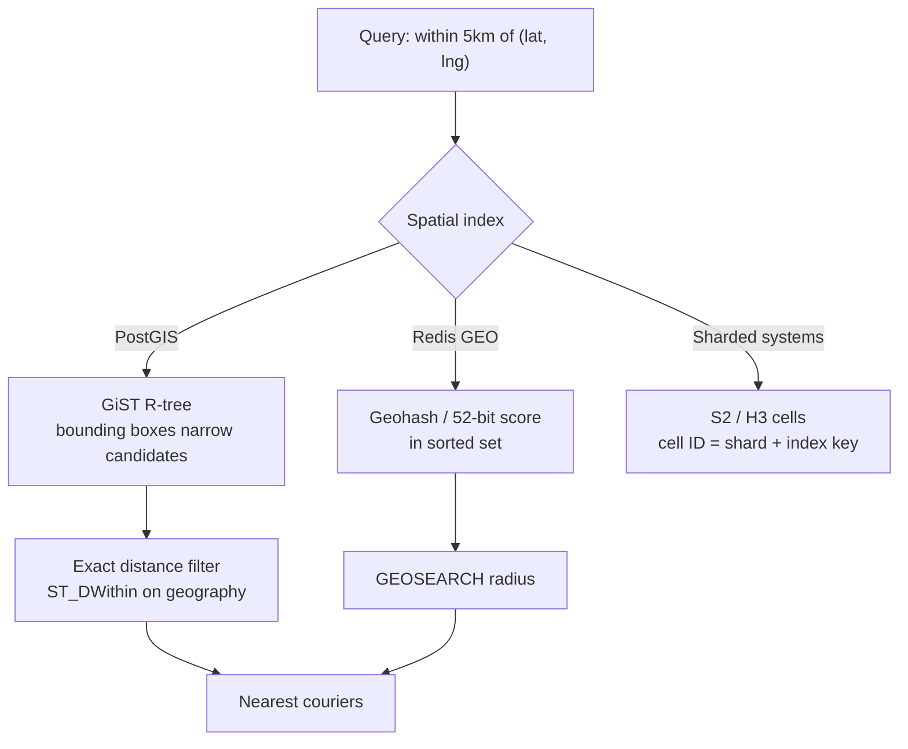

# 2026-07-25 — Geospatial Indexing

> "Find everything within 5km of me" can't be answered by B-trees on latitude and longitude — spatial queries need spatial structures: R-trees, geohashes, or cell coverings.

## Problem

A delivery app stores courier positions as `lat` / `lng` columns and finds nearby couriers with:

```sql
SELECT * FROM couriers
WHERE lat BETWEEN $1 - 0.05 AND $1 + 0.05
  AND lng BETWEEN $2 - 0.05 AND $2 + 0.05;
```

Two B-tree indexes, and the planner can only use one efficiently — the other dimension is a filter over a huge intermediate set. At 1M couriers, every "nearby" query scans hundreds of thousands of rows. Sorting by actual distance ("nearest 10") is worse: compute distance for every candidate, then sort.

Space is two-dimensional; composite B-trees index nested one-dimensional ranges. The mismatch is structural.

## Constraints

- **Scale:** 1M moving points, 10k position updates/sec
- **Queries:** Radius search and k-nearest-neighbors, p99 < 50ms
- **Accuracy:** Real distance (meters), not bounding-box approximations
- **Stack:** Prefer staying in PostgreSQL; Redis acceptable for the hot path

## Architecture



Diagram source: [`diagrams/2026-07-25-geospatial-indexing.mmd`](../diagrams/2026-07-25-geospatial-indexing.mmd)

### PostGIS — the full-strength answer

```sql
CREATE EXTENSION postgis;

ALTER TABLE couriers ADD COLUMN geom geography(Point, 4326);
UPDATE couriers SET geom = ST_MakePoint(lng, lat)::geography;

CREATE INDEX idx_couriers_geom ON couriers USING GIST (geom);

-- Radius: index-accelerated, meters-accurate
SELECT id, name
FROM couriers
WHERE ST_DWithin(geom, ST_MakePoint($lng, $lat)::geography, 5000);

-- K-nearest: the <-> operator walks the index in distance order
SELECT id, name, ST_Distance(geom, ST_MakePoint($lng, $lat)::geography) AS meters
FROM couriers
ORDER BY geom <-> ST_MakePoint($lng, $lat)::geography
LIMIT 10;
```

The GiST index is an R-tree: nested bounding rectangles. `ST_DWithin` prunes via boxes, then exact-checks survivors. The `<->` KNN operator is the key trick — `ORDER BY distance LIMIT 10` without computing distance to every row.

Use `geography` (meters on a sphere) over `geometry` (planar degrees) for anything spanning real distances — planar math on lat/lng degrades badly away from the equator.

### Geohash — sortable strings for cache-friendly lookups

Geohash interleaves lat/lng bits into a base32 string (`u4pruyd...`): longer = more precise, and **shared prefix ≈ nearby**. That makes proximity a string-prefix problem any KV store can handle.

The classic gotcha: two adjacent points can have completely different geohashes across cell boundaries (the equator, meridians). Correct radius search always checks the cell **and its 8 neighbors**.

```
Redis does this for you:
GEOADD couriers 13.361389 38.115556 "courier:42"
GEOSEARCH couriers FROMLONLAT 13.36 38.11 BYRADIUS 5 km ASC COUNT 10
```

Redis GEO stores members in a sorted set keyed by a 52-bit geohash — 10k updates/sec is trivial, ideal for the moving-courier hot path with PostGIS as the durable store.

### S2 / H3 — cells for sharded and analytical systems

Google S2 (quadrilaterals on a sphere) and Uber H3 (hexagons) map the globe to fixed hierarchical cells with 64-bit IDs. A radius query becomes "cover this circle with N cells, look up each cell's members" — plain key lookups, which distribute across shards naturally. H3's hexagons have uniform neighbor distances, which is why ride-sharing surge pricing and geo-aggregation analytics use them.

| Approach | Strength | Weakness |
|----------|----------|----------|
| **PostGIS GiST** | Exact, KNN, polygons, joins | Single-node Postgres limits |
| **Redis GEO** | 10k+ writes/sec, trivial ops | Radius/KNN only; no polygons |
| **Geohash prefix** | Works in any KV/search engine | Boundary neighbors; rectangle distortion |
| **S2 / H3 cells** | Shardable, analytics-friendly | Approximate covering; library dependency |

## Trade-offs

| Choice | Pros | Cons |
|--------|------|------|
| **PostGIS only** | One system, exact everything | Write-heavy tracking load on the main DB |
| **Redis hot + PostGIS cold** | Each store does what it's best at | Two stores to keep in sync |
| **H3 in app code** | No spatial DB at all | You reimplement covering/neighbor logic |

## When to use

- ✅ PostGIS for geofences, delivery zones, spatial joins — anything with polygons
- ✅ Redis GEO for high-frequency moving objects with radius/KNN queries
- ✅ H3/S2 when geo data must shard across nodes or feed analytics

- ❌ Don't range-scan raw lat/lng columns — it's a full scan wearing an index costume
- ❌ Don't use planar `geometry` for country-scale distance math — use `geography`
- ❌ Don't do prefix-only geohash search without neighbor cells — you'll miss points across boundaries

## References

- [PostGIS — Nearest-neighbor searches](https://postgis.net/workshops/postgis-intro/knn.html)
- [Redis — GEOSEARCH](https://redis.io/docs/latest/commands/geosearch/)
- [Uber H3 — hexagonal hierarchical index](https://www.uber.com/blog/h3/)

---

**Tags:** `#geospatial` `#postgis` `#redis` `#indexing` `#postgresql` `#h3`
