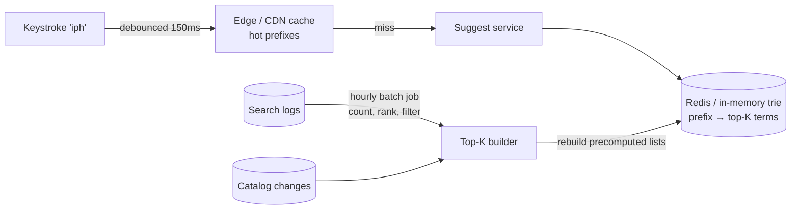

# 2026-07-26 — Search Autocomplete at Scale

> Suggestions must appear within ~100ms of every keystroke — that latency budget rules out ad-hoc LIKE queries and shapes the entire design around precomputed prefixes.

## Problem

The search box fires a request per keystroke. The first implementation:

```sql
SELECT term FROM products WHERE name LIKE 'iph%' ORDER BY popularity DESC LIMIT 10;
```

At 5k concurrent typers × ~3 keystrokes/sec, that's 15k queries/sec against the main database. Short prefixes (`i`, `ip`) match millions of rows that must be sorted by popularity every time. p99 hits 800ms; suggestions arrive after the user has finished typing — which is to say, never.

Autocomplete is its own system with its own data structure, not a query bolted onto the products table.

## Constraints

- **Latency:** p99 < 100ms end-to-end, including network
- **QPS:** 15k+ prefix lookups/sec
- **Freshness:** New trending terms appear within hours; catalog changes within minutes
- **Ranking:** By popularity/recency, not alphabetically; typo tolerance is a plus

## Architecture



Diagram source: [`diagrams/2026-07-26-search-autocomplete.mmd`](../diagrams/2026-07-26-search-autocomplete.mmd)

### The core idea — precompute top-K per prefix

Runtime work must be O(1): a single lookup of an already-ranked list. All the hard work (counting, ranking, filtering) moves to an offline pipeline.

```
"iphone 15 case" (popularity 9800) contributes to prefixes:
  i → ip → iph → ... → iphone 15 case

Store: prefix → [top 10 completions, pre-sorted by score]
Lookup at runtime: GET suggest:iph → done
```

Storage trade: every term of length L appears under L prefixes. Cap prefix length at ~8–10 chars (past that, prefix search on the live index is cheap anyway) and keep only top-K per prefix.

### Redis implementation sketch

```typescript
// Offline builder — runs hourly from search logs
async function buildPrefixLists(terms: Array<{ term: string; score: number }>) {
  const pipeline = redis.pipeline();
  for (const { term, score } of terms) {
    for (let len = 1; len <= Math.min(term.length, 10); len++) {
      const prefix = term.slice(0, len);
      pipeline.zadd(`suggest:${prefix}`, score, term);
      pipeline.zremrangebyrank(`suggest:${prefix}`, 0, -11); // keep top 10
    }
  }
  await pipeline.exec();
}

// Runtime — one O(log K) call
async function suggest(prefix: string): Promise<string[]> {
  return redis.zrevrange(`suggest:${prefix.toLowerCase()}`, 0, 9);
}
```

Alternative single-key design: one sorted set with score 0 and lexicographic `ZRANGEBYLEX` — memory-lean but ranking then needs a second pass. The per-prefix design spends memory to keep runtime trivial.

### Or let the search engine do it

Elasticsearch's `completion` suggester builds an in-memory FST (finite state transducer) at index time — prefix lookup with weights and fuzzy matching built in:

```json
PUT products/_doc/1
{ "suggest": { "input": ["iphone 15 case", "case iphone"], "weight": 9800 } }

POST products/_search
{ "suggest": { "s": { "prefix": "iph",
  "completion": { "field": "suggest", "fuzzy": { "fuzziness": 1 }, "size": 10 } } } }
```

Note the `input` array: FSTs match from the **beginning only**, so mid-phrase matching means indexing rotations/shingles yourself.

### Client-side rules (as important as the backend)

| Rule | Why |
|------|-----|
| **Debounce ~150–200ms** | Cuts request volume ~3× with no perceived lag |
| **Cancel stale requests** | Response for `ip` must never overwrite results for `iphone` (out-of-order arrival) |
| **Min 1–2 chars before firing** | Single-char prefixes are the most expensive and least useful |
| **Cache prefixes client-side** | Backspacing re-hits prefixes just seen |

CDN-cache the hottest prefixes with a short TTL (30–60s) — the head of the distribution is extremely concentrated, so even a tiny edge cache absorbs a large share of traffic.

### Ranking beyond raw popularity

```
score = log(search_count)            base popularity
      + recency_boost                trending decay (e.g. ×2 if hot this week)
      + personalization              user's category affinity (looked up at runtime)
      - demotion                     out-of-stock, policy-filtered terms
```

Keep runtime blending trivial (add a couple of numbers); anything heavier belongs in the offline builder. Always pass suggestions through a blocklist — autocomplete surfacing offensive queries is a classic PR incident.

## Trade-offs

| Choice | Pros | Cons |
|--------|------|------|
| **Precomputed prefix lists (Redis)** | O(1) runtime, full ranking control | Freshness = rebuild cadence; memory × prefix count |
| **ES completion suggester** | Fuzzy + weights out of the box | Prefix-anchored; index-time cost; heap usage |
| **In-process trie per node** | No network hop at all | Rebuild/distribution complexity; per-node memory |
| **SQL LIKE on the main DB** | Zero extra infra | Melts at real QPS — prototype only |

## When to use

- ✅ Precomputed top-K in Redis for product/query suggestions with custom ranking
- ✅ ES completion suggester if Elasticsearch is already in the stack
- ✅ Debounce + request cancellation on every client, regardless of backend

- ❌ Don't serve autocomplete from the transactional database
- ❌ Don't skip request cancellation — out-of-order responses show wrong suggestions
- ❌ Don't ship without a term blocklist and stock/policy filtering in the builder

## References

- [Redis — Auto-complete patterns (sorted sets)](https://redis.io/docs/latest/develop/data-types/sorted-sets/)
- [Elasticsearch — Completion suggester](https://www.elastic.co/guide/en/elasticsearch/reference/current/search-suggesters.html#completion-suggester)
- [Prefixy — how we built prefix autocomplete at scale](https://prefixy.github.io/)

---

**Tags:** `#autocomplete` `#search` `#redis` `#elasticsearch` `#latency` `#caching`
