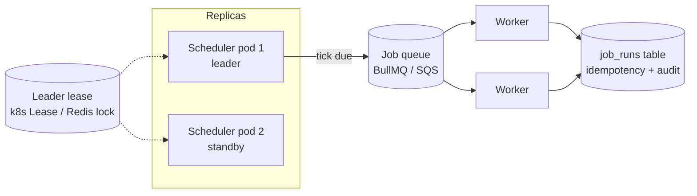

# 2026-07-27 — Distributed Cron and Job Scheduling

> One cron box is a single point of failure; cron on every replica runs everything N times. Scheduled work in a distributed system needs election, idempotency, and catch-up semantics.

## Problem

The nightly billing job lives in crontab on one VM. Two incidents in one quarter:

- The VM is rebooted for patching at 02:00 — billing silently doesn't run; nobody notices for three days
- The app is moved to Kubernetes with 6 replicas, each container inheriting the old cron sidecar — **customers are billed six times**

Add the subtler failures: a job still running when its next tick fires (overlap), a deploy at the scheduled moment (missed tick), and DST making 02:30 happen twice or never.

## Constraints

- **Exactly-one execution** per tick across all replicas
- **No SPOF:** Scheduler survives node loss; missed ticks are detected and handled
- **Overlap policy:** Long runs must not stack concurrent instances
- **Observability:** "Did last night's billing run?" answerable in one query

## Architecture



Diagram source: [`diagrams/2026-07-27-distributed-cron-job-scheduling.mmd`](../diagrams/2026-07-27-distributed-cron-job-scheduling.mmd)

### Separate the tick from the work

The core design move: the **scheduler** only decides "it's time" and enqueues a message; **workers** (stateless, horizontally scaled, retry-capable) do the work. Scheduling needs exactly-one; execution needs idempotency and retries — different problems, different tools.

### Getting exactly-one ticks

| Approach | Mechanism | Fit |
|----------|-----------|-----|
| **Leader election** | One replica holds a lease (k8s `Lease`, Redis `SET NX PX`); only the leader ticks | Self-hosted schedulers |
| **K8s CronJob** | The control plane is the elected scheduler | Anything already on Kubernetes |
| **DB-coordinated tick** | All replicas race an atomic claim; one wins | No extra infra beyond the DB |
| **Managed** (EventBridge Scheduler, Cloud Scheduler) | Cloud emits the tick | Serverless stacks |

The DB claim pattern needs no leader at all:

```sql
-- Every replica runs this each minute; exactly one gets the row
UPDATE scheduled_jobs
SET last_tick = now()
WHERE name = 'nightly-billing'
  AND next_run_at <= now()
RETURNING id;   -- got a row → you own this tick, enqueue it
```

Atomic single-row `UPDATE ... RETURNING` is the whole trick — the losers see zero rows and move on.

### Overlap and misfire policies

Every real scheduler needs an answer to two questions per job:

```
Overlap (previous run still going when next tick fires):
  forbid   — skip the new tick (billing, migrations)
  allow    — run concurrently (independent per-tick work)
  replace  — cancel the old run, start fresh (cache warmers)

Misfire (tick missed — scheduler was down / deploy in progress):
  fire immediately once   — billing must happen, even late
  skip                    — a missed cache refresh is irrelevant
  fire all missed         — almost never what you want
```

K8s CronJob expresses these as `concurrencyPolicy: Forbid|Allow|Replace` and `startingDeadlineSeconds`. If you build your own, these policies are the actual work.

### Idempotency at the execution layer

Ticks can still duplicate (lease expiry during a GC pause, redelivery). Workers dedupe on a deterministic run key:

```typescript
// Run key = job + scheduled tick, NOT wall-clock time
const runKey = `nightly-billing:2026-07-27T02:00Z`;

const claimed = await db.query(
  `INSERT INTO job_runs (run_key, status, started_at)
   VALUES ($1, 'running', now())
   ON CONFLICT (run_key) DO NOTHING`,
  [runKey],
);
if (!claimed.rowCount) return;   // another worker already ran this tick
```

The `job_runs` table doubles as the audit log — "did billing run?" is `SELECT status FROM job_runs WHERE run_key = ...`, and a monitor alerting on *absence* of a success row catches silent failures (the failure mode cron never covers).

### Timezones

Schedule in UTC unless the business explicitly needs local time ("9am for the customer"). If local: store the IANA zone per job and compute next-run through a proper tz library — DST transitions double-fire or skip naive `02:30` schedules once a year, always in production, always at night.

## Trade-offs

| Choice | Pros | Cons |
|--------|------|------|
| **K8s CronJob + queue** | Election solved by the platform | Per-job YAML; k8s-only |
| **In-app scheduler + DB claims** | No new infra; jobs versioned with app code | You own overlap/misfire logic |
| **Temporal / durable workflows** | Retries, backoff, history built in | Heavy dependency for plain cron |
| **Managed cloud scheduler** | Zero ops | Cloud lock-in; local dev friction |

## When to use

- ✅ Scheduler-enqueues / workers-execute split for anything beyond a hobby project
- ✅ Deterministic run keys + `job_runs` audit table — dedup and observability in one structure
- ✅ Absence-based alerting on critical jobs ("no billing success row by 03:00 → page")

- ❌ Don't run cron inside every app replica — the N-times bug is guaranteed
- ❌ Don't key idempotency on wall-clock start time — retries get different keys and re-run
- ❌ Don't leave overlap policy undefined — a slow night turns into stacked concurrent billing runs

## References

- [Kubernetes — CronJob concurrency and deadlines](https://kubernetes.io/docs/concepts/workloads/controllers/cron-jobs/)
- [Google SRE Book — Distributed periodic scheduling with cron](https://sre.google/sre-book/distributed-periodic-scheduling/)
- [BullMQ — Repeatable jobs](https://docs.bullmq.io/guide/jobs/repeatable)

---

**Tags:** `#scheduling` `#cron` `#distributed-systems` `#kubernetes` `#idempotency` `#reliability`
