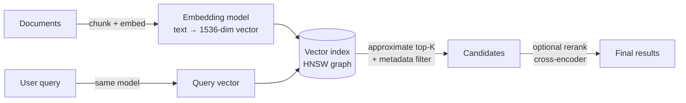

# 2026-07-28 — Vector Search and Embeddings

> Semantic search, RAG, and recommendations all reduce to one operation — find the nearest vectors to a query vector — and exact nearest-neighbor doesn't scale, so everything hinges on approximate indexes.

## Problem

Support search matches keywords only: a user typing "my payment didn't go through" finds nothing, because every relevant article says "transaction declined." Synonym lists patch one gap at a time and rot immediately.

Embeddings fix the matching problem — text becomes vectors where semantic similarity is geometric closeness — but create a scaling problem: comparing a query against 10M 1536-dimensional vectors by brute force is ~60GB of reads per query. And no B-tree, GIN, or geohash helps: high-dimensional space defeats all classical indexing (the curse of dimensionality).

## Constraints

- **Scale:** 10M documents, 100 QPS, p99 < 100ms
- **Recall:** ≥ 95% of true nearest neighbors (approximate is fine, wrong is not)
- **Freshness:** New documents searchable within seconds
- **Filtering:** Combine similarity with metadata (`tenant_id`, language, date)

## Architecture



Diagram source: [`diagrams/2026-07-28-vector-search-embeddings.mmd`](../diagrams/2026-07-28-vector-search-embeddings.mmd)

### ANN indexes — trading exactness for speed

| Index | Idea | Character |
|-------|------|-----------|
| **HNSW** | Multi-layer navigable graph; greedy descent from coarse to fine | Fast queries, high recall; memory-hungry; the default |
| **IVF** | Cluster vectors; probe only the nearest clusters | Less memory; recall depends on `nprobe`; needs training |
| **PQ / quantization** | Compress vectors (16×+ smaller); scan compressed | Combines with IVF/HNSW to fit RAM budgets |

HNSW's knobs are a straight recall/speed dial: `m` (graph connectivity) and `ef_search` (candidates explored per query). Tune against a ground-truth sample — recall isn't observable in production.

### pgvector — the "already have Postgres" answer

```sql
CREATE EXTENSION vector;

CREATE TABLE docs (
  id        bigint PRIMARY KEY,
  tenant_id uuid NOT NULL,
  content   text,
  embedding vector(1536)
);

CREATE INDEX ON docs USING hnsw (embedding vector_cosine_ops);

-- Top-10 semantically nearest, tenant-scoped
SELECT id, content, embedding <=> $1 AS distance
FROM docs
WHERE tenant_id = $2
ORDER BY embedding <=> $1
LIMIT 10;
```

Vectors live next to relational data: joins, transactions, RLS tenancy — one system. Honest limits: single-node memory bounds the index, and heavily-filtered queries can degrade (the index returns K candidates *before* the filter eats most of them — raise `hnsw.ef_search` or use iterative scan modes).

### Dedicated engines and when they earn their keep

Qdrant / Weaviate / Milvus / Pinecone add: filter-aware graph traversal (filtering *during* search, not after), horizontal sharding past single-node RAM, quantization tiers, and hybrid search built in. The operational cost is a second stateful system plus a sync pipeline from the source of truth — the same trade as Elasticsearch vs Postgres FTS, and the same answer: **start in Postgres, graduate on measured pain.**

### The parts that actually determine quality

```
Chunking      — embed ~200–500 token chunks, not whole documents;
                overlap chunks ~10–20%; store doc_id for context assembly
Model choice  — query and documents MUST use the same model + version;
                a model upgrade = full re-embed + reindex (plan for it)
Hybrid search — vectors miss exact identifiers ("error TS2345", SKUs);
                run BM25 + vector in parallel, merge with RRF
Reranking     — cheap ANN retrieves top-100; a cross-encoder reranks to
                top-10; biggest relevance win per engineering hour
```

Hybrid + rerank is the difference between a demo and a product: pure vector search on real workloads embarrasses itself on exact-match queries, and pure keyword search misses paraphrases — the merge covers both flanks.

## Trade-offs

| Choice | Pros | Cons |
|--------|------|------|
| **pgvector** | One database, transactions, RLS | Single-node ceiling; filter-recall interplay |
| **Dedicated vector DB** | Scale, filtered HNSW, hybrid built in | Second system + sync pipeline |
| **Brute force (no index)** | Perfect recall, zero tuning | Fine to ~100k vectors, then dead |
| **Managed (Pinecone)** | Zero ops | Cost at scale; data residency |

## When to use

- ✅ Semantic search, RAG retrieval, "similar items," dedup by meaning
- ✅ pgvector + HNSW up to a few million vectors with modest filters
- ✅ Hybrid (BM25 + vector + RRF) and a reranker for anything user-facing

- ❌ Don't brute-force past ~100k vectors or index-free demos become production incidents
- ❌ Don't mix embedding model versions between corpus and queries — results silently degrade
- ❌ Don't ship pure vector search where users type IDs, SKUs, or error codes — hybrid or bust

## References

- [pgvector — README](https://github.com/pgvector/pgvector)
- [HNSW paper — Malkov & Yashunin](https://arxiv.org/abs/1603.09320)
- [Qdrant — Filtrable HNSW design](https://qdrant.tech/articles/filtrable-hnsw/)

---

**Tags:** `#vector-search` `#embeddings` `#rag` `#pgvector` `#hnsw` `#search`
