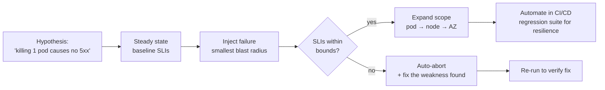

# 2026-07-29 — Chaos Engineering

> Your retry logic, failovers, and circuit breakers are untested claims until something actually fails — chaos engineering tests them on your schedule instead of at 3am.

## Problem

The architecture diagram says: replicas fail over, retries absorb blips, circuit breakers isolate slow dependencies. Then a routine AZ maintenance window reveals what was actually true:

- The failover works, but the connection pool caches dead IPs for 15 minutes
- Retries work, but three services' timeouts stack: 10s × 3 hops = 30s user-facing hangs
- The circuit breaker never opens, because its error threshold was tuned for an error rate nobody validated

Every one of these was discoverable in advance. The system's *designed* behavior and its *actual* behavior under failure had never been compared — that comparison is the entire discipline.

## Constraints

- **Safety:** Experiments must have a bounded blast radius and an instant abort
- **Realism:** Test in production eventually — staging never has real traffic patterns
- **Evidence over vibes:** Each experiment states a measurable hypothesis up front
- **Maturity gate:** Observability and SLOs must exist first — chaos without measurement is just breaking things

## Architecture



Diagram source: [`diagrams/2026-07-29-chaos-engineering.mmd`](../diagrams/2026-07-29-chaos-engineering.mmd)

### The experiment loop

1. **Define steady state** — the SLIs that mean "healthy" (checkout success rate, p99)
2. **Hypothesize** — "if we kill one payment pod, success rate stays ≥ 99.9%"
3. **Inject minimal failure** — one pod, one canary instance, 1% of traffic
4. **Measure against the hypothesis** — not "did it seem fine," but SLI numbers
5. **Abort automatically** if guardrail metrics breach; otherwise expand scope
6. **Fix what you find, re-run** — the experiment becomes a regression test

A chaos experiment with no hypothesis is an outage with extra steps.

### What to inject, in order of increasing courage

| Level | Failure | Typical finding |
|-------|---------|-----------------|
| 1 | Kill one pod/instance | Missing readiness gates; dropped in-flight requests |
| 2 | Add latency to a dependency (100–500ms) | Timeout stacking; missing budgets per hop |
| 3 | Fail a dependency entirely (DNS, 100% errors) | Circuit breakers that never open; infinite retries |
| 4 | Exhaust a resource (CPU, memory, disk, conns) | OOM-kill loops; pool starvation |
| 5 | Partition the network / kill an AZ | Split-brain; failover that needs a human |
| 6 | Region failure (game day) | The DR runbook's first real test |

Latency injection (level 2) finds the most bugs per unit of risk — distributed systems handle clean failure far better than slowness, and slowness is what production actually serves.

### Tooling

```
Kubernetes    → Chaos Mesh, LitmusChaos (CRD-driven: PodChaos, NetworkChaos)
AWS           → Fault Injection Service (managed, IAM-scoped, auto-rollback alarms)
Service mesh  → Istio fault injection (HTTP delays/aborts per route, % of traffic)
Legacy        → tc netem for latency, stress-ng for resources
```

```yaml
# Chaos Mesh: 200ms latency to the payment service, 10% of traffic, 5 min
apiVersion: chaos-mesh.org/v1alpha1
kind: NetworkChaos
spec:
  action: delay
  mode: fixed-percent
  value: "10"
  selector: { labelSelectors: { app: payment } }
  delay: { latency: 200ms, jitter: 50ms }
  duration: 5m
```

Istio's version needs no agents at all — a `VirtualService` with `fault: { delay: ... }` — the cheapest possible entry point if a mesh is already deployed.

### Production, guardrails, and game days

Staging chaos validates mechanics; only production chaos validates the system — real traffic, real data volumes, real cold caches. The discipline that makes it sane:

- **Business-hours only**, everyone informed, one experiment at a time
- **Guardrail metrics with auto-abort** — error budget burn triggers instant rollback of the injection
- **Canary scope first** — 1% of traffic, one AZ, never the whole fleet
- **Game days** for the human layer: does paging work, does the runbook exist, can on-call actually execute the failover? Half of every game day's findings are process bugs, not code bugs.

## Trade-offs

| Choice | Pros | Cons |
|--------|------|------|
| **Continuous automated chaos** | Resilience regressions caught like test failures | Requires mature observability + auto-abort |
| **Scheduled game days** | Tests humans and runbooks too | Point-in-time; drift between events |
| **Staging-only chaos** | Zero production risk | Validates staging, not the system |
| **No chaos** | No upfront cost | Failure modes discovered by customers |

## When to use

- ✅ After SLOs and dashboards exist — chaos consumes error budget deliberately
- ✅ Latency injection on every critical dependency as the first experiment
- ✅ Before trusting any failover story in an architecture review

- ❌ Don't run chaos without a hypothesis and an abort condition
- ❌ Don't start with "kill an AZ" — earn it through pod-level experiments first
- ❌ Don't run experiments the team didn't agree to — surprise chaos destroys the trust the practice needs

## References

- [Principles of Chaos Engineering](https://principlesofchaos.org/)
- [Netflix — Chaos Monkey and the Simian Army](https://netflixtechblog.com/the-netflix-simian-army-16e57fbab116)
- [AWS Fault Injection Service](https://docs.aws.amazon.com/fis/latest/userguide/what-is.html)

---

**Tags:** `#chaos-engineering` `#resilience` `#sre` `#kubernetes` `#reliability` `#testing`
