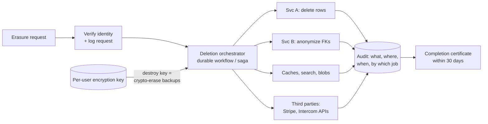

# 2026-07-30 — Data Deletion at Scale (GDPR Right to Erasure)

> "Delete this user" sounds like one DELETE statement — in a real system it's a distributed workflow across databases, caches, search indexes, queues, backups, and third parties, with a 30-day legal deadline.

## Problem

A user invokes GDPR Article 17. Their data lives in:

- PostgreSQL rows across 12 services (some with foreign keys to shared aggregates)
- Redis caches, Elasticsearch documents, S3 uploads and logs
- Kafka topics with 30-day retention, data warehouse snapshots
- Nightly backups retained 90 days — **longer than the compliance deadline**
- Stripe, Intercom, and an email provider

An engineer runs `DELETE FROM users WHERE id = $1` and reports done. Three months later the user's name resurfaces — restored from a backup after an incident, still indexed in search, still in a warehouse table. Each reappearance is a reportable violation.

## Constraints

- **Deadline:** Complete erasure within 30 days (extendable, but auditable)
- **Completeness:** Every store, every replica, every processor — provable, not assumed
- **Exemptions:** Financial/tax records must be *retained* — deletion must be selective
- **Referential sanity:** Erasing a user can't corrupt aggregates others depend on (orders, threads, analytics)

## Architecture



Diagram source: [`diagrams/2026-07-30-gdpr-deletion-at-scale.mmd`](../diagrams/2026-07-30-gdpr-deletion-at-scale.mmd)

### Prerequisite — a data map

You cannot delete what you can't find. The foundational artifact is a registry: *which services hold personal data, in which stores, keyed how*. Teams register their stores and expose a deletion endpoint; the orchestrator fans out to every registered handler. Without the registry, every erasure request is an archaeology project.

### Delete vs anonymize

Hard-deleting a user who has orders breaks accounting, aggregates, and other users' data (chat threads, reviews). The standard split:

```sql
-- PII tables: hard delete
DELETE FROM user_profiles WHERE user_id = $1;
DELETE FROM user_sessions WHERE user_id = $1;

-- Business records others depend on: anonymize in place
UPDATE orders SET
  customer_name  = 'Deleted User',
  email          = null,
  address        = null,
  user_id        = '00000000-0000-0000-0000-000000000000'
WHERE user_id = $1;
```

Anonymization counts as erasure **only if it's irreversible** — no lookup table mapping the tombstone back, no "deleted_users" side table quietly keeping the joins alive.

### The backup problem — crypto-shredding

Backups can't be surgically edited, and restoring one resurrects deleted users. The clean solution is **per-user envelope encryption**:

```
Encrypt each user's PII fields with a per-user data key.
Store keys in a KMS-backed keystore — NOT in the backups.
Erasure = destroy the user's key.
Every backup, replica, and cold snapshot becomes ciphertext garbage
for that user — no backup rewriting required.
```

Adopting this retroactively is a major migration, which is why it's a day-one architecture decision for anything user-heavy. The pragmatic fallback: document that backups expire in N days, exclude restored backups from serving until a **re-deletion replay** runs (keep erasure requests durable for exactly this).

### Orchestration — a saga with a deadline

Each store's deletion is a step that can fail independently; the workflow must survive partial failure, retry, and prove completion:

```typescript
// Durable workflow (Temporal-style pseudocode)
async function eraseUser(userId: string) {
  await verifyAndLog(userId);
  const results = await Promise.allSettled(
    registry.handlersFor(userId).map(h => h.delete(userId)), // idempotent, retried
  );
  await destroyUserKey(userId);              // crypto-erase backups
  await scheduleVerificationScan(userId, days(7)); // prove absence, don't assume
  await issueCertificate(userId, results);
}
```

Two details that separate compliant from hopeful: handlers are **idempotent** (the workflow will retry), and a later **verification scan** greps all stores for the identifier — deletion is asserted by evidence, not by return codes.

### The long tail everyone forgets

| Location | Handling |
|----------|----------|
| **Kafka topics** | Can't delete mid-log — rely on retention ≤ 30d, or compacted topics with null tombstones |
| **Logs with PII** | Shouldn't be there at all — scrub at emission; retention ≤ 30d as backstop |
| **Search indexes** | Explicit delete-by-id; reindex jobs must not resurrect from stale sources |
| **Data warehouse** | Delete from source tables; recompute or expire derived tables |
| **Third parties** | Stripe/Intercom deletion APIs — their confirmation goes in your audit log |
| **ML training sets** | Exclude on next retrain; document the cycle |

## Trade-offs

| Choice | Pros | Cons |
|--------|------|------|
| **Crypto-shredding** | Backups solved instantly; provable | Key infra complexity; day-one decision |
| **Anonymization** | Preserves aggregates and FKs | Must be provably irreversible |
| **Hard delete everywhere** | Conceptually simple | Breaks referential integrity; backups still leak |
| **Retention-based expiry only** | No workflow needed | 30-day deadline vs 90-day backups doesn't reconcile |

## When to use

- ✅ Data registry + per-service deletion endpoints before the first erasure request, not after
- ✅ Crypto-shredding for new systems with heavy PII
- ✅ Durable orchestration + verification scans + audit certificates

- ❌ Don't treat `DELETE FROM users` as compliance — the copies are the problem
- ❌ Don't let PII into logs and analytics events; deleting from append-only stores is misery
- ❌ Don't forget third parties — their copy of the data is legally your problem

## References

- [GDPR Article 17 — Right to erasure](https://gdpr-info.eu/art-17-gdpr/)
- [AWS — Crypto-shredding with envelope encryption](https://docs.aws.amazon.com/wellarchitected/latest/financial-services-industry-lens/use-cryptographic-erasure-methods.html)
- [Stripe — Deleting customer data](https://docs.stripe.com/privacy-center/legal)

---

**Tags:** `#gdpr` `#privacy` `#data-deletion` `#crypto-shredding` `#compliance` `#architecture`
