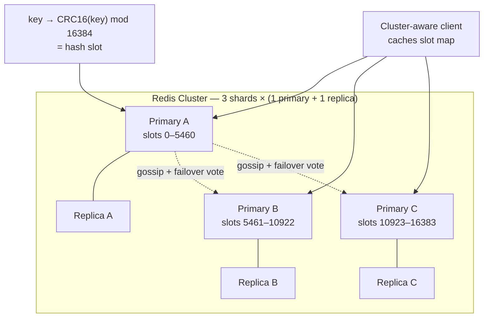

# 2026-07-31 — Scaling Redis: Cluster, Sentinel, and Their Sharp Edges

> One Redis node eventually hits a wall — memory, throughput, or blast radius. The scaling paths (replicas, Sentinel, Cluster) each change the guarantees your code can rely on.

## Problem

A single Redis instance backs caching, sessions, queues, and rate limiting. Growth exposes three separate ceilings:

- **Memory:** the dataset crosses 60GB; one box can't hold it (and BGSAVE forks double peak RSS)
- **Throughput:** 300k ops/sec saturates the single command-processing thread
- **Availability:** one process restart drops sessions and stampedes the database

The instinctive fix — "just enable Redis Cluster" — quietly breaks code: multi-key operations (`MGET`, transactions, Lua scripts spanning keys) stop working across shards, and pipelines start throwing `MOVED` errors.

## Constraints

- **Dataset:** 100GB working set, growing ~10%/month
- **Throughput:** 500k ops/sec target, mostly reads
- **Availability:** Automatic failover < 10s; no manual paging for node loss
- **Compatibility:** Existing Lua scripts and multi-key ops must be audited, not assumed

## Architecture



Diagram source: [`diagrams/2026-07-31-redis-cluster-scaling.mmd`](../diagrams/2026-07-31-redis-cluster-scaling.mmd)

### The three scaling stages

| Stage | Solves | Doesn't solve |
|-------|--------|---------------|
| **Read replicas** | Read throughput; warm standby | Memory ceiling; write throughput; auto-failover |
| **Sentinel** (replicas + quorum watchdog) | Automatic failover | Memory ceiling; write throughput |
| **Cluster** (sharding, 16384 slots) | Memory + write scaling + failover | Multi-key ops across shards; client simplicity |

Take the earliest stage that solves the actual bottleneck — each step up costs real operational and code complexity.

### How Cluster shards

Every key maps to one of 16,384 hash slots via `CRC16(key) % 16384`; slots are distributed across primaries. Clients cache the slot→node map and go directly to the right shard; a `MOVED` reply after resharding refreshes the map. There is no proxy tier in OSS cluster — the client library does the routing, which is why using a **cluster-aware client** is non-negotiable.

### The multi-key problem and hash tags

Cross-slot operations fail:

```
MGET user:1:name user:2:name        → CROSSSLOT error (different slots)
EVAL "... KEYS[1] KEYS[2] ..."      → all keys must live on one slot
```

Hash tags force co-location — only the substring in `{braces}` is hashed:

```
cart:{user:42}:items    ┐
cart:{user:42}:coupon   ├── same slot → MULTI, Lua, MGET all work
profile:{user:42}       ┘
```

Design the keyspace around the entity you need atomicity for. The trap: tagging too broadly (`{tenant:big-corp}`) recreates the hot-partition problem — one giant tenant pins to one shard.

### Failover and the honest durability caveat

Cluster failover is built in: replicas detect a dead primary via gossip, the remaining primaries vote, a replica promotes (typically < 10s). Two things to internalize:

- **Replication is async** — a failed-over primary loses its last unreplicated writes. Redis is not the system of record; anything that must survive belongs in a database (or accept `WAIT` for quorum acknowledgment at a latency cost).
- **Minimum topology is 3 primaries + 3 replicas** — failover requires a primary majority; two-node "clusters" cannot vote.

### Operational sharp edges

| Edge | Reality |
|------|---------|
| **Resharding** | Online but slow; large keys block the migration; do it during low traffic |
| **Hot shard** | One hot key still lands on one node — cluster doesn't fix skewed access |
| **Big keys** | A 2GB hash blocks its shard during migration/eviction — cap value sizes |
| **Pipelines** | Only within one slot/node; cluster clients split them, costing round-trips |
| **`KEYS` / `SCAN`** | Per-node only; cluster-wide scans mean iterating every primary |
| **Client libraries** | ioredis/lettuce handle `MOVED`/`ASK`; hand-rolled clients silently misroute |

### Do you even need Cluster?

Before sharding, check the cheaper exits: split workloads onto **separate single Redises** (cache vs queues vs rate limiting — they have different SLAs anyway), trim memory (TTLs, shorter keys, hashes for small objects), or move oversized values to object storage with a pointer in Redis. A 100GB "dataset" is often 30GB of live data and 70GB of missing TTLs.

## Trade-offs

| Choice | Pros | Cons |
|--------|------|------|
| **Sentinel + replicas** | HA with full command compatibility | Single-node memory/write ceiling remains |
| **Cluster** | Linear memory + write scaling, built-in failover | Multi-key restrictions; keyspace redesign; ops weight |
| **Managed (ElastiCache, MemoryDB)** | Failover/resharding operated for you | Cost; version lag; same client-side constraints |
| **Workload split (multiple Redises)** | Trivial; isolates blast radius | Doesn't scale a single huge dataset |

## When to use

- ✅ Sentinel when the need is availability, not capacity
- ✅ Cluster when the dataset or write load genuinely exceeds one node
- ✅ Hash tags designed around atomicity entities from day one of the migration

- ❌ Don't enable Cluster without auditing every MULTI, Lua script, and multi-key command
- ❌ Don't treat any Redis topology as durable storage — async replication loses tail writes
- ❌ Don't shard your way out of a hot key or a missing-TTL memory leak — fix the access pattern first

## References

- [Redis — Cluster specification](https://redis.io/docs/latest/operate/oss_and_stack/reference/cluster-spec/)
- [Redis — Sentinel documentation](https://redis.io/docs/latest/operate/oss_and_stack/management/sentinel/)
- [AWS — ElastiCache best practices](https://docs.aws.amazon.com/AmazonElastiCache/latest/dg/BestPractices.html)

---

**Tags:** `#redis` `#cluster` `#sharding` `#high-availability` `#caching` `#scaling`
