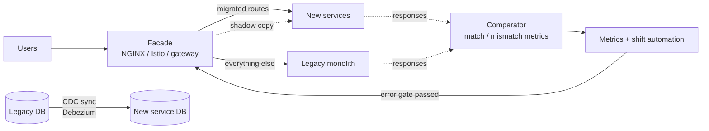

# 2026-08-01 — Implementing the Strangler Fig: Facade, Shadow Mode, and Automated Cutover

> The concept is easy — route slices of traffic away from the monolith until nothing is left. This is the implementation playbook: what the facade actually looks like, how to prove the new service matches the old one, and how to shift traffic without a human watching dashboards all night.

*Concept and when-to-use covered in [2026-06-09 — Strangler Fig Migration](2026-06-09-strangler-fig-migration.md). This note is the execution guide.*

## Problem

The team agreed on strangler fig. Then the practical questions start:

- Where does routing live, and how does a route flip from legacy to new without a deploy?
- How do you **know** the new orders service returns the same answers as 12 years of accumulated edge cases — before customers find out?
- Both systems need the same data during the transition — who owns writes?
- Who babysits the 10% → 25% → 50% canary, and what triggers rollback at 2am?

Most stalled migrations die on these mechanics, not on the pattern.

## Constraints

- **Reversibility:** Any cutover undone by one config change, in seconds
- **Evidence:** Response parity measured on real production traffic, not staging tests
- **Data:** One system owns writes per table at any moment — no ambiguous dual-ownership
- **Automation:** Traffic shifting driven by error-rate gates, not vigilance

## Architecture



Diagram source: [`diagrams/2026-08-01-strangler-fig-implementation.mmd`](../diagrams/2026-08-01-strangler-fig-implementation.mmd)

### The facade — routing as data, not code

The facade is any layer that can route by path and change its mind cheaply. NGINX's `map` keeps the routing table declarative:

```nginx
map $request_uri $backend {
    ~^/api/users      new_user_service;     # migrated
    ~^/api/products   new_product_service;  # migrated
    default           legacy_backend;       # everything else
}

server {
    location /api/ {
        proxy_pass http://$backend;
        add_header X-Served-By $backend;   # every response says who answered
    }
}
```

Percentage rollout without a mesh — `split_clients` hashes each client to a stable bucket:

```nginx
split_clients "${remote_addr}" $orders_backend {
    10%   new_orders_service;
    *     legacy_backend;
}
```

The `X-Served-By` header is disproportionately valuable: every bug report during migration starts with "which system served this?"

### Shadow mode — proving parity on production traffic

Before the new service serves anyone, mirror traffic to it and compare answers. The user always gets the legacy response; the comparison happens off the critical path:

```typescript
async function shadow(req: Request, res: Response) {
  const [legacy, candidate] = await Promise.allSettled([
    forward(LEGACY_URL, req),
    forward(NEW_URL, req),
  ]);

  respondWith(res, legacy);              // user sees legacy, always

  setImmediate(() => {                   // compare async — never block the response
    const verdict = compare(legacy, candidate, {
      ignore: ['generated_at', 'trace_id', 'server_version'],
    });
    metrics.increment(`shadow.${verdict}`, { path: req.route });
    if (verdict === 'mismatch') log.warn({ path: req.path, legacy, candidate });
  });
}
```

Two rules that make shadow mode honest:
- **Normalize before diffing** — timestamps, IDs, and field ordering produce false mismatches that train the team to ignore the signal
- **Shadow reads only, or stub side effects** — mirrored POSTs must not send duplicate emails or charge cards twice; give the shadow target a no-op mode for external effects

Gate promotion on numbers: e.g. ≥ 99.9% match rate over 7 days of production traffic before the first real user hits the new path.

### Data during the transition

```
Phase 1 — shared DB:     new service reads/writes legacy schema directly
                          (via anti-corruption layer). Fastest start, zero sync.
Phase 2 — CDC sync:      new service gets its own DB; Debezium streams
                          legacy WAL → Kafka → new DB. Legacy still owns writes.
Phase 3 — write cutover: new service owns writes for its tables;
                          reverse CDC feeds legacy until it's retired.
```

The invariant across all phases: **exactly one system owns writes for a given table at any time.** App-level dual-writes are the classic failure — a crash between the two writes diverges the stores silently. CDC from the WAL (covered in [2026-07-09](2026-07-09-change-data-capture-debezium.md)) makes the sync transactional with the source.

### Anti-corruption layer — keep the legacy model out

The new service should not import `USER_ID`, `STATUS_CODE = 'A'`, and XML preference blobs into its domain. One translation module owns the mapping at the boundary, in both directions:

```typescript
const STATUS: Record<string, UserStatus> = { A: 'active', I: 'inactive', P: 'pending' };

export function fromLegacy(row: LegacyUserRow): User {
  return {
    id: row.USER_ID,
    email: row.EMAIL_ADDRESS.toLowerCase(),
    fullName: `${row.FIRST_NAME} ${row.LAST_NAME}`.trim(),
    status: STATUS[row.STATUS_CODE] ?? 'unknown',
  };
}
// toLegacy(): the inverse, for as long as legacy consumers remain
```

Without the ACL, legacy naming and semantics leak into the new codebase — and the migration faithfully reproduces the system it was meant to replace.

### Automated traffic shifting with rollback gates

Istio weights (or any weighted router) plus a loop that checks error rates between steps:

```
weights: 5 → 25 → 50 → 75 → 100, soak 10 min each

per step:
  patch VirtualService weights
  wait soak period
  query Prometheus: 5xx rate + p99 for the NEW backend vs the LEGACY baseline
  breach → set weights back to legacy=100, page the team, stop
  clean  → next step
```

This is the same machinery as canary deploys ([2026-07-04](2026-07-04-canary-deployments.md)) — Argo Rollouts or Flagger runs this loop natively if you'd rather not script it. The property that matters: **rollback is a weight change, not a deploy** — seconds, not minutes.

### Migration dashboard

| Metric | Question it answers |
|--------|---------------------|
| Requests by `X-Served-By` per route | What % of traffic still hits legacy? |
| Shadow match rate per route | Is the new service ready for real traffic? |
| Error rate + p99, legacy vs new | Is the new path actually better? |
| Routes migrated / total | Is the migration moving or stalled? |

The last one is political as much as technical — a visible progress gauge is what keeps a multi-quarter migration funded.

## Trade-offs

| Choice | Pros | Cons |
|--------|------|------|
| **NGINX facade** | Simple, fast, no new infra | Config reloads; % split is per-client hash only |
| **Service mesh routing** | Weighted shifts + metrics without code | Mesh operational cost if not already present |
| **Shadow mode** | Catches what tests can't — real traffic | Double load on dependencies; side-effect discipline |
| **Shared DB phase first** | Ship the first slice in weeks | ACL must guard the schema boundary rigorously |

## When to use

- ✅ Shadow mode before every cutover that changes business logic
- ✅ CDC over app-level dual-writes for the data transition
- ✅ Automated shift-with-rollback for every traffic increment past 5%

- ❌ Don't mirror side-effecting traffic without stubbing external calls
- ❌ Don't let two systems write the same table — pick an owner per phase
- ❌ Don't skip the ACL "to save time" — the legacy model will colonize the new service

## References

- [Nawaz Dhandala — How to Implement the Strangler Fig Pattern](https://oneuptime.com/blog)
- [Martin Fowler — Strangler Fig Application](https://martinfowler.com/bliki/StranglerFigApplication.html)
- [Flagger — Progressive delivery operator](https://flagger.app/)
- [GitHub — Scientist (parallel-run comparison library)](https://github.com/github/scientist)

---

**Tags:** `#strangler-fig` `#migration` `#shadow-testing` `#istio` `#cdc` `#legacy`
