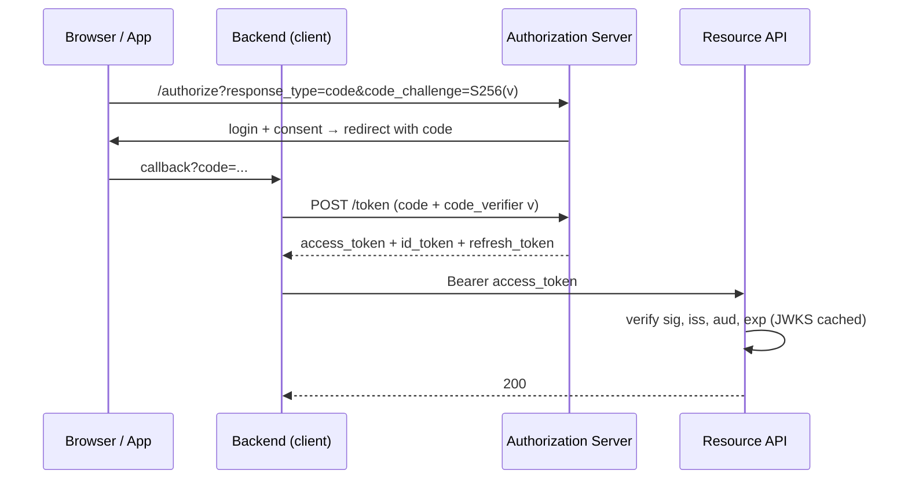

# 2026-08-02 — OAuth 2.0 and OIDC Flows in Practice

> OAuth is authorization, OIDC is authentication on top of it — and nearly every integration bug traces back to picking the wrong flow or validating the wrong token.

## Problem

A product needs "Sign in with Google," a partner API, machine-to-machine service calls, and a CLI tool. The team reaches for OAuth and immediately hits the swamp:

- The SPA stores an access token in localStorage; an XSS one-liner exfiltrates it
- The mobile app embeds a client secret — extracted from the APK within a week of launch
- The backend accepts any Google-signed token, including tokens minted for **someone else's app**
- Machine-to-machine calls run through a browser-redirect flow that makes no sense headless

OAuth isn't one flow — it's a family, and each client type gets exactly one right answer.

## Constraints

- **Client zoo:** SPA, native mobile, server-rendered web, CLI, service-to-service
- **Token theft:** Assume XSS on web clients; assume decompiled binaries on mobile
- **Validation:** Every token check verifies signature, issuer, audience, expiry — no shortcuts
- **Sessions:** Refresh without re-login; revocation within minutes

## Architecture



Diagram source: [`diagrams/2026-08-02-oauth2-oidc-flows.mmd`](../diagrams/2026-08-02-oauth2-oidc-flows.mmd)

### Flow selection — one right answer per client

| Client | Flow | Why |
|--------|------|-----|
| Server-rendered web app | **Authorization Code** | Secret stays server-side |
| SPA | **Authorization Code + PKCE** (or BFF) | No secret in the browser; PKCE binds code to the initiator |
| Native mobile | **Authorization Code + PKCE** | Binaries can't keep secrets; system browser, not webview |
| Service-to-service | **Client Credentials** | No user, no redirect — direct token exchange |
| CLI / TV / IoT | **Device Code** | User authorizes on a second device |
| ~~Anything~~ | ~~Implicit / Password grant~~ | Deprecated — tokens in URLs, credentials proxied |

PKCE (Proof Key for Code Exchange) is the load-bearing upgrade: the client sends `SHA256(verifier)` on the authorize call and the raw `verifier` on the token call, so an intercepted authorization code is useless without the verifier. OAuth 2.1 makes it mandatory for **all** clients, confidential ones included.

### OAuth vs OIDC — which token is which

```
access_token  → for the API. Opaque or JWT. The API validates it.
                Says: "this caller may do X."
id_token      → for the client. Always JWT. Proves who logged in.
                NEVER send it to APIs; NEVER use it for API authz.
refresh_token → for the auth server only. Long-lived, rotated on use.
```

The classic confusion: treating an `id_token` as an API credential. It authenticates the *user to the client* — its audience is the client ID, so an API accepting it is accepting a token minted for someone else.

### Token validation — where integrations actually break

```typescript
import { createRemoteJWKSet, jwtVerify } from 'jose';

const jwks = createRemoteJWKSet(new URL('https://auth.example.com/.well-known/jwks.json'));

async function validate(token: string) {
  const { payload } = await jwtVerify(token, jwks, {
    issuer: 'https://auth.example.com',   // exactly your tenant — not "any Google token"
    audience: 'https://api.example.com',  // minted for THIS API, not another client
    algorithms: ['RS256'],                // never trust the token's own alg header
  });
  return payload;
}
```

The three checks people skip and regret, in incident-frequency order: **audience** (accepting tokens issued for a different app), **issuer** (accepting any IdP tenant), and **algorithm pinning** (the `alg: none` family of attacks). JWKS keys rotate — fetch by `kid` with caching, don't hardcode.

### Keeping browser sessions safe — the BFF pattern

Even with PKCE, tokens living in browser storage are XSS food. The pattern that sidesteps the whole class: a thin **backend-for-frontend** holds the tokens server-side and gives the SPA only an `httpOnly` session cookie. Combine with refresh-token rotation (reuse of a rotated token nukes the session family — theft becomes detection, as in [2026-07-14](2026-07-14-jwt-vs-sessions.md)).

### Scopes are not permissions

`scope: orders:read` says what the *client app* may request on the user's behalf — it doesn't say this user can read order 42. Resource-level authorization (tenancy, ownership, roles) stays in your API. Treating scopes as a full permission system ends with either scope explosion or authorization holes.

## Trade-offs

| Choice | Pros | Cons |
|--------|------|------|
| **Managed IdP** (Auth0, Cognito, Entra) | Standards kept current for you | Cost, per-MAU pricing, migration lock-in |
| **Self-hosted** (Keycloak, Ory) | Control, no per-user cost | You patch the most attacked component you run |
| **BFF for SPAs** | Tokens never touch the browser | One more deployable; session state |
| **Pure SPA + PKCE** | No backend needed | Tokens in JS memory at best; XSS surface |

## When to use

- ✅ Authorization Code + PKCE for every user-facing client, no exceptions
- ✅ Client Credentials for service-to-service — never a shared user account
- ✅ Full `iss`/`aud`/`exp`/signature validation at every API, via JWKS

- ❌ Don't use implicit flow or password grant — deprecated for concrete exploit reasons
- ❌ Don't send id_tokens to APIs or accept them there
- ❌ Don't derive object-level permissions from scopes — that's your API's job

## References

- [OAuth 2.1 draft — consolidated best practices](https://oauth.net/2.1/)
- [RFC 7636 — PKCE](https://www.rfc-editor.org/rfc/rfc7636)
- [OpenID Connect Core spec](https://openid.net/specs/openid-connect-core-1_0.html)

---

**Tags:** `#oauth2` `#oidc` `#authentication` `#security` `#pkce` `#api-design`
