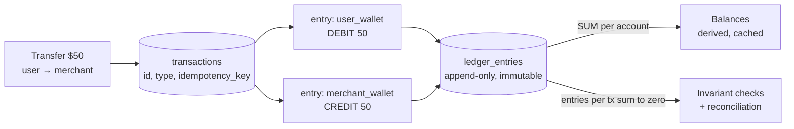

# 2026-08-03 — Double-Entry Ledgers for Payment Systems

> Storing money as a mutable `balance` column guarantees eventual unexplainable drift — a double-entry ledger makes every cent traceable and every bug reconstructable.

## Problem

The wallet service stores `users.balance` and mutates it: `UPDATE users SET balance = balance - 50`. Six months in:

- Finance asks why total user balances differ from the payment provider's settlement report by $3,412 — **nobody can answer**, because balances have no history
- A retried webhook credited a deposit twice; the evidence is gone, overwritten by later updates
- A refund bug subtracted instead of adding for a week — reconstructing affected accounts means archaeology through application logs

A single mutable number is a running total with amnesia. Accounting solved this ~700 years ago: record **movements**, never edit them, and derive balances.

## Constraints

- **Auditability:** Any balance explainable as a sum of immutable entries
- **Invariant:** Money is never created or destroyed by a bug — only moved
- **Concurrency:** Parallel transfers on one account without lost updates
- **Performance:** Balance reads in milliseconds even with millions of entries

## Architecture



Diagram source: [`diagrams/2026-08-03-double-entry-ledgers.mmd`](../diagrams/2026-08-03-double-entry-ledgers.mmd)

### The model — two tables, three rules

```sql
CREATE TABLE transactions (
  id               uuid PRIMARY KEY,
  type             text NOT NULL,            -- deposit, transfer, refund...
  idempotency_key  text UNIQUE NOT NULL,
  created_at       timestamptz NOT NULL DEFAULT now()
);

CREATE TABLE ledger_entries (
  id               bigint GENERATED ALWAYS AS IDENTITY PRIMARY KEY,
  transaction_id   uuid NOT NULL REFERENCES transactions(id),
  account_id       uuid NOT NULL,
  direction        text NOT NULL CHECK (direction IN ('debit','credit')),
  amount           bigint NOT NULL CHECK (amount > 0),   -- minor units; never float
  created_at       timestamptz NOT NULL DEFAULT now()
);
-- No UPDATE or DELETE grants on ledger_entries. Ever.
```

The rules that make it a ledger and not just a log:

1. **Every transaction's entries sum to zero** (debits = credits) — money moves, it doesn't appear
2. **Entries are immutable** — corrections are new reversing entries, so the mistake *and* the fix are both visible forever
3. **External money gets its own accounts** — deposits debit a `provider_settlement` account and credit the user, so even money entering the system balances

```typescript
async function transfer(from: string, to: string, amount: bigint, idemKey: string) {
  await db.transaction(async (tx) => {
    const t = await tx.query(
      `INSERT INTO transactions (id, type, idempotency_key)
       VALUES (gen_random_uuid(), 'transfer', $1)
       ON CONFLICT (idempotency_key) DO NOTHING RETURNING id`, [idemKey]);
    if (!t.rowCount) return;                          // retried webhook → no-op

    await assertSufficientBalance(tx, from, amount);  // under SELECT ... FOR UPDATE
    await tx.query(
      `INSERT INTO ledger_entries (transaction_id, account_id, direction, amount)
       VALUES ($1, $2, 'debit', $3), ($1, $4, 'credit', $3)`,
      [t.rows[0].id, from, amount, to]);
  });
}
```

Idempotency lives on the transaction ([2026-07-20](2026-07-20-exactly-once-delivery.md)) — the double-credit-on-retry bug becomes structurally impossible.

### Fast balances without losing the audit trail

`SUM(entries)` over 10M rows per read doesn't fly. The standard fix is **periodic snapshots**:

```sql
CREATE TABLE balance_snapshots (
  account_id     uuid,
  balance        bigint,
  last_entry_id  bigint,        -- high-water mark
  PRIMARY KEY (account_id, last_entry_id)
);

-- balance = latest snapshot + SUM(entries newer than the mark)
```

Snapshot nightly (or per N entries); reads sum a handful of recent rows. A cached `current_balance` column is fine too — as a **derived value verified against the ledger**, never as the source of truth.

### Reconciliation — the payoff

Because everything is entries, correctness checks are one-line queries you run continuously:

```
Per-transaction zero-sum:  entries grouped by transaction_id must sum to 0
System-wide:               sum of all user accounts = sum of settlement accounts (negated)
External:                  provider_settlement account vs the provider's daily report
```

That $3,412 discrepancy stops being a mystery — it's a diff that points at specific transactions on a specific day.

### Build vs adopt

Purpose-built ledger databases (TigerBeetle) handle millions of transfers/sec with the invariants enforced natively; frameworks like Blnk or Formance give you the schema and API on Postgres. The Postgres DIY above is fine for most SaaS wallet/credits use cases — the discipline matters more than the engine.

## Trade-offs

| Choice | Pros | Cons |
|--------|------|------|
| **Double-entry ledger** | Full audit, reconciliation, retry-safe | More rows, more concepts, balance derivation |
| **Mutable balance column** | Trivial reads | No history; drift is undetectable and unexplainable |
| **Event sourcing (general)** | Same auditability, broader scope | Heavier machinery than money needs |
| **TigerBeetle / ledger DB** | Invariants + extreme throughput built in | New specialized dependency |

## When to use

- ✅ Anything holding user money, credits, points, or quotas that finance will ever ask about
- ✅ Integer minor units (cents) — floating point in a ledger is malpractice
- ✅ Continuous invariant checks wired to alerts, not quarterly audits

- ❌ Don't allow UPDATE/DELETE on entries — corrections are reversing entries
- ❌ Don't let a cached balance become the source of truth — it's a materialized view of the ledger
- ❌ Don't model external money as balance mutations — give providers their own accounts

## References

- [Modern Treasury — Ledgers 101](https://www.moderntreasury.com/learn/what-is-a-ledger)
- [TigerBeetle — design docs](https://docs.tigerbeetle.com/)
- [Square — Books, an immutable double-entry ledger](https://developer.squareup.com/blog/books-an-immutable-double-entry-accounting-database-service/)

---

**Tags:** `#ledger` `#payments` `#double-entry` `#postgresql` `#fintech` `#audit`
