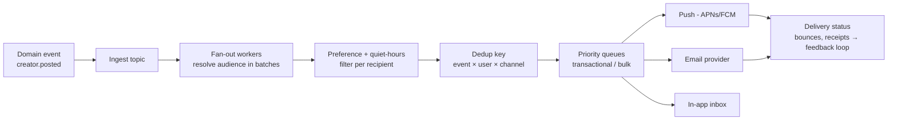

# 2026-08-04 — Notification Fan-Out at Scale

> One event, potentially millions of recipients, four delivery channels, per-user preferences, and quiet hours — notification systems are fan-out engines with a compliance problem, not "just send an email."

## Problem

"Notify followers when a creator posts" ships as a loop over followers calling the email API inline. Then reality:

- A creator with 2M followers posts — the request times out after notifying 40k people, **twice** for some, because the retry restarted the loop
- Users get the same alert on push, email, and in-app simultaneously; unsubscribes spike
- Marketing sends a blast at 4am local time for half the user base
- The email provider rate-limits at 100/sec; the queue behind it backs up for 9 hours, delaying password-reset emails behind the marketing blast

## Constraints

- **Scale:** Single events fanning out to millions; steady-state 50k notifications/min
- **Priority:** Transactional (reset password, 2FA) never queues behind bulk
- **Preferences:** Per-user, per-channel, per-category opt-outs; quiet hours by timezone
- **Dedup:** At-least-once pipeline, but a user sees one notification per event per channel

## Architecture



Diagram source: [`diagrams/2026-08-04-notification-fanout.mmd`](../diagrams/2026-08-04-notification-fanout.mmd)

### Stage 1 — decouple trigger from fan-out

The publishing request emits **one** event and returns. Fan-out workers expand the audience asynchronously, in pages:

```typescript
// Worker: expand audience in cursor-paginated batches — resumable, not a loop in a request
async function fanOut(event: CreatorPostedEvent) {
  let cursor: string | null = null;
  do {
    const page = await followers.page(event.creatorId, cursor, 1000);
    await queue.addBulk(page.userIds.map(userId => ({
      name: 'notify',
      data: { eventId: event.id, userId, category: 'creator_post' },
      opts: { jobId: `${event.id}:${userId}` },   // dedup at the queue layer
    })));
    cursor = page.nextCursor;
    await checkpoint(event.id, cursor);            // crash-safe resume point
  } while (cursor);
}
```

The checkpoint is what fixes the "timed out and restarted" bug: a crashed fan-out resumes from the last page, and the deterministic `jobId` makes re-enqueued pages no-ops ([2026-07-20](2026-07-20-exactly-once-delivery.md)).

### Stage 2 — the per-recipient decision

Each queued job runs the gauntlet before anything sends:

```
1. Category opt-out?          user disabled 'creator_post' → drop
2. Channel selection          prefers push; email only as fallback
3. Quiet hours                22:00–08:00 in user's tz → schedule, don't drop
4. Frequency cap / digest     4th notification this hour → fold into digest
5. Dedup                      SETNX sent:{event}:{user}:{channel} → skip if set
```

Channel *orchestration* beats channel *broadcast*: send push first, and only send email if the push isn't opened within 30 minutes. Cuts notification fatigue and provider spend at the same time.

### Stage 3 — priority isolation

One queue per priority class, separate workers, separate provider rate budgets:

```
transactional   → own queue, own workers, own (higher) provider quota
product alerts  → normal queue
bulk/digest     → throttled queue, paced to provider limits
```

This is bulkhead thinking ([2026-06-16](2026-06-16-bulkhead-pattern.md)) applied to notifications — the marketing blast physically cannot delay a password reset because they don't share a lane. Pace bulk sends to the provider's rate limit at the consumer (token bucket), rather than letting the provider's 429s do the pacing.

### Stage 4 — feedback loops (the part that keeps email working)

| Signal | Action |
|--------|--------|
| **Hard bounce** | Suppress the address permanently — retrying burns sender reputation |
| **Spam complaint** | Global opt-out immediately; investigate the campaign |
| **APNs/FCM invalid token** | Delete the device token; stale tokens waste quota |
| **Opens/clicks** | Feed channel orchestration and digest decisions |

Skipping bounce handling is how a domain lands on a blocklist — at which point *transactional* email stops delivering too, and that's a company-level incident.

### In-app inbox — the different one

Push and email are fire-and-forget; the in-app inbox is **stateful** (read/unread, list, badge count). Store inbox entries as rows, fan out the badge over WebSocket/SSE ([2026-06-26](2026-06-26-long-polling-sse-websockets.md)). For huge audiences, hybrid fan-out applies here exactly as it does for feeds ([2026-07-12](2026-07-12-hot-partitions-celebrity-problem.md)): write per-user rows for normal events, merge celebrity events at read time.

## Trade-offs

| Choice | Pros | Cons |
|--------|------|------|
| **Build (queues + workers)** | Full control, no per-notification pricing | Preferences, digests, feedback loops are months of work |
| **Notification platform** (Knock, Courier, Novu) | Preference center + orchestration out of the box | Per-event pricing; another external dependency |
| **Provider-direct (SES/FCM inline)** | Simplest start | Every problem above, rediscovered one incident at a time |

## When to use

- ✅ Paginated, checkpointed fan-out with deterministic dedup keys from day one
- ✅ Priority-isolated queues before the first marketing blast, not after
- ✅ Bounce/complaint handling wired before volume grows — reputation doesn't recover fast

- ❌ Don't fan out inside the triggering request — the 2M-follower creator will find you
- ❌ Don't broadcast to all channels at once — orchestrate with fallbacks
- ❌ Don't ignore quiet hours and frequency caps — unsubscribe is permanent, annoyance compounds

## References

- [Knock — Notification system design guide](https://knock.app/blog/how-to-design-a-notification-system)
- [AWS SES — Bounce and complaint handling](https://docs.aws.amazon.com/ses/latest/dg/monitor-sending-activity.html)
- [Discord — How we scale message notifications](https://discord.com/blog)

---

**Tags:** `#notifications` `#fan-out` `#queues` `#email` `#push` `#scaling`
