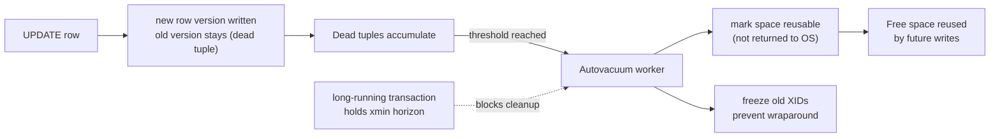

# 2026-08-05 — PostgreSQL VACUUM, Bloat, and Autovacuum Tuning

> Postgres never updates a row in place — every UPDATE writes a new version and leaves the old one behind. VACUUM is the garbage collector, and when it falls behind, tables silently triple in size and queries crawl.

## Problem

A busy `jobs` table (constant status updates) degrades over weeks:

- The table holds 2M live rows but occupies **40GB** — queries read mostly dead space
- p99 on an indexed lookup creeps from 5ms to 90ms with no code change
- Autovacuum runs, but on this table it's always "in progress" and never catches up
- One long-lived analytics transaction pins cleanup for hours — dead rows accumulate fleet-wide

And a quieter, scarier clock ticks underneath: if VACUUM can't freeze old rows fast enough, the 32-bit transaction ID space wraps around — Postgres will force an emergency shutdown to protect data rather than let it happen.

## Constraints

- **No downtime:** Maintenance can't lock tables on a 24/7 system
- **Write-heavy hotspots:** A few tables get 90% of the churn and need their own settings
- **Long transactions exist:** Analytics and migrations can't just be banned — but must be bounded
- **Observability:** Bloat and vacuum lag visible on dashboards before users feel them

## Architecture



Diagram source: [`diagrams/2026-08-05-postgres-vacuum-bloat.mmd`](../diagrams/2026-08-05-postgres-vacuum-bloat.mmd)

### Why dead rows exist at all (MVCC in one paragraph)

Readers never block writers because every transaction sees a consistent snapshot: UPDATE = insert new version + mark old one dead-as-of-my-transaction. Old versions must stick around until **no transaction can still see them** — the oldest snapshot in the system (the `xmin` horizon) gates all cleanup. That's the whole mechanism, and both superpowers (non-blocking reads) and both pathologies (bloat, long-transaction poisoning) fall out of it.

### What VACUUM actually does — and doesn't

```
VACUUM (regular / autovacuum):
  ✅ marks dead tuples' space reusable for future writes
  ✅ freezes old transaction IDs (wraparound defense)
  ✅ updates the visibility map (enables index-only scans)
  ❌ does NOT shrink the file on disk (except trailing empty pages)

VACUUM FULL:
  ✅ rewrites the table compactly, returns space to the OS
  ❌ takes an EXCLUSIVE lock — an outage on any hot table
  → use pg_repack instead: same result, online
```

A steady-state table with working autovacuum hovers at some equilibrium bloat (10–30% is normal and fine). The pathology is *runaway* bloat — dead space growing without bound because vacuum can't keep pace or can't advance the horizon.

### Tuning — global defaults are wrong for hot tables

Default `autovacuum_vacuum_scale_factor = 0.2` means "vacuum after 20% of rows die." On a 100M-row table that's 20M dead rows before cleanup starts. Fix per table:

```sql
ALTER TABLE jobs SET (
  autovacuum_vacuum_scale_factor  = 0.01,   -- trigger at 1% dead, not 20%
  autovacuum_vacuum_cost_delay    = 1       -- let it work faster
);
```

Fleet-wide, the usual suspects: raise `autovacuum_max_workers` (default 3 is low for many-table systems) and `autovacuum_vacuum_cost_limit` — an autovacuum that's always running but never finishing is *throttled*, not broken.

Two structural helpers: **HOT updates** — if no indexed column changes and the page has slack (`fillfactor = 90`), Postgres avoids index churn entirely; and **partitioning** for high-churn time-series data — vacuum works per-partition, and retention becomes `DROP PARTITION` ([2026-07-21](2026-07-21-time-series-data-storage.md)) with zero vacuum debt.

### The long-transaction poison

One `idle in transaction` session from an abandoned analytics notebook holds the `xmin` horizon for every table in the database — vacuum runs but can clean nothing newer than that snapshot. Defenses:

```sql
SET idle_in_transaction_session_timeout = '5min';   -- kill zombies
SET statement_timeout = '30s';                       -- app connections
-- and monitor: SELECT max(now() - xact_start) FROM pg_stat_activity;
```

Run analytics on a read replica with `hot_standby_feedback = off` — accepting occasional query cancellation there instead of bloat on the primary.

### What to monitor

| Signal | Query / source | Alert on |
|--------|----------------|----------|
| Dead tuple ratio | `pg_stat_user_tables.n_dead_tup / n_live_tup` | > ~20% sustained on hot tables |
| Last successful vacuum | `pg_stat_user_tables.last_autovacuum` | hot table not vacuumed in hours |
| Oldest transaction age | `age(datfrozenxid)` per database | > ~500M (wraparound headroom) |
| Horizon-pinning sessions | `pg_stat_activity` oldest `xact_start` | > minutes outside known jobs |

## Trade-offs

| Choice | Pros | Cons |
|--------|------|------|
| **Aggressive per-table autovacuum** | Bloat capped near equilibrium | More background I/O (usually cheap vs the alternative) |
| **pg_repack on bad tables** | Online, reclaims disk fully | Operational step; needs 2× space during rebuild |
| **VACUUM FULL** | Built-in, thorough | Exclusive lock — effectively downtime |
| **fillfactor < 100 on hot tables** | More HOT updates, less index bloat | Slightly larger table footprint upfront |

## When to use

- ✅ Per-table autovacuum settings for any table with heavy UPDATE/DELETE churn
- ✅ Timeouts on idle transactions from day one — the poison is silent
- ✅ Bloat and vacuum-lag dashboards next to your latency dashboards — bloat *is* a latency story

- ❌ Don't run VACUUM FULL on a live hot table — that's pg_repack's job
- ❌ Don't ignore `age(datfrozenxid)` — wraparound protection is a forced outage with your name on it
- ❌ Don't blame "Postgres is slow" before checking dead-tuple ratios — bloat wears a query-planner costume

## References

- [PostgreSQL docs — Routine vacuuming](https://www.postgresql.org/docs/current/routine-vacuuming.html)
- [pg_repack](https://github.com/reorg/pg_repack)
- [Cybertec — Understanding table bloat](https://www.cybertec-postgresql.com/en/detecting-table-bloat/)

---

**Tags:** `#postgresql` `#vacuum` `#mvcc` `#bloat` `#performance` `#operations`
