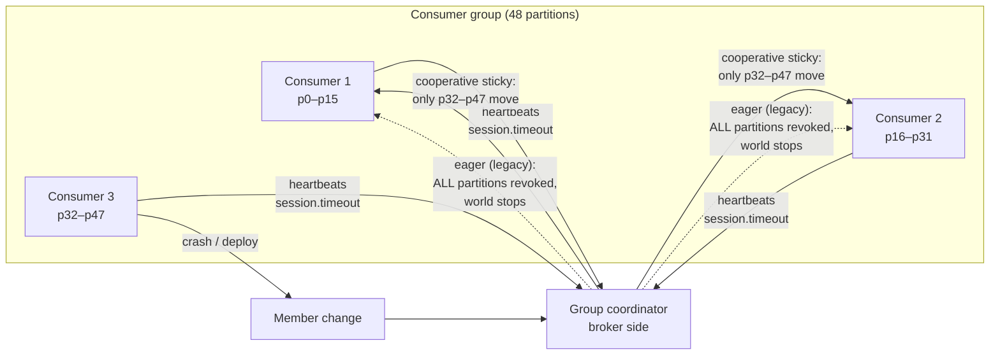

# 2026-08-06 — Kafka Consumer Group Rebalancing

> Every consumer deploy, crash, or slow poll triggers a rebalance — and a badly configured group turns each one into minutes of stalled processing and a wave of duplicate messages.

## Problem

A 12-consumer group processes payments from a 48-partition topic. Symptoms accumulate:

- Every rolling deploy causes a **rebalance storm**: 12 consumers restart one by one, and each restart makes the whole group stop, redistribute partitions, and rebuild state — 12 times per deploy
- A consumer takes 6 minutes on a poison batch; the broker declares it dead, rebalances, and hands its partition to a peer — which hits the same batch. The group cycles in **rebalance loops** while lag climbs
- After each rebalance, hundreds of already-processed messages reprocess, because offsets weren't committed before partitions were revoked

Rebalancing is Kafka's scaling superpower; unmanaged, it's the biggest source of consumer-side incidents.

## Constraints

- **Availability:** A single instance restart must not pause the whole group
- **Deploy hygiene:** Rolling deploys ≠ 12 rebalances
- **Duplicates:** Bounded and handled — processing is idempotent regardless ([2026-07-20](2026-07-20-exactly-once-delivery.md))
- **Slow work:** Batches can legitimately take minutes without the group ejecting members

## Architecture



Diagram source: [`diagrams/2026-08-06-kafka-consumer-rebalancing.mmd`](../diagrams/2026-08-06-kafka-consumer-rebalancing.mmd)

### What triggers a rebalance

| Trigger | Notes |
|---------|-------|
| Member joins/leaves | Deploys, scaling, crashes |
| **Session timeout** | No heartbeat within `session.timeout.ms` (default 45s) — process hung or GC-paused |
| **Poll timeout** | Gap between `poll()` calls exceeds `max.poll.interval.ms` (default 5 min) — *processing too slow* |
| Metadata change | Partitions added, subscription changed |

The two timeouts are the classic confusion: heartbeats run on a background thread, so a **hung process** fails the session timeout, but a **slow consumer** that's happily processing fails the *poll* timeout — and gets ejected while doing useful work. That's the 6-minute-batch rebalance loop.

### Fix 1 — cooperative sticky rebalancing

The legacy (eager) protocol revokes **every** partition from **every** member on any change — the whole group stops for each deploy step. Cooperative sticky moves only the partitions that must move:

```properties
partition.assignment.strategy=org.apache.kafka.clients.consumer.CooperativeStickyAssignor
```

With incremental rebalancing, consumers keep processing their retained partitions during the rebalance; only the reassigned ones pause. This single config change is the difference between "deploys are invisible" and "deploys are incidents." (Kafka Streams and newer clients default to it; plain consumer groups often still run eager because nobody changed the default.)

### Fix 2 — static membership for rolling restarts

Give each consumer instance a stable identity so a quick restart isn't a departure:

```properties
group.instance.id=payments-consumer-3     # per-instance, stable across restarts
session.timeout.ms=60000                  # restart must finish within this window
```

The coordinator holds the restarting member's partitions instead of rebalancing — a rolling deploy of 12 instances triggers **zero** rebalances if each pod comes back within the session timeout. Pairs naturally with StatefulSet ordinals or pod names.

### Fix 3 — size the timeouts to the work

```properties
max.poll.records=100            # smaller batches → poll() called more often
max.poll.interval.ms=600000     # honest ceiling for worst-case batch (10 min)
```

Rule of thumb: `max.poll.interval.ms > max.poll.records × worst-case-per-record-time`, with margin. If one record can legitimately take minutes (external API calls), decouple: hand records to a bounded worker pool and keep polling — but then **pause the partition** until the pool drains, or offsets get ahead of completed work.

### Fix 4 — commit on revocation

Duplicates after rebalance come from processed-but-uncommitted offsets. The rebalance listener is the hook:

```typescript
consumer.subscribe(topics, {
  onPartitionsRevoked: async (partitions) => {
    await commitProcessedOffsets(partitions);   // flush before handing over
  },
  onPartitionsAssigned: async (partitions) => {
    await warmStateFor(partitions);             // rebuild caches/state for new work
  },
});
```

With cooperative rebalancing this callback fires only for the partitions actually moving — cheap and targeted.

### Monitoring the group

| Metric | Alert on |
|--------|----------|
| Rebalance rate | > a few per hour outside deploys — something is flapping |
| Consumer lag per partition | One partition lagging while siblings are current = hot partition or stuck member ([2026-07-12](2026-07-12-hot-partitions-celebrity-problem.md)) |
| `last-rebalance-seconds-ago` | Continuously small = rebalance loop |
| Time-in-rebalance | Minutes = eager protocol or heavy state rebuild |

## Trade-offs

| Choice | Pros | Cons |
|--------|------|------|
| **Cooperative sticky** | Deploys and scaling barely visible | Requires all members on a compatible client version |
| **Static membership** | Zero-rebalance rolling restarts | Stale instance holds partitions until session timeout |
| **Big `max.poll.interval.ms`** | Slow batches tolerated | Genuinely stuck consumers detected slower |
| **Eager (default in old clients)** | Universally compatible | Stop-the-world on every membership change |

## When to use

- ✅ Cooperative sticky + static membership as the baseline for any production group
- ✅ Timeouts derived from measured worst-case batch time, not defaults
- ✅ Offset commit in `onPartitionsRevoked` + idempotent processing as the safety net

- ❌ Don't run eager rebalancing with frequent deploys — you're scheduling outages
- ❌ Don't raise `session.timeout.ms` to paper over slow processing — that's the poll interval's job
- ❌ Don't scale consumers past partition count — the extras sit idle and add rebalance churn

## References

- [Kafka — Consumer configuration reference](https://kafka.apache.org/documentation/#consumerconfigs)
- [Confluent — Incremental cooperative rebalancing](https://www.confluent.io/blog/incremental-cooperative-rebalancing-in-kafka/)
- [Confluent — Static membership](https://www.confluent.io/blog/kafka-rebalance-protocol-static-membership/)

---

**Tags:** `#kafka` `#consumer-groups` `#rebalancing` `#streaming` `#operations` `#messaging`
