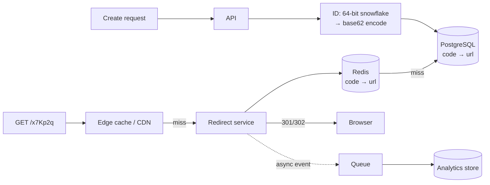

# 2026-08-07 — URL Shortener Design

> The interview classic is worth doing properly once: ID generation, redirect latency, and analytics ingestion each teach a general pattern that transfers to real systems.

## Problem

Build `sho.rt/x7Kp2q` → `https://example.com/very/long/path`. Sounds like one table — until the requirements arrive:

- **Read-heavy asymmetry:** ~100:1 redirect-to-create ratio; redirects must be < 20ms globally
- **Collision-free codes** at millions of creates/day, without a coordination bottleneck
- Codes must be **non-guessable enough** that `/x7Kp2p` doesn't enumerate someone else's campaign links
- Every redirect logs analytics — but logging must never slow the redirect

## Constraints

- **Latency:** Redirect p99 < 20ms; create p99 < 100ms
- **Scale:** 10M creates/month, 1B redirects/month
- **Durability:** A published short link must never break or repoint
- **Analytics:** Click counts, referrers, geo — eventually consistent is fine

## Architecture



Diagram source: [`diagrams/2026-08-07-url-shortener-design.mmd`](../diagrams/2026-08-07-url-shortener-design.mmd)

### Code generation — the interesting decision

| Approach | Property | Catch |
|----------|----------|-------|
| **Hash the URL** (MD5 prefix) | Same URL → same code (dedup free) | Truncation collisions need retry loops |
| **Random string** | Non-guessable | Must check-and-retry on collision; birthday math at scale |
| **Counter + base62** | No collisions ever, shortest codes | Sequential = enumerable; counter is a SPOF |
| **Snowflake + base62** | No collisions, no coordination ([2026-07-17](2026-07-17-distributed-id-generation.md)) | Codes longer (~11 chars); still ordered |

The pragmatic hybrid: snowflake ID for uniqueness, then **bit-scramble before encoding** (a reversible permutation like a Feistel round) so codes look random and aren't enumerable, while remaining collision-free with zero coordination:

```typescript
const ALPHABET = '0123456789abcdefghijklmnopqrstuvwxyzABCDEFGHIJKLMNOPQRSTUVWXYZ';

function encode(id: bigint): string {
  let n = feistelScramble(id);      // reversible bijection — kills enumerability
  let out = '';
  while (n > 0n) { out = ALPHABET[Number(n % 62n)] + out; n /= 62n; }
  return out;
}
```

Custom aliases (`sho.rt/summer-sale`) are just a uniqueness check on insert — keep them in the same table with a `custom` flag.

### The redirect path — everything is a cache

1B redirects/month ≈ 400 RPS average, spiky to thousands. The read path never touches Postgres in the hot case:

```
CDN/edge (hot links cached with short TTL)
  → Redis (code → URL, ~all active links fit: 100M links ≈ a few GB)
    → Postgres (source of truth, cold misses only)
```

Two details that matter more than they look:

- **301 vs 302:** 301 (permanent) lets browsers cache the redirect — great for latency, but the browser stops hitting you, so **analytics die** and the destination can never change. Most shorteners serve **302/307** deliberately. Trade traffic cost for data.
- **Nonexistent codes** are a cache-penetration vector — random probes bypass Redis and hammer Postgres. Negative-cache misses briefly, or front with a bloom filter ([2026-06-07](2026-06-07-bloom-filter-cache-penetration.md)).

### Analytics without slowing redirects

The redirect handler does exactly two things synchronously: look up, respond. The click event (code, timestamp, referrer, user-agent, IP-derived geo) goes to a queue and gets batch-inserted into an analytics store — a counter increment in Redis for the dashboard "total clicks" number, salted if a link goes viral ([2026-07-12](2026-07-12-hot-partitions-celebrity-problem.md)), and the raw events into something columnar for the breakdowns.

### Abuse — the part the interview skips

Real shorteners are phishing infrastructure by default. Minimum viable defenses: destination URL validation against blocklists (Safe Browsing API) at create time **and** periodic re-scan (destinations turn malicious after creation), per-key rate limits on creates, and an interstitial warning page for flagged links.

## Trade-offs

| Choice | Pros | Cons |
|--------|------|------|
| **302 + own analytics** | Data, mutable destinations | Every click hits your edge |
| **301** | Cheapest serving | No analytics, immutable forever |
| **Scrambled snowflake** | No coordination, no collisions | ~11-char codes vs 7 for counters |
| **Random 7-char + retry** | Shortest non-guessable codes | Retry logic; collision rate grows with corpus |

## When to use

- ✅ This exact shape — tiny key → value lookup at high read ratio — appears everywhere: invite codes, deep links, QR campaigns
- ✅ Scrambled sequential IDs whenever you need "unique, short, non-enumerable"
- ✅ Async analytics on any hot read path, not just shorteners

- ❌ Don't serve 301s if you need analytics or mutable destinations
- ❌ Don't let missing codes reach the database unguarded
- ❌ Don't launch a public shortener without abuse scanning — you're hosting phishing within the week

## References

- [System Design Interview — URL shortener chapter (Alex Xu)](https://www.amazon.com/System-Design-Interview-insiders-Second/dp/B08CMF2CQF)
- [Google Safe Browsing API](https://developers.google.com/safe-browsing)
- [Bitly engineering blog](https://bitly.com/blog/engineering/)

---

**Tags:** `#url-shortener` `#system-design` `#caching` `#base62` `#analytics` `#redis`
