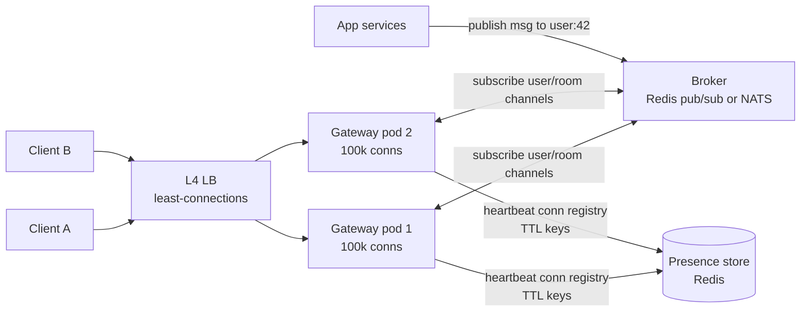

# 2026-08-08 — Scaling WebSockets: Connection Gateways and Presence

> Stateless HTTP scales by adding pods; WebSockets pin state to specific machines — scaling them is about managing that pinning, routing messages to the right box, and surviving deploys without dropping a million connections.

## Problem

Chat works great with one server. Then:

- **Two pods:** user A connects to pod 1, user B to pod 2 — A's message to B goes nowhere, because pod 1 doesn't know B exists
- **Deploys:** every rolling restart drops all connections on the cycled pod; 200k clients reconnect simultaneously and DDoS your own auth service
- **Memory math:** each connection holds a socket, buffers, and session state — a pod that served 5k RPS of HTTP handles maybe 50k *idle* connections before memory, not CPU, is the ceiling
- **Presence** ("who's online") becomes a distributed-state problem the moment connections spread across pods

Transport choice was covered in [2026-06-26](2026-06-26-long-polling-sse-websockets.md) — this note is what happens when the WebSocket tier has to scale.

## Constraints

- **Scale:** 1M concurrent connections, ~50k messages/sec fan-out
- **Delivery:** Message to a user reaches every device they're connected on, any pod
- **Deploys:** Rolling restarts without reconnection storms
- **Presence:** Online/offline accurate within seconds, cheap to query

## Architecture



Diagram source: [`diagrams/2026-08-08-websocket-scaling.mmd`](../diagrams/2026-08-08-websocket-scaling.mmd)

### Split the gateway from the business logic

The load-bearing design move: a thin **connection gateway** tier that only holds sockets, authenticates, and shuttles messages — all business logic stays in stateless services behind it.

- Gateways scale on **connection count** (memory-bound); services scale on **throughput** (CPU-bound) — independently
- Deploying business logic no longer touches a single socket
- Gateway pods become boring, rarely-deployed infrastructure

### Cross-pod message routing

Any service (or gateway) publishes to a broker channel; every gateway subscribes to channels for the users/rooms it hosts:

```typescript
// Gateway: on connection, subscribe to this user's channel
async function onConnect(socket: WS, userId: string) {
  local.add(userId, socket);                       // in-process map: user → sockets
  await broker.subscribe(`user:${userId}`);        // cross-pod: I host this user now
}

// Any pod, any service: deliver to user 42 wherever they are
await broker.publish('user:42', JSON.stringify(payload));

// Gateway: broker delivery → local sockets (all devices on this pod)
broker.on('message', (channel, msg) => {
  for (const s of local.get(channel.slice(5))) s.send(msg);
});
```

Redis pub/sub is the standard start (this is exactly what the Socket.IO Redis adapter does). At very high fan-out, subscription-count and single-node throughput push people to NATS or sharded pub/sub. Room broadcast = one `room:{id}` channel instead of N user channels.

### Presence — TTL heartbeats, not connect/disconnect events

Tracking presence by connect/disconnect events breaks the first time a pod dies without goodbye messages. The robust pattern is leases:

```
On connect + every 30s:  SET presence:{user}:{connId} EX 75
On disconnect:           DEL presence:{user}:{connId}
Is user online?          EXISTS any presence:{user}:*  (or a per-user set with expiring members)
Pod crash:               keys expire in ≤75s — self-healing, no cleanup job
```

Debounce the offline signal (grace period ~30–60s) so a page refresh doesn't flap online → offline → online to everyone watching.

### Deploys and reconnection storms

- **Drain, don't drop:** on SIGTERM, the gateway stops accepting, sends a `reconnect` close frame with a **client-side jittered delay**, and lets existing connections finish over minutes ([2026-06-19](2026-06-19-graceful-shutdown.md))
- **Client backoff with jitter** on reconnect — 200k clients retrying at the same second is a self-inflicted outage ([2026-07-06](2026-07-06-exponential-backoff-jitter.md))
- **Resume tokens:** client sends its last-received message ID on reconnect; gateway replays the gap from a short buffer — reconnects become invisible instead of lossy
- Keep gateway deploys rare — that's half the reason the tier exists

### Capacity notes

L4 load balancing with least-connections beats round robin for long-lived sockets ([2026-07-07](2026-07-07-load-balancing-strategies.md)). Tune file-descriptor limits and kernel buffers; a tuned gateway holds 100k+ mostly-idle connections per pod comfortably — the real limits are heartbeat CPU and fan-out bursts, so load-test the burst, not the idle count.

## Trade-offs

| Choice | Pros | Cons |
|--------|------|------|
| **Gateway tier + broker** | Independent scaling; deploy safety | Extra hop; broker is critical infra |
| **Sticky sessions, logic in-pod** | Simple start | Deploys drop users; state pinned to pods |
| **Managed (Ably, Pusher, API GW WebSockets)** | Connection scaling outsourced | Cost at 1M conns; vendor semantics |
| **SSE instead** | Stateless-ish, HTTP/2 multiplexed | One-way; not for chat-like send rates |

## When to use

- ✅ Gateway/broker split as soon as you run two pods with WebSockets
- ✅ TTL-lease presence and resume tokens from the first real deployment
- ✅ Jittered client backoff — written into the client SDK, not hoped for

- ❌ Don't route user messages by assuming "they're on this pod" — always go through the broker
- ❌ Don't deploy gateways like stateless services — drain with client-spread reconnects
- ❌ Don't build presence on disconnect events — crashed pods never say goodbye

## References

- [Socket.IO — Redis adapter internals](https://socket.io/docs/v4/redis-adapter/)
- [Discord — Scaling to millions of concurrent connections](https://discord.com/blog/how-discord-scaled-elixir-to-5-000-000-concurrent-users)
- [NATS — pub/sub for real-time systems](https://docs.nats.io/)

---

**Tags:** `#websockets` `#realtime` `#presence` `#pubsub` `#scaling` `#gateway`
