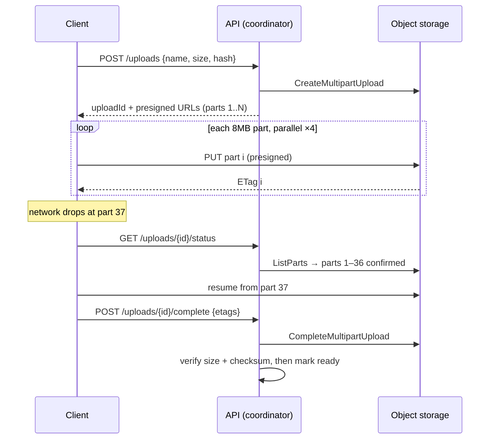

# 2026-08-09 — Resumable Large File Uploads

> A 4GB upload over hotel Wi-Fi will fail at 97% — the design question is whether the user restarts from zero or from 97%.

## Problem

Users upload multi-gigabyte videos. The naive `POST /upload` streaming through the API server fails four ways at once:

- Any network blip past minute 20 → **restart from byte zero**
- The API pod buffers gigabytes per active upload — memory and disk pressure from a handful of users
- A 60-second gateway timeout caps upload size by arithmetic: size ≤ timeout × bandwidth
- Mobile clients on flaky links can't finish at all — the retry always starts over

## Constraints

- **Resumability:** Reconnect and continue from the last confirmed byte/chunk
- **Bypass the app tier:** Bytes flow client → object storage; API servers only coordinate
- **Integrity:** Corrupted or truncated uploads detected before the file is accepted
- **Cleanup:** Abandoned partial uploads must not accumulate storage cost forever

## Architecture



Diagram source: [`diagrams/2026-08-09-resumable-file-uploads.mmd`](../diagrams/2026-08-09-resumable-file-uploads.mmd)

### The pattern — chunked, direct-to-storage, server-coordinated

1. **Initiate:** client declares name/size/checksum; API creates a multipart upload and returns pre-signed part URLs — authorization happens here, once
2. **Upload parts** directly to object storage, in parallel (4–8 concurrent 8–16MB parts saturates most links); each part is independently retryable with backoff
3. **Resume** = ask what parts the server has, send the rest — the storage service is the source of truth on progress, not the client
4. **Complete:** API verifies the part list, total size, and checksum, then finalizes; only now does the file "exist" for the product

The app tier never touches a byte of payload — it issues URLs and verifies the result. That single property removes the memory, timeout, and bandwidth problems simultaneously.

### Chunk size and parallelism

```
Too small (1MB):   per-request overhead dominates; S3 caps at 10k parts → max 10GB
Too big (100MB):   a retry re-sends 100MB; flaky links never finish a part
Sweet spot:        8–16MB fixed, parallelism 4–8
                   (adaptive: halve on repeated part failures)
```

### Integrity — verify parts and the whole

Per-part checksums (S3 accepts `ChecksumSHA256` per part) catch corruption early — a bad part re-uploads alone. The full-file checksum computed client-side at initiate time is checked at complete time; note S3's multipart ETag is *not* an MD5 of the file, so use the dedicated checksum fields, not ETag comparison.

### Cleanup and quotas

Abandoned multipart uploads bill storage invisibly. Two defenses, both mandatory:

```
Bucket lifecycle rule: AbortIncompleteMultipartUpload after 7 days
API-side sweep:        uploads in 'initiated' state > 48h → abort + delete record
```

And because pre-signed URLs let clients write without further authorization: cap declared size at initiate, count in-flight uploads per user, and verify actual uploaded size at complete (a client can lie at initiate).

### Don't hand-roll the client — tus and friends

The [tus protocol](https://tus.io/) standardizes exactly this flow (`Upload-Offset` headers, `PATCH` resumption) with mature clients (Uppy) and servers (tusd) — including the edge cases you'll otherwise rediscover: concurrent tab uploads, offset drift, expired sessions mid-upload. Uppy's S3 multipart plugin gives the architecture above with the client logic done. Build the coordinator; don't build the resumption state machine.

### After the upload

Completion should emit an event (`file.uploaded`) that triggers the processing pipeline — virus scan, transcode, thumbnail — asynchronously ([2026-07-02](2026-07-02-pubsub-vs-message-queues.md)). The file is `ready` only after scanning; never serve raw user uploads from the upload bucket directly.

## Trade-offs

| Choice | Pros | Cons |
|--------|------|------|
| **Multipart + presigned, direct-to-S3** | No app-tier bytes; parallel; resumable | Client complexity (or a tus/Uppy dependency) |
| **tus protocol server** | Standard, battle-tested clients | Server holds upload state; another service if not S3-backed |
| **Single presigned PUT** | Dead simple | No resume, no parallelism — fine under ~100MB |
| **Stream through app tier** | Full control mid-stream | Every problem in this note, on purpose |

## When to use

- ✅ Multipart + presigned URLs for anything routinely over ~100MB
- ✅ tus/Uppy instead of a custom resumption client
- ✅ Lifecycle rules for abandoned parts on day one — the bill is silent otherwise

- ❌ Don't proxy large uploads through API pods — coordinate, don't carry
- ❌ Don't trust client-declared size or state — storage is the source of truth, verify at complete
- ❌ Don't serve uploaded files before scanning/processing marks them ready

## References

- [AWS S3 — Multipart upload](https://docs.aws.amazon.com/AmazonS3/latest/userguide/mpuoverview.html)
- [tus — resumable upload protocol](https://tus.io/protocols/resumable-upload)
- [Uppy — S3 multipart plugin](https://uppy.io/docs/aws-s3/)

---

**Tags:** `#file-uploads` `#s3` `#multipart` `#resumable` `#presigned-urls` `#object-storage`
