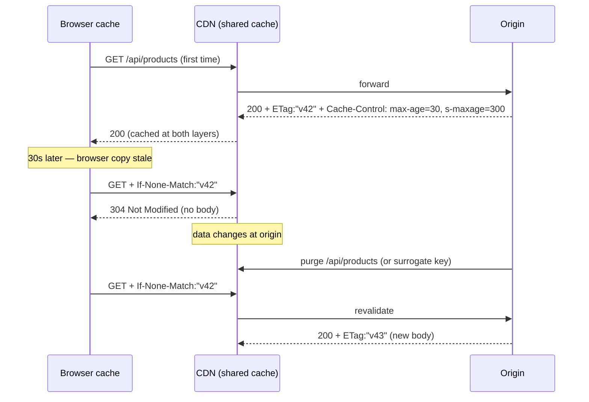

# 2026-08-10 — HTTP Caching: Cache-Control, ETags, and Conditional Requests

> The cheapest request is one a browser never sends — HTTP's built-in caching machinery serves it, but only if your headers say the right things, and most APIs say nothing.

## Problem

An API returns the same product catalog to the same client hundreds of times a day, full-body, 200 OK every time. Meanwhile the frontend team fights the opposite battle: a deploy ships new JavaScript, but users run week-old bundles because *something* cached them — nobody can say what or for how long.

Both problems are the same missing skill: nobody is telling the HTTP caching layers — browser, CDN, proxies — what they're allowed to do. The defaults are heuristic and wrong in both directions.

## Constraints

- **Bandwidth:** Unchanged responses shouldn't re-transfer bodies
- **Freshness:** A deploy or a data change propagates within seconds where it matters
- **Correctness:** Private data never cached where another user can receive it
- **Layers:** Rules must work identically for browser cache and shared caches (CDN)

## Architecture



Diagram source: [`diagrams/2026-08-10-http-caching-etags.mmd`](../diagrams/2026-08-10-http-caching-etags.mmd)

### Cache-Control — the vocabulary that matters

| Directive | Meaning |
|-----------|---------|
| `max-age=60` | Fresh for 60s — serve from cache without asking |
| `s-maxage=300` | Shared caches (CDN) get their own, longer freshness |
| `no-cache` | Cache it, but **revalidate every time** (misnamed — it does cache) |
| `no-store` | Never write to disk — auth pages, PII |
| `private` | Browser only; CDN must not store (per-user responses) |
| `immutable` | Never revalidate during freshness — for hashed assets |
| `stale-while-revalidate=30` | Serve stale instantly, refresh in background |

The two workhorse recipes:

```
Hashed static assets (app.4f8a2c.js):
  Cache-Control: public, max-age=31536000, immutable
  → cache forever; the filename changes when content does

API responses (shared data):
  Cache-Control: public, max-age=15, s-maxage=120, stale-while-revalidate=60
  ETag: "..."
  → browser brief, CDN longer (purgeable), background refresh

Per-user API responses:
  Cache-Control: private, no-cache
  ETag: "..."
  → browser revalidates every time; 304s save the bandwidth; CDN stays out
```

The static-asset recipe is why cache busting via hashed filenames matters: `immutable` + a year of `max-age` is only safe because a deploy produces *new URLs*. The HTML that references them gets `no-cache` — that's the switch that makes deploys instant.

### ETags and 304s — pay headers, not bodies

An `ETag` is a version fingerprint. The client echoes it back as `If-None-Match`; if unchanged, the server answers `304 Not Modified` with no body. For a 200KB catalog polled every minute, that's ~99% bandwidth off the wire.

The trap on the server side: computing the ETag by rendering the full response and hashing it saves bandwidth but **zero server work**. A cheap version source — `updated_at`, a row version, a cache generation counter — lets you answer 304 *before* doing the expensive query:

```typescript
@Get('/products')
async list(@Headers('if-none-match') inm: string, @Res() res) {
  const version = await redis.get('products:version');   // bumped on any write
  const etag = `"v${version}"`;
  if (inm === etag) return res.status(304).header('ETag', etag).end();

  const body = await this.products.list();               // only on real change
  res.header('ETag', etag)
     .header('Cache-Control', 'private, no-cache')
     .json(body);
}
```

Two operational footguns: default ETags in nginx/Express are derived from file metadata and **differ across pods** — either generate content-based ETags or make the version source shared, or clients revalidate uselessly forever. And `Last-Modified`/`If-Modified-Since` is the weaker fallback (1-second granularity, clock-dependent) — fine for files, worse for APIs.

### Shared caches need two more things

- **`Vary`** declares what the cache key includes: `Vary: Accept-Encoding, Accept-Language` — forget it, and the CDN serves gzipped French to everyone. Never vary on high-cardinality headers (cookies, full user-agent) — that's a 0% hit rate wearing a correctness costume.
- **Purge/surrogate keys:** long `s-maxage` is only safe if you can invalidate. Tag responses (`Surrogate-Key: product-42 catalog`) and purge by tag on writes — the CDN equivalent of cache invalidation by dependency, and the reason `s-maxage` can be minutes while `max-age` stays seconds.

The `stale-while-revalidate` directive is the HTTP-native version of the pattern from [2026-07-01](2026-07-01-thundering-herd-request-coalescing.md) — users never wait on a refresh; the CDN does origin coalescing for you.

## Trade-offs

| Choice | Pros | Cons |
|--------|------|------|
| **Long s-maxage + purge** | Origin barely sees reads | Purge plumbing required; miss = stale minutes |
| **Short max-age + ETag** | Always near-fresh; cheap 304s | Request per revalidation (headers only) |
| **`immutable` hashed assets** | Zero revalidation forever | Requires build-time hashing discipline |
| **No headers (defaults)** | No work | Heuristic caching: stale bugs *and* wasted bandwidth |

## When to use

- ✅ Explicit `Cache-Control` on **every** response — silence means heuristics
- ✅ Cheap version sources for ETags so 304s skip real work
- ✅ Surrogate-key purging when CDN freshness windows exceed seconds

- ❌ Don't mark per-user responses `public` — that's serving one user's data to another
- ❌ Don't `Vary` on cookies or user-agent — you've built a cache with no hits
- ❌ Don't cache-bust with query strings on `immutable` assets — some caches ignore them; change the path

## References

- [MDN — HTTP caching](https://developer.mozilla.org/en-US/docs/Web/HTTP/Caching)
- [RFC 9111 — HTTP Caching](https://www.rfc-editor.org/rfc/rfc9111)
- [Fastly — Surrogate keys](https://docs.fastly.com/en/guides/working-with-surrogate-keys)

---

**Tags:** `#http-caching` `#etag` `#cache-control` `#cdn` `#performance` `#api-design`
