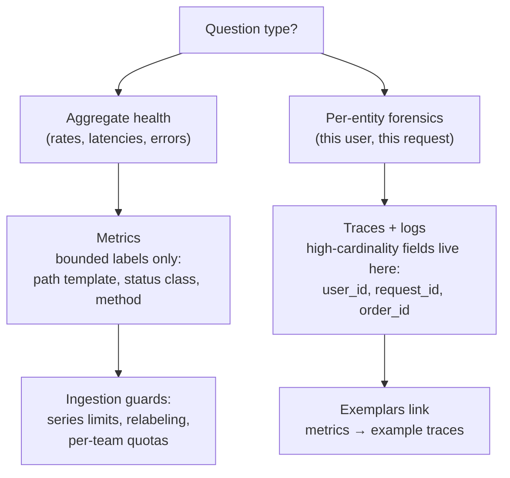

# 2026-08-11 — Metrics Cardinality

> Every unique label combination is a separate time series stored forever-ish in RAM — one `user_id` label on a request counter can cost more than the service it monitors.

## Problem

An engineer adds "just one label" to the request counter:

```
http_requests_total{path=..., status=..., user_id=...}
```

With 50k active users × 200 paths × 6 statuses, that's up to **60 million time series** where there were 1,200. Prometheus memory triples in an hour, dashboards time out, and eventually the ingestion layer starts dropping data — the monitoring system goes down *because* of monitoring. This is the cardinality explosion, and it's the most common way teams break their own observability.

## Constraints

- **Budget:** Total active series capped and known — memory scales linearly with it
- **Usefulness:** Enough dimensions to debug (path, status, method), not per-entity forensics
- **Blast control:** One bad label from one team must not take down metrics for everyone
- **Detail preserved:** Per-user/per-request investigation still possible — somewhere

## Architecture



Diagram source: [`diagrams/2026-08-11-metrics-cardinality.mmd`](../diagrams/2026-08-11-metrics-cardinality.mmd)

### The math nobody does before adding a label

```
series = metric × |label1| × |label2| × ... (worst case: the product)

http_requests_total
  × path      (200 templates)     ← templates, not raw URLs
  × method    (5)
  × status    (6 classes)
  = 6,000 series                  fine

+ user_id     (50,000)            = 300,000,000 potential series
+ pod         (× 50)              and it multiplies by infrastructure too
```

Histograms multiply again: each has ~12 buckets, so one histogram costs 12× a counter *per label combo*. A histogram with an unbounded label is the fastest known way to kill a Prometheus.

### The rule — metrics aggregate, traces identify

| Belongs in metric labels | Belongs in traces/logs |
|--------------------------|------------------------|
| Path **template** (`/orders/:id`) | Raw URL, query strings |
| Status class or code | request_id, session_id |
| Method, region, tier | user_id, tenant_id (unless tenants ≤ dozens) |
| Queue name, job type | job payload, error messages |

The linking mechanism that makes this split livable is **exemplars**: a latency histogram bucket carries a sampled trace ID, so "p99 spiked" clicks through to an actual slow trace ([2026-06-10](2026-06-10-distributed-tracing-opentelemetry.md)) — per-request detail without per-request series.

### Classic explosions and their fixes

| Explosion | Fix |
|-----------|-----|
| Raw URLs as `path` | Route templates; normalize before instrumenting |
| IDs in error labels (`error="timeout for order 4812"`) | Error **class** in the label, details in logs |
| `Vary`-like free-text labels (user-agent) | Parse to bounded categories |
| Per-pod labels on app metrics you'll only query aggregated | Drop with relabeling at ingestion |
| Version label kept across releases | Fine — but old series must expire (staleness), watch churn |

Churn is the quieter killer: labels like `pod_name` in a fast-scaling deployment create *new* series on every restart — total historical series grows unboundedly even if the active count looks stable.

### Guardrails — assume someone will ship a bad label

```yaml
# Prometheus: hard ceiling per scrape target
scrape_configs:
  - job_name: api
    sample_limit: 50000          # drop the target, not the server

# Relabeling: strip known-dangerous labels at ingestion
metric_relabel_configs:
  - regex: 'user_id|session_id|request_id'
    action: labeldrop
```

At fleet scale (Mimir/Cortex/Victoria): **per-tenant series quotas**, so team A's explosion throttles team A. And monitor the monitoring: `prometheus_tsdb_head_series` with an alert on rate-of-growth catches an explosion in minutes instead of at the OOM.

Cost framing for the platform conversation: managed vendors price per series (or per 1k series) — a single careless label on a popular service is routinely a five-figure annual line item. Cardinality review belongs in code review for exactly that reason.

## Trade-offs

| Choice | Pros | Cons |
|--------|------|------|
| **Strict label budget + exemplars** | Metrics stay fast and cheap; detail via traces | Requires tracing to actually be deployed |
| **High-cardinality observability stores** (Honeycomb-style events) | Slice by anything, no pre-aggregation | Different cost model; not Prometheus-ecosystem |
| **Let teams label freely** | No governance friction | The explosion is a when, not an if |
| **Per-tenant quotas** | Blast isolation | Ops complexity; quota-tuning conversations |

## When to use

- ✅ Cardinality math in code review for every new label — it's one multiplication
- ✅ Route templates, status classes, bounded enums as the only label values
- ✅ `sample_limit` + labeldrop rules + head-series alerts as standing guardrails

- ❌ Don't put user/request/session IDs in metric labels — that's what traces are for
- ❌ Don't add labels to histograms casually — every label multiplies ~12 buckets
- ❌ Don't run shared metrics infra without per-team quotas — one team's label is everyone's outage

## References

- [Prometheus — Instrumentation best practices on labels](https://prometheus.io/docs/practices/naming/#labels)
- [Grafana — What is cardinality and why it matters](https://grafana.com/blog/2022/02/15/what-are-cardinality-spikes-and-why-do-they-matter/)
- [OpenTelemetry — Exemplars](https://opentelemetry.io/docs/specs/otel/metrics/data-model/#exemplars)

---

**Tags:** `#observability` `#prometheus` `#cardinality` `#metrics` `#monitoring` `#operations`
