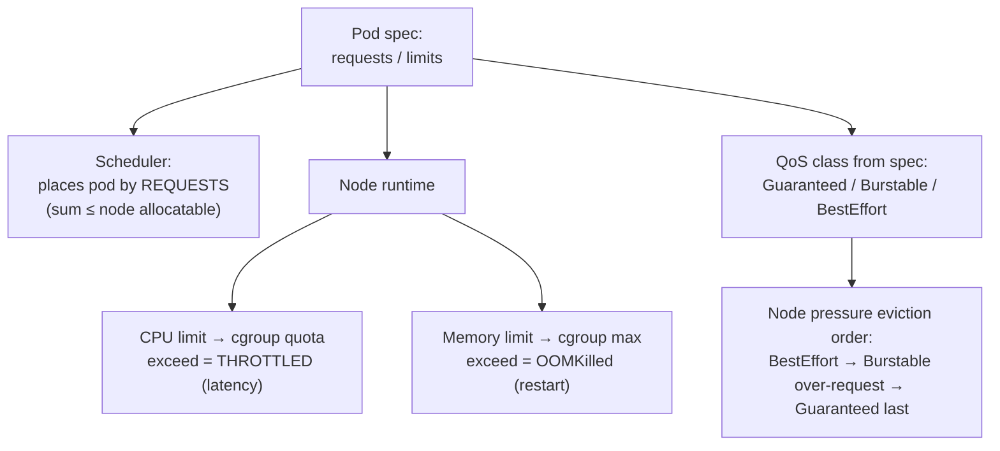

# 2026-08-12 — Kubernetes Requests, Limits, and OOMKills

> Requests decide where pods land and who survives node pressure; limits decide when the kernel throttles or kills them — most "random" pod deaths are misconfigured answers to those two questions.

## Problem

The cluster exhibits three "mysteries":

- The API pod dies with `OOMKilled` every few days at traffic peaks — no leak found, restarts "fix" it
- p99 latency doubles under load with CPU "only at 60%" — invisible **CPU throttling** is eating request time in 100ms slices
- A node fills up and evicts a batch of pods; the ones that die first are exactly the team's most important services

All three trace to requests/limits set by copy-paste — or the fourth mystery: not set at all, which silently assigns the worst possible answers.

## Constraints

- **Stability:** Critical services survive node pressure; batch jobs die first
- **Latency:** No throttling-induced tail latency on user-facing paths
- **Utilization:** Nodes packed efficiently — requests near actual usage, not 5× padding
- **Predictability:** OOMKills are capacity signals, not random events

## Architecture



Diagram source: [`diagrams/2026-08-12-kubernetes-requests-limits.mmd`](../diagrams/2026-08-12-kubernetes-requests-limits.mmd)

### The two numbers do different jobs

```yaml
resources:
  requests:   # scheduling + eviction priority: "reserve this much"
    cpu: 500m
    memory: 512Mi
  limits:     # runtime ceiling: "never exceed this"
    cpu: "2"          # exceed → throttled (slow)
    memory: 1Gi       # exceed → OOMKilled (dead)
```

The asymmetry is the key mental model: **CPU is compressible** (over the limit you get slowed), **memory is not** (over the limit you get killed). That asymmetry drives the standard recommendation:

```
CPU:    set requests honestly; consider NO cpu limit for latency-sensitive services
        (idle node CPU is free burst; the request still guarantees your share)
Memory: requests = limits (Guaranteed-style) — memory "burst" is a delayed OOMKill,
        because the kernel can't take memory back politely
```

### CPU throttling — the invisible latency tax

CPU limits are enforced per 100ms window (CFS quota): a pod with `limit: 1` that needs 150ms of CPU in a window runs 100ms, then **freezes 50ms** — mid-request. Multi-threaded runtimes burn quota in parallel and hit this at "low" average CPU; that's the 60%-CPU-but-p99-doubled mystery. Check `container_cpu_cfs_throttled_periods_total` — if it's nonzero on a user-facing service, that's where the tail latency lives.

Runtime footnote: JVM/Node/Go read the cgroup, so a CPU *limit* also sizes thread pools (`GOMAXPROCS`, GC threads). No limit means the runtime sees the whole node — usually fine, occasionally surprising.

### QoS classes — who dies first under node pressure

| Class | Spec shape | Eviction |
|-------|-----------|----------|
| **Guaranteed** | requests = limits, both set, all containers | Last resort |
| **Burstable** | requests < limits (or partial) | Middle — most-over-request first |
| **BestEffort** | nothing set | First, always |

The third mystery decoded: important services with padded limits (big gap over requests) are *deprioritized* relative to a humble Guaranteed pod. Critical path services should be Guaranteed on memory; batch workloads are the ones that should be evictable.

### OOMKill triage

```
1. kubectl describe pod → last state: OOMKilled, exit code 137
2. Was actual usage near the limit? (container_memory_working_set_bytes)
   → yes, steadily: undersized limit — capacity, not a bug; raise it
   → yes, sawtooth climbing: leak — fix the app, don't chase with limits
   → no, spike: burst workload (big query, file parse) — bound the work,
     stream instead of buffering, or size for the burst honestly
3. Runtime-specific: JVM/Node heap ceilings must fit INSIDE the limit
   with headroom for off-heap (arena, buffers) — heap 75-80% of limit
```

### Setting the numbers without guessing

Measure, don't vibe: run with generous limits under realistic load, read the p99 of actual usage (VPA in recommendation mode does exactly this), set requests at ~p95 of usage and memory limits with ~30–50% headroom over observed peak. Namespace `LimitRange` (defaults for the forgetful) and `ResourceQuota` (caps for the greedy) keep the fleet honest. Requests also gate HPA math ([2026-05-23](2026-05-23-kubernetes-hpa-scaling.md)) — utilization targets are percentages *of requests*, so wrong requests mean wrong scaling.

## Trade-offs

| Choice | Pros | Cons |
|--------|------|------|
| **Guaranteed (req=limit)** | Predictable; evicted last; no throttle surprises below limit | Reserves peak capacity — lower node utilization |
| **Burstable, no CPU limit** | Free burst on idle nodes; good latency | Noisy-neighbor risk if requests are dishonest |
| **VPA-recommended sizing** | Data-driven, drift-corrected | Auto-apply mode restarts pods; use recommend-only for stateful |
| **No specs (BestEffort)** | Zero effort | First evicted, unbounded, HPA can't work — never in prod |

## When to use

- ✅ Memory requests = limits on anything user-facing; heap sized inside with headroom
- ✅ Honest CPU requests + throttling metrics on dashboards; drop CPU limits where tail latency matters
- ✅ VPA in recommendation mode as the sizing source of truth, revisited quarterly

- ❌ Don't run production pods without requests — scheduling and eviction both go worst-case
- ❌ Don't "fix" a memory leak by raising the limit — you've scheduled the same crash later
- ❌ Don't set CPU limits reflexively on latency-critical services — measure throttling first

## References

- [Kubernetes — Resource management for pods](https://kubernetes.io/docs/concepts/configuration/manage-resources-containers/)
- [Kubernetes — Node-pressure eviction and QoS](https://kubernetes.io/docs/concepts/scheduling-eviction/node-pressure-eviction/)
- [For the love of god, stop using CPU limits — (widely-cited argument)](https://home.robusta.dev/blog/stop-using-cpu-limits)

---

**Tags:** `#kubernetes` `#resources` `#oomkill` `#cpu-throttling` `#qos` `#operations`
