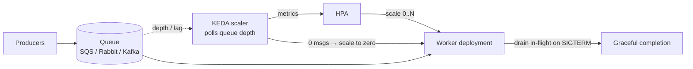

# 2026-08-13 — Queue-Based Autoscaling with KEDA

> CPU-based autoscaling watches the worker, not the work — a queue quietly backing up to 2M messages while workers idle at 30% CPU is the failure mode it structurally cannot see.

## Problem

Image-processing workers scale on CPU via HPA ([2026-05-23](2026-05-23-kubernetes-hpa-scaling.md)). Three failures follow:

- Workers spend most of each job **waiting on S3 and the image API** — CPU sits at 30%, HPA sees a healthy fleet, the queue grows to 2M messages and delivery SLAs blow by hours
- Overnight the queue is empty, but HPA's floor keeps 5 workers running — paying for idle
- A batch enqueue of 500k jobs arrives in one minute; CPU-based scaling reacts only *after* workers saturate — twenty minutes behind the demand curve

The right signal was never CPU. It was **queue depth** — the demand itself, not the workers' exhaust.

## Constraints

- **SLA:** Any enqueued job starts within 5 minutes, even after burst enqueues
- **Cost:** Zero workers when the queue is empty — true scale-to-zero
- **Signals:** Lag from SQS/RabbitMQ/Kafka drives scaling directly
- **Safety:** Scale-in must not kill workers mid-job

## Architecture



Diagram source: [`diagrams/2026-08-13-queue-based-autoscaling-keda.mmd`](../diagrams/2026-08-13-queue-based-autoscaling-keda.mmd)

### KEDA in one paragraph

KEDA (Kubernetes Event-Driven Autoscaling) is a metrics adapter plus 60+ **scalers** (SQS, Kafka, RabbitMQ, Postgres queries, Prometheus, cron…). It polls the external source, feeds the value into a standard HPA it manages for you, and — the part HPA can't do alone — **activates from zero**: at zero replicas there are no pods to measure, so KEDA itself watches the queue and creates the first pod when work appears.

```yaml
apiVersion: keda.sh/v1alpha1
kind: ScaledObject
metadata:
  name: image-workers
spec:
  scaleTargetRef: { name: image-worker }
  minReplicaCount: 0            # true scale-to-zero
  maxReplicaCount: 200
  cooldownPeriod: 120           # wait before scaling to zero
  triggers:
    - type: aws-sqs-queue
      metadata:
        queueURL: https://sqs.../image-jobs
        queueLength: "20"       # target: ~20 messages per replica
```

`queueLength: 20` is the sizing knob: desired replicas ≈ depth ÷ 20. Derive it from Little's law — if one worker clears 4 jobs/min and the SLA is 5 minutes, one replica per ~20 queued jobs holds the line.

### Depth vs lag vs age — pick the right signal

| Signal | Good for | Trap |
|--------|----------|------|
| **Queue depth** (SQS/Rabbit) | Simple job queues | Ignores job size variance |
| **Consumer lag** (Kafka) | Partitioned streams | Scaling past partition count adds idle consumers ([2026-08-06](2026-08-06-kafka-consumer-rebalancing.md)) |
| **Oldest message age** | SLA-shaped scaling ("nothing waits > 5 min") | Needs queue support or a probe |
| **Custom Prometheus query** | Composite/business signals | You own the query's correctness |

Kafka's ceiling deserves emphasis: consumers beyond the partition count do nothing, so `maxReplicaCount` ≤ partitions — the *partition count* is the real scaling decision, made at topic creation.

### Scale-in without killing jobs

Scaling down mid-job is the classic self-inflicted wound. The layered defense:

1. **SIGTERM → stop consuming, finish in-flight** — with `terminationGracePeriodSeconds` sized to the longest job ([2026-06-19](2026-06-19-graceful-shutdown.md))
2. **Visibility timeouts / no-ack**: a killed job reappears on the queue anyway — at-least-once by construction
3. **Idempotent handlers** so the reappearance is harmless ([2026-07-20](2026-07-20-exactly-once-delivery.md))
4. For very long jobs: KEDA's `ScaledJob` runs each message as a Kubernetes Job that completes rather than a pod that's terminated

### Flapping and burst behavior

Bursty enqueues make raw depth a jumpy signal. Dampen with `cooldownPeriod` (before zero), HPA `stabilizationWindowSeconds` (before scale-in), and scale-up policies capping replica-doubling rate. The goal is asymmetry: **scale up fast, scale down lazily** — the cost of a spare worker for five minutes is nothing next to a blown SLA.

Scale-to-zero has a cold-start echo: first message after idle waits for image pull + boot. If the SLA can't absorb ~a minute, keep `minReplicaCount: 1` — the serverless trade-off in Kubernetes clothing ([2026-07-23](2026-07-23-serverless-cold-starts.md)).

## Trade-offs

| Choice | Pros | Cons |
|--------|------|------|
| **KEDA on queue depth** | Scales on demand itself; scale-to-zero | Another operator; scaler config per queue |
| **HPA on CPU** | Built-in, zero deps | Blind to I/O-bound backlog — the original problem |
| **HPA + custom metrics adapter** | No KEDA dependency | You build what KEDA ships; no zero-activation |
| **Fixed worker pool** | Predictable | Over-provisioned nights, under-provisioned bursts |

## When to use

- ✅ Any queue-consuming workload where backlog, not CPU, defines "behind"
- ✅ Scale-to-zero for spiky or business-hours workloads — with the cold-start caveat priced in
- ✅ Target values derived from measured per-worker throughput and the SLA, not defaults

- ❌ Don't scale Kafka consumers past partition count — fix partitions first
- ❌ Don't enable scale-to-zero without graceful drain + idempotent handlers
- ❌ Don't scale on CPU for I/O-bound workers and call the queue growth "a traffic anomaly"

## References

- [KEDA — Scalers catalog](https://keda.sh/docs/latest/scalers/)
- [KEDA — ScaledObject spec](https://keda.sh/docs/latest/concepts/scaling-deployments/)
- [AWS — Scaling on SQS with target tracking (the math)](https://docs.aws.amazon.com/autoscaling/ec2/userguide/as-using-sqs-queue.html)

---

**Tags:** `#keda` `#autoscaling` `#kubernetes` `#queues` `#scale-to-zero` `#operations`
