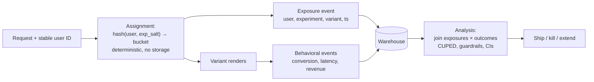

# 2026-08-14 — A/B Testing Infrastructure

> Feature flags decide *who sees what*; experimentation infrastructure decides *what it did* — and the second half is where teams ship "winning" variants that were actually noise.

## Problem

The team runs its first A/B test through feature flags ([2026-06-12](2026-06-12-feature-flags-progressive-delivery.md)) and hits every classic failure in one quarter:

- A user sees variant B on web, variant A in the app, and B again after reinstalling — **assignment isn't sticky**, and the metrics are garbage
- The dashboard shows B "winning" on day 2; the team ships it; the effect evaporates — they **peeked** at a fluctuating p-value and stopped at a random high
- Checkout conversion "improved 4%," but variant B accidentally excluded users with slow connections — the test measured **a biased sample**, not the feature
- Six teams run overlapping tests; nobody can say which experiment moved which metric

## Constraints

- **Deterministic assignment:** Same user → same variant, every device, every session
- **Trustworthy stats:** Predeclared metrics, sample sizes, and stopping rules
- **Isolation:** Concurrent experiments must not confound each other
- **Guardrails:** A variant that hurts latency or revenue gets caught, not just the target metric

## Architecture



Diagram source: [`diagrams/2026-08-14-ab-testing-experimentation.mmd`](../diagrams/2026-08-14-ab-testing-experimentation.mmd)

### Assignment — hash, don't store

```typescript
function variant(userId: string, expId: string, split = [50, 50]): number {
  const h = murmur3(`${expId}:${userId}`) % 10000;   // salt per experiment
  let acc = 0;
  for (let i = 0; i < split.length; i++) {
    acc += split[i] * 100;
    if (h < acc) return i;
  }
  return split.length - 1;
}
```

Deterministic hashing gives stickiness with zero storage and works identically on every platform — the fix for the "different variant per device" bug is simply *one stable ID* (account ID once logged in; a persisted anonymous ID before). The per-experiment salt is what isolates concurrent experiments: the same user lands in independent buckets across experiments, so effects average out rather than correlate.

Log an **exposure event** at the moment of assignment-and-render. Analysis joins exposures to outcomes — users who never *saw* the variant don't belong in the math, and the exposure log is also how you debug "who was in this test."

### The statistics that keep you honest

| Sin | Consequence | Fix |
|-----|-------------|-----|
| **Peeking** at p-values daily and stopping early | ~30%+ false-positive rate in practice | Fixed sample size computed upfront — or sequential methods (mSPRT) *designed* for continuous monitoring |
| No power analysis | Test can't detect the effect size you care about; "no result" is meaningless | Sample-size calculator before launch: baseline rate, MDE, power 0.8 |
| Twenty metrics, one significant | That's what randomness does | One predeclared primary metric; the rest are guardrails/exploratory |
| Ignoring **SRM** (sample ratio mismatch) | A 50/50 test arriving 54/46 means broken assignment — every downstream number is invalid | Automated chi-square check on arrival ratios; alert, don't analyze |

SRM deserves the emphasis: it's the smoke detector for the biased-sample bug (variant B crashing on slow devices *removes those users* from B's sample and flatters every metric). Mature platforms refuse to show results while SRM fires.

### Guardrail metrics

Every experiment ships with automatic tripwires beside the target metric: error rate, p99 latency, revenue per user, unsubscribe rate. A variant that "wins" checkout conversion while adding 300ms p99 is a net loss someone must see *during* the test — wire guardrail breaches to auto-stop or page, exactly like burn-rate alerts ([2026-07-19](2026-07-19-sli-slo-error-budgets.md)).

### Variance reduction — the free sample-size discount

CUPED (using each user's *pre-experiment* behavior as a covariate) routinely cuts required sample size 30–50% for metrics with strong historical correlation, like spend. For product teams whose tests take weeks to reach power, this is the single highest-leverage statistical upgrade — and every serious platform (internal or vendor) implements it.

### Build vs adopt

The flag SDK is the easy 10%. The exposure pipeline, SRM checks, sequential stats, CUPED, and the metrics catalog are the other 90% — which is why the honest default is a platform (GrowthBook and PlanOut-style open source; Statsig/Eppo/Optimizely managed) wired to your warehouse, with your own event taxonomy as the foundation either way.

## Trade-offs

| Choice | Pros | Cons |
|--------|------|------|
| **Warehouse-native platform** (GrowthBook, Eppo) | Your data, real stats engine | Warehouse event hygiene is a prerequisite |
| **Managed end-to-end** (Statsig, Optimizely) | Fastest to trustworthy results | Cost; events leave your infra |
| **DIY on feature flags** | No new vendor | You will rediscover peeking, SRM, and exposure bugs at production cost |
| **No experimentation** | No infra | Decisions by loudest opinion |

## When to use

- ✅ Deterministic hash assignment + exposure logging as the foundation, whatever sits above
- ✅ Predeclared primary metric, power analysis, SRM checks — before the first user is assigned
- ✅ Guardrails with auto-stop on every test touching money or latency

- ❌ Don't stop a fixed-horizon test because today's p-value looks good — that's the peeking bug
- ❌ Don't analyze a test with SRM — find the assignment bug instead
- ❌ Don't run experiments without a stable cross-platform user ID — stickiness is the foundation

## References

- [Kohavi, Tang, Xu — Trustworthy Online Controlled Experiments](https://experimentguide.com/)
- [Microsoft — Diagnosing sample ratio mismatch](https://www.microsoft.com/en-us/research/group/experimentation-platform-exp/articles/diagnosing-sample-ratio-mismatch-in-a-b-testing/)
- [CUPED — variance reduction paper](https://exp-platform.com/Documents/2013-02-CUPED-ImprovingSensitivityOfControlledExperiments.pdf)

---

**Tags:** `#ab-testing` `#experimentation` `#statistics` `#feature-flags` `#product` `#data`
