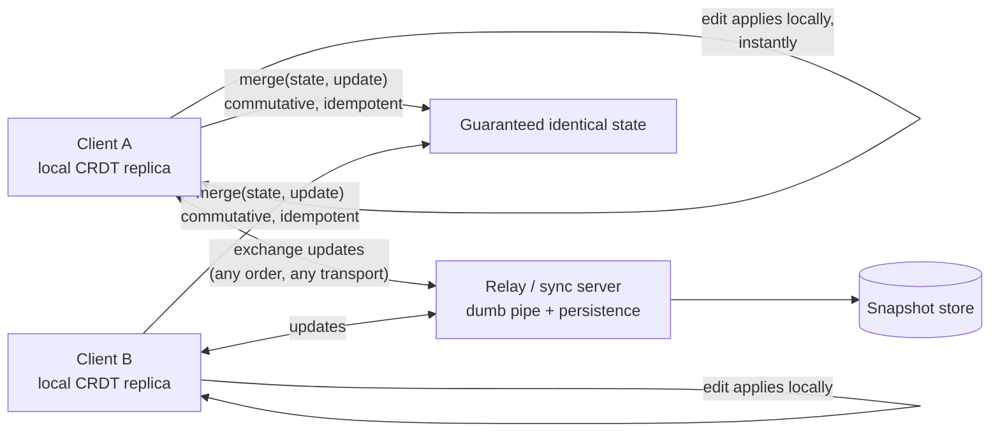

# 2026-08-15 — CRDTs and Collaborative Editing

> Two people type in the same document offline, reconnect, and both keep their changes with no conflict dialog — CRDTs make that mathematically guaranteed rather than heuristically hoped.

## Problem

Build "Google Docs for our app." The naive approaches collapse in order:

- **Last-write-wins on the whole document:** one user's hour of edits silently vanishes
- **Locking:** "Document is being edited by Alice" — this is 1998
- **Naive diffs/merges:** concurrent edits at the same position produce merge conflicts a user is supposed to resolve mid-sentence
- **Server-ordered operations without transformation:** insert-at-index-5 is wrong the moment someone else inserted at index 2 first

The two real answers are OT (Operational Transformation — transform concurrent ops against each other, needs a central sequencing server) and **CRDTs** (Conflict-free Replicated Data Types — data structures whose merge is defined for *any* pair of states, no coordinator required).

## Constraints

- **Convergence:** All replicas that saw the same set of updates end in the same state — regardless of arrival order
- **Offline:** Hours of disconnected edits merge cleanly on reconnect
- **Latency:** Local edits apply instantly (zero round-trip), sync happens behind
- **Memory:** Document metadata must not grow unboundedly with edit history

## Architecture



Diagram source: [`diagrams/2026-08-15-crdts-collaborative-editing.mmd`](../diagrams/2026-08-15-crdts-collaborative-editing.mmd)

### The core trick — identity instead of position

Index-based operations conflict because positions shift. Sequence CRDTs give every character a **permanent unique ID** (site ID + counter), and operations reference IDs, not indexes:

```
"insert 'x' after char#(alice,42)"   — true forever, regardless of what
                                        anyone else inserted anywhere
"delete char#(bob,17)"               — tombstoned, not removed
                                        (a concurrent 'insert after it' must still resolve)
```

Merging becomes set union plus deterministic tie-breaking for same-position inserts. Order of update arrival stops mattering — which is the whole theorem: merge is **commutative, associative, idempotent**, so replicas converge.

### The CRDT family — not just text

| Type | Semantics | Use |
|------|-----------|-----|
| **G-Counter / PN-Counter** | Increment/decrement, sums converge | Distributed likes, metrics |
| **LWW-Register** | Last write wins per field (timestamped) | Simple profile fields |
| **OR-Set** | Add/remove with unique tags; add wins over concurrent remove | Shopping carts, tags |
| **Sequence (RGA/YATA)** | Ordered list with stable IDs | Text, todo lists |
| **Map + nested** | Compose the above per key | JSON-like app state |

The composability is the practical unlock: libraries expose "a JSON document that merges itself," and app state that fits the shapes above syncs for free. Multi-region conflict resolution ([2026-06-25](2026-06-25-multi-region-active-active.md)) uses the same types at database scale.

### Use a library — this is a solved-by-experts problem

**Yjs** and **Automerge** are the production choices; Loro the performance-focused newcomer. What they solved that a DIY attempt rediscovers painfully: tombstone garbage collection, memory-efficient encoding (Yjs stores runs, not per-char objects — 100k-edit documents in single-digit MB), editor bindings (ProseMirror/Monaco/CodeMirror), awareness protocol (cursors, presence), and snapshot/update encodings for storage.

```typescript
import * as Y from 'yjs';

const doc = new Y.Doc();
const text = doc.getText('body');
text.insert(0, 'hello');                        // applies locally, instantly

doc.on('update', (u: Uint8Array) => broadcast(u));  // ship deltas any way you like
onRemoteUpdate((u) => Y.applyUpdate(doc, u));       // any order — convergence guaranteed
```

The server becomes a **dumb relay with persistence** — broadcast updates to room members ([2026-08-08](2026-08-08-websocket-scaling.md) gateways fit exactly), append updates to storage, periodically compact into snapshots. No document logic server-side; that's the operational payoff vs OT, which needs the transforming sequencer alive and correct forever.

### The costs — where CRDTs bite

- **Metadata growth:** tombstones and IDs accumulate; compaction/GC is what the libraries earn their keep on — but a document edited daily for years still needs snapshot-and-reset strategies
- **No global invariants:** CRDTs guarantee convergence, not *validity* — "seat can only be booked once" is not expressible as a merge; that's still a coordination problem (locks, single writer)
- **Semantic conflicts survive:** two users editing the same sentence converge to *interleaved text*, not to *meaning* — convergence ≠ intention preservation
- **Awareness ≠ CRDT:** cursors and presence are ephemeral state over the same transport, not merged data

### OT vs CRDT honestly

Google Docs runs OT with a central server and it's excellent — with a sequencing server you control, OT's memory profile is leaner and intention-preservation tuning is mature. CRDTs win when offline-first, peer-to-peer, or multi-region-writer topologies matter, and when you'd rather operate a dumb relay than a smart sequencer. In 2026, the library maturity (Yjs ecosystem) makes CRDTs the pragmatic default for new collaborative features.

## Trade-offs

| Choice | Pros | Cons |
|--------|------|------|
| **CRDT (Yjs/Automerge)** | Offline-first, dumb servers, any topology | Metadata overhead; no global invariants |
| **OT (central)** | Lean state; proven at Docs scale | Sequencer is critical, subtle, forever |
| **LWW per field** | Trivial | Loses concurrent edits — fine for fields, fatal for text |
| **Locking** | Invariants preserved trivially | Collaboration in name only |

## When to use

- ✅ Collaborative text/whiteboards/structured docs — via Yjs/Automerge, never hand-rolled
- ✅ Offline-capable apps syncing user data across devices
- ✅ OR-Sets/counters for concurrently-updated non-text state (carts, reactions)

- ❌ Don't use CRDTs where global invariants matter (inventory, bookings) — convergence isn't correctness
- ❌ Don't build sequence CRDTs from the paper — the libraries encode a decade of edge cases
- ❌ Don't skip compaction strategy — edit-history metadata is the silent unbounded growth

## References

- [Yjs — docs and ecosystem](https://docs.yjs.dev/)
- [Automerge — docs](https://automerge.org/)
- [Kleppmann — CRDTs: The Hard Parts (talk)](https://martin.kleppmann.com/2020/07/06/crdt-hard-parts-hydra.html)

---

**Tags:** `#crdt` `#collaboration` `#offline-first` `#yjs` `#distributed-systems` `#realtime`
