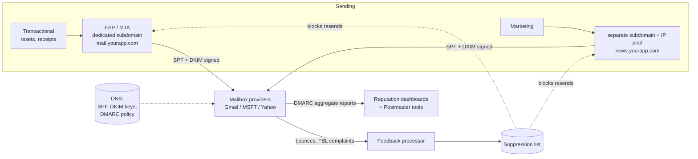

# 2026-08-16 — Email Deliverability: SPF, DKIM, DMARC, and Sender Reputation

> Sending email is an API call; getting it into the inbox is an infrastructure discipline — authentication records, reputation management, and list hygiene decide whether your password resets land in spam.

## Problem

Transactional email "works" for months, then decays:

- Password resets from `@yourapp.com` start landing in Gmail spam — support tickets say "never got the email"
- A marketing blast to a stale list triggers a spam-trap hit; the shared IP's reputation tanks, and **transactional mail sinks with it**
- Someone spoofs `ceo@yourapp.com` for phishing; customers get burned, and mailbox providers now distrust the whole domain
- Nobody notices any of this for weeks, because bounces go to an unmonitored address

Deliverability isn't a property of your code — it's a reputation system run by Gmail/Microsoft/Yahoo, and you're either managing your standing in it or losing it.

## Constraints

- **Transactional isolation:** Resets and receipts must never share fate with marketing
- **Authentication:** SPF, DKIM, DMARC all pass and aligned — table stakes since the 2024 Gmail/Yahoo bulk-sender rules
- **Feedback:** Bounces, complaints, and reputation visible on dashboards within hours
- **Volume discipline:** New domains/IPs warmed gradually, never blasted cold

## Architecture



Diagram source: [`diagrams/2026-08-16-email-deliverability.mmd`](../diagrams/2026-08-16-email-deliverability.mmd)

### The three DNS records — what each actually proves

| Record | Proves | Fails when |
|--------|--------|-----------|
| **SPF** | This *server IP* may send for the envelope domain | Forwarding breaks it; >10 DNS lookups voids it |
| **DKIM** | This *message body* was signed by the domain's key and unmodified | Weak keys; forgetting rotation |
| **DMARC** | The From: header **aligns** with SPF/DKIM domains + tells receivers what to do on failure | Set to `p=none` forever (monitoring theater) |

The alignment concept is the part people miss: SPF can pass for `bounce.espvendor.com` while the visible From: says `yourapp.com` — DMARC is what closes that spoofing hole by requiring the *aligned* domain to pass.

```
_dmarc.yourapp.com  TXT  "v=DMARC1; p=quarantine; rua=mailto:dmarc@yourapp.com; pct=100"
```

Roll DMARC out in stages: `p=none` (collect aggregate reports, find every legitimate sender you forgot — the CRM, the billing tool, that one cron job), fix their SPF/DKIM, then `quarantine`, then `reject`. Jumping straight to `reject` breaks the senders you didn't know you had.

### Separate the streams — the load-bearing decision

One compromised reputation must not sink everything:

```
mail.yourapp.com   → transactional (resets, receipts, 2FA)   dedicated IP/pool
news.yourapp.com   → marketing / bulk                         separate pool
corp @yourapp.com  → humans (Google Workspace / M365)         untouched by product mail
```

Subdomain reputations are tracked separately by providers — the marketing list's bad day stays quarantined to `news.`. This is the bulkhead pattern ([2026-06-16](2026-06-16-bulkhead-pattern.md)) applied to sender identity, and it's the deliverability equivalent of the priority-queue isolation from the notification fan-out note ([2026-08-04](2026-08-04-notification-fanout.md)).

### Reputation mechanics

- **Warm-up:** a new domain/IP sending 500k emails on day one *is* the spam pattern. Ramp over 2–6 weeks (50 → 500 → 5k → …), starting with your most-engaged recipients — engagement (opens, not-spam moves) is the positive signal that builds standing
- **List hygiene:** hard bounces suppressed permanently and immediately; recipients inactive for months sunset out of bulk sends. High bounce rates are how you hit **spam traps** (dead addresses providers watch specifically for careless senders)
- **Complaint budget:** Gmail's enforced threshold is a 0.3% spam-complaint rate — above it, bulk mail stops being delivered, period. One-click unsubscribe (RFC 8058 `List-Unsubscribe-Post`) is mandatory for bulk senders and *reduces* complaints (unsubscribing is easier than the spam button)
- **Monitor where providers tell you:** Google Postmaster Tools and Microsoft SNDS show *their* view of your reputation — that's the ground truth, not your ESP's dashboard

### Wire the feedback loop into the product

Every ESP emits bounce/complaint webhooks. The minimum viable processor: hard bounce → permanent suppression; complaint → global opt-out + campaign investigation; DMARC aggregate reports → parsed weekly (a spike in failing sources = spoofing attempt or a forgotten sender). Suppression must sit **in front of every send path** — a suppressed address re-emailed by a different code path resets your reputation progress and may be a legal problem besides.

## Trade-offs

| Choice | Pros | Cons |
|--------|------|------|
| **ESP (SES, Postmark, SendGrid)** | Infrastructure + FBL plumbing handled | Shared-pool fate unless you pay for dedicated |
| **Dedicated IPs** | Your reputation, your control | You own warm-up and volume consistency |
| **Self-hosted MTA** | Full control, no per-mail cost | You've hired yourself as a deliverability team |
| **Shared ESP pool** | Zero warm-up, fine at low volume | Neighbors' behavior is your reputation |

## When to use

- ✅ SPF + DKIM + DMARC (ramped to `reject`) on every sending domain — non-negotiable since 2024
- ✅ Transactional/marketing separation by subdomain and pool before the first campaign
- ✅ Bounce/complaint webhooks feeding a global suppression list from day one

- ❌ Don't leave DMARC at `p=none` permanently — it's monitoring, not protection
- ❌ Don't blast a cold domain/IP — warm-up isn't optional folklore, it's how filters work
- ❌ Don't let any send path bypass the suppression list — one rogue cron undoes months of reputation

## References

- [Google — Email sender guidelines (2024 bulk rules)](https://support.google.com/a/answer/81126)
- [RFC 7489 — DMARC](https://www.rfc-editor.org/rfc/rfc7489)
- [Google Postmaster Tools](https://postmaster.google.com/)

---

**Tags:** `#email` `#deliverability` `#dmarc` `#spf` `#dkim` `#reputation`
