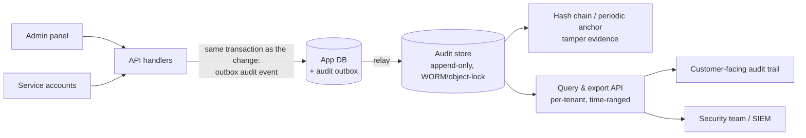

# 2026-08-17 — Audit Logging

> Application logs answer "what did the system do?"; audit logs answer "who did what to what, and can we prove it?" — the second question has legal weight, and retrofitting the answer is archaeology.

## Problem

The enterprise deal's security review asks: *"Show us every access to customer records by your staff in the last year."* The honest answers available:

- Application logs rotated out after 30 days, mix `user 42 logged in` with stack traces, and can be edited by anyone with cluster access
- Admin actions run through the same endpoints as user actions — no distinction recorded
- The one incident that mattered ("who changed this customer's payout account?") is answerable only by grepping Postgres WAL backups, badly
- Nothing proves the logs weren't modified after the fact

Audit logging is a *product feature with compliance teeth* (SOC 2, ISO 27001, HIPAA all require it) — not a logging config.

## Constraints

- **Attribution:** Every sensitive action tied to an authenticated identity — including service accounts and support staff impersonating users
- **Immutability:** Append-only; tamper-*evident* at minimum
- **Retention:** Years (per compliance regime), queryable, exportable per tenant
- **Performance:** Auditing must not add user-visible latency or lose events on crashes

## Architecture



Diagram source: [`diagrams/2026-08-17-audit-logging.mmd`](../diagrams/2026-08-17-audit-logging.mmd)

### The event — who, what, when, where, outcome

```json
{
  "id": "01J5X...",                        // time-sortable (UUIDv7)
  "occurred_at": "2026-08-17T09:14:03Z",
  "actor":   { "type": "user", "id": "u_42", "impersonated_by": "support_7" },
  "action":  "payout_account.updated",     // stable verb taxonomy, not URL paths
  "target":  { "type": "customer", "id": "c_913", "tenant_id": "t_5" },
  "context": { "ip": "203.0.113.9", "user_agent": "...", "request_id": "r_..." },
  "outcome": "success",
  "changes": { "iban": { "from": "DE89…7", "to": "DE44…1" } }   // redacted values where needed
}
```

Design decisions hiding in that schema: `impersonated_by` (support acting as a user is *the* case investigations care about), a **stable action taxonomy** (renaming endpoints must not orphan history), tenant on every event (per-customer export is a sales requirement, [2026-07-24](2026-07-24-multi-tenancy-isolation-models.md)), and **redaction discipline** — the audit log records *that* the IBAN changed and a masked form, not a second unencrypted copy of PII (which would make it a GDPR liability of its own, [2026-07-30](2026-07-30-gdpr-deletion-at-scale.md)).

### Capture — the outbox, again

Fire-and-forget audit emission loses exactly the events you'll be asked about (the crash during the suspicious change). The reliable pattern is the transactional outbox ([2026-05-25](2026-05-25-transactional-outbox-pattern.md)): the audit event commits **in the same transaction** as the change it describes, then relays to the audit store. The change and its audit record exist or don't, together.

Where to hook it: explicit calls in handlers for business actions (intent is visible there — "payout account updated *by support after verification call*"), not database triggers (which see rows, not intent) and not gateway middleware alone (which sees URLs, not semantics). Triggers are a decent *backstop* for direct-DB changes by operators — which should themselves be rare and audited.

### Immutability — proportionate to threat model

| Level | Mechanism | Defends against |
|-------|-----------|-----------------|
| 1 | Separate store, no UPDATE/DELETE grants | Casual tampering, bugs |
| 2 | Object storage with **object lock / WORM**, or append-only service | Compromised app credentials |
| 3 | **Hash chain** (each event includes hash of previous) + periodic external anchor | Insider with storage access — modifications become detectable |

Most SaaS needs level 2 with level 3's hash chain as cheap insurance. The point isn't preventing all tampering — it's making tampering *provably evident* to an auditor.

### Serving it — the part that makes it a feature

Compliance retention wants years in cheap storage (object store, partitioned by month — retention = lifecycle rules). Investigations want indexed recent history (12–18 months hot). Customers increasingly expect a **self-serve audit trail UI** ("show me every login and permission change in my workspace") — enterprise plans monetize exactly this. Build the query API per-tenant and time-ranged from the start; bolting tenant isolation onto a shared log later is the painful version.

## Trade-offs

| Choice | Pros | Cons |
|--------|------|------|
| **Outbox + dedicated store** | Never loses events; queryable product feature | More moving parts than "just log it" |
| **App-log pipeline reuse** | Zero new infra | Retention, immutability, and query needs all mismatch |
| **DB triggers everywhere** | Catches direct DB edits | Row-level noise without intent; migration pain |
| **Vendor audit service** (WorkOS, etc.) | Compliance features out of the box | Per-event cost; data residency questions |

## When to use

- ✅ Before the first enterprise security review, not after — retrofit is archaeology
- ✅ Outbox capture in the same transaction for anything money-, permission-, or PII-touching
- ✅ Impersonation and service-account attribution as first-class schema fields

- ❌ Don't mix audit events into rotating app logs — different retention, different guarantees, different consumers
- ❌ Don't store raw PII in audit events — record the change, mask the values
- ❌ Don't grant UPDATE on the audit store to anything — corrections are new events, like a ledger ([2026-08-03](2026-08-03-double-entry-ledgers.md))

## References

- [AWS — S3 Object Lock (WORM)](https://docs.aws.amazon.com/AmazonS3/latest/userguide/object-lock.html)
- [SOC 2 — logging and monitoring criteria overview](https://www.aicpa-cima.com/topic/audit-assurance/audit-and-assurance-greater-than-soc-2)
- [WorkOS — Audit logs design guide](https://workos.com/blog/audit-logs)

---

**Tags:** `#audit-logging` `#compliance` `#security` `#soc2` `#immutability` `#outbox`
