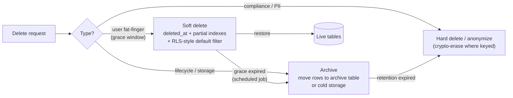

# 2026-08-18 — Soft Deletes, Hard Deletes, and Archival

> `deleted_at` looks like the safe choice — until every query needs a filter, unique constraints break, and "deleted" data turns out to be a compliance liability rather than a safety net.

## Problem

The team adds `deleted_at timestamptz` to every table, and the costs arrive on a delay:

- A production query forgets `WHERE deleted_at IS NULL` — deleted records resurface in an export sent to a customer
- A user "deletes" their account, re-registers, and hits `unique(email)` — **the constraint sees the soft-deleted row**
- Three years later, 40% of the `orders` table is deleted rows: indexes bloat, backups balloon, and nobody dares purge because *something* might reference them
- Legal asks whether user data is erased on request; the honest answer is "we set a timestamp" ([2026-07-30](2026-07-30-gdpr-deletion-at-scale.md) says that's not erasure)

Soft delete solves real problems — undo, referential integrity, forensic trails — but it's a *data lifecycle decision* being made table-by-table by whoever writes the migration.

## Constraints

- **Undo:** User-facing deletions recoverable for a grace window (fat-finger insurance)
- **Correctness:** No query can accidentally see deleted data; constraints work
- **Lifecycle:** Deleted data ages out — to archive, then to gone — on a schedule
- **Compliance:** Erasure requests produce actual erasure, not flags

## Architecture



Diagram source: [`diagrams/2026-08-18-soft-deletes-archival.mmd`](../diagrams/2026-08-18-soft-deletes-archival.mmd)

### Making soft delete safe — mechanics that remove the foot-guns

**The forgotten filter** should be structurally impossible, not a convention:

```sql
-- Option A: views as the default read surface
CREATE VIEW orders AS SELECT * FROM orders_all WHERE deleted_at IS NULL;

-- Option B: ORM global scope (Prisma middleware / TypeORM @DeleteDateColumn)
-- Either way: reading deleted rows requires *explicit* intent
```

**Unique constraints** must scope to live rows — partial indexes are the clean fix:

```sql
CREATE UNIQUE INDEX users_email_live
  ON users (email) WHERE deleted_at IS NULL;   -- re-registration works
```

**Index bloat** gets the same treatment: partial indexes on `deleted_at IS NULL` keep hot-path indexes sized to live data only, so soft-deleted bulk doesn't tax every query ([2026-08-05](2026-08-05-postgres-vacuum-bloat.md) covers what unbounded dead weight does to a table).

**Foreign keys** are the subtle one: soft-deleting a parent leaves children pointing at a "deleted" row — decide per relationship whether delete cascades (soft-delete children too), restricts (block while children exist), or nulls. The database can't enforce soft-cascades; a deletion service must.

### The three-stage lifecycle — the actual answer

The dichotomy "soft vs hard" is false; production systems want a pipeline:

```
Stage 1 — soft-deleted (days–weeks):    instant restore; user-facing undo;
                                         still in live tables, filtered out
Stage 2 — archived (months–years):      moved OUT of live tables to
                                         archive tables / object storage;
                                         queryable for support & analytics,
                                         invisible and cost-cheap
Stage 3 — erased:                        hard delete or anonymize;
                                         compliance clock satisfied
```

Stage transitions are scheduled jobs ([2026-07-27](2026-07-27-distributed-cron-job-scheduling.md)) with the retention windows written down as policy, per data class — not folklore. The move to stage 2 is what keeps live tables lean: `INSERT INTO orders_archive SELECT … ; DELETE …` in batches, or partition-based archival where dropping a partition *is* the archival ([2026-07-21](2026-07-21-time-series-data-storage.md)).

### What should never be soft-deleted

- **PII under erasure request** — the GDPR note's whole point: a flag is not erasure; anonymize or crypto-erase
- **Secrets, tokens, sessions** — dead credentials are attack surface, not history
- **Large blobs** — soft-delete the *metadata row* if needed; lifecycle the actual bytes in object storage
- **High-churn operational rows** (queue jobs, locks) — deleted-but-present rows are pure bloat with zero restore value

And the inverse: things that look like delete but are really *state* — `order.status = cancelled` is a domain state with business meaning, not a deletion. Don't model it with `deleted_at`; audit history belongs in the audit log ([2026-08-17](2026-08-17-audit-logging.md)), not in rows pretending to be alive.

### Restore is a feature — test it

If soft delete exists for undo, undo must actually work: restoring a user must restore their dependent rows coherently (the soft-cascade, reversed), and the grace window must be visible to support tooling ("this account is deletable-restorable until Sep 1"). An untested restore path is a false promise wearing a schema column.

## Trade-offs

| Choice | Pros | Cons |
|--------|------|------|
| **Soft delete + lifecycle jobs** | Undo; forensics; lean live tables *eventually* | Filter/constraint discipline; jobs to run |
| **Hard delete only** | Simple; compliant by default | No undo; FK cascades can amputate history |
| **Archive tables / partitions** | Live tables stay fast; cheap storage | Cross-archive queries are clunky |
| **Event-sourced (never delete state)** | Full history by construction | Whole different architecture ([2026-06-18](2026-06-18-event-sourcing.md)) |

## When to use

- ✅ Soft delete with partial unique indexes + default-filtered views for user-facing entities
- ✅ A written retention ladder per data class, enforced by scheduled archival/erasure jobs
- ✅ Hard delete (or anonymization) as the *terminal* state for anything with PII

- ❌ Don't add `deleted_at` to every table reflexively — most operational tables want hard delete
- ❌ Don't let unique constraints span deleted rows — partial indexes or the re-registration bug ships
- ❌ Don't treat `deleted_at` as compliance erasure — regulators and the GDPR note disagree

## References

- [PostgreSQL — Partial indexes](https://www.postgresql.org/docs/current/indexes-partial.html)
- [Brandur — Soft deletion probably isn't worth it](https://brandur.org/soft-deletion)
- [Prisma — Soft delete middleware pattern](https://www.prisma.io/docs/orm/prisma-client/client-extensions/middleware/soft-delete-middleware)

---

**Tags:** `#soft-delete` `#data-lifecycle` `#archival` `#postgresql` `#retention` `#gdpr`
