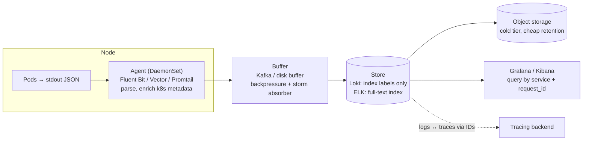

# 2026-08-19 — Log Aggregation Pipelines

> Fifty services × fifty pods means the log line you need exists on a machine you can't name — centralized logging is table stakes, but the design choice is *index everything* vs *index labels, grep the rest*, and it's a 10× cost difference.

## Problem

Debugging without aggregation: `kubectl logs` across pods that may have restarted (logs gone), guessing which of 50 services touched the request. So the team ships everything to Elasticsearch — and trades the old problems for new ones:

- The logging bill rivals the compute bill — full-text indexing every DEBUG line from every pod is the most expensive way to store data nobody reads
- One service in a crash-loop emits 50k lines/sec and the cluster tips over — ingestion has no backpressure or quotas
- Log formats differ per service; the one query that matters (`request_id=r_8f3a`) works in half of them ([2026-06-20](2026-06-20-correlation-ids-structured-logging.md) solved the format; this note is the pipeline)

## Constraints

- **Completeness:** Every pod's stdout collected, surviving pod/node death
- **Cost:** Retention measured in weeks hot, months cold — priced sanely
- **Query:** By service, time range, and correlation ID in seconds
- **Resilience:** Log storms and sink outages must not drop everyone's logs (or take down nodes)

## Architecture



Diagram source: [`diagrams/2026-08-19-log-aggregation-pipelines.mmd`](../diagrams/2026-08-19-log-aggregation-pipelines.mmd)

### Collection — stdout + DaemonSet, nothing clever in the app

Twelve-factor rules: apps write structured JSON to **stdout** and know nothing about shipping. A node-level agent (Fluent Bit, Vector, Promtail) tails container logs, attaches Kubernetes metadata (namespace, pod, container, labels), and forwards. No in-app log shippers — they couple every service to the pipeline and die with the pod holding unsent logs.

Agent survival rules learned the hard way: cap the agent's memory buffer and spill to a bounded **disk buffer** (sink outages happen; nodes must not OOM because Elasticsearch is down), and rate-limit per pod at the agent so a crash-looping service is *its* problem, not the pipeline's.

### The storage decision — what do you index?

| | **Loki model** (index labels only) | **Elasticsearch model** (index every field) |
|--|--|--|
| Index | Tiny: service, namespace, level | Huge: every JSON field searchable |
| Query "all logs for request_id" | Label-filter to service/time, then **scan** (fast enough in practice) | Direct index hit — instant |
| Cost | Object storage + small index — cheap | RAM/SSD-heavy cluster — 5–10× |
| Best for | Debugging workflows: narrow by service/time, grep | Search-heavy: security analytics, arbitrary field queries across everything |

The Loki bet: engineers debugging almost always know *which service* and *roughly when* — so index only those labels, store compressed chunks in object storage, and brute-scan the narrowed window. It's the metrics-cardinality lesson ([2026-08-11](2026-08-11-metrics-cardinality.md)) applied to logs: **labels must be bounded** (service, level — never request_id as a label), high-cardinality values live *inside* the log line where scans find them.

ELK (or Datadog/Splunk with per-GB pricing) earns its cost when the workload is genuinely search-shaped — SIEM, product analytics on logs, arbitrary-field hunting. Many shops run Loki for debug logs and route the small security-relevant stream to the expensive store — the two models compose.

### The buffer tier — why Kafka sits in serious pipelines

Direct agent→store works until the store slows down; then agents buffer, then drop — everywhere at once. A Kafka (or managed equivalent) tier between agents and storage absorbs storms, lets the store ingest at its own pace, and enables fan-out (same stream → Loki for debugging, → S3 for compliance archival, → the audit path from [2026-08-17](2026-08-17-audit-logging.md) staying separate). Backpressure becomes a queue-lag metric you can alert and autoscale on ([2026-08-13](2026-08-13-queue-based-autoscaling-keda.md)) instead of silent drops.

### Retention ladder and volume discipline

```
Hot (queryable, indexed):    7–30 days     — where debugging happens
Cold (object storage):       6–24 months   — compliance, rare restores
Sampling:                    INFO/DEBUG sampled or dropped for chatty paths;
                             ERROR/WARN always kept
Per-team quotas:             a service's log volume is a budgeted resource —
                             storms throttle the emitter, not the platform
```

The biggest cost lever isn't the store — it's **not emitting garbage**: DEBUG in production behind a dynamic flag, one structured line per request instead of twelve narrative ones, and payload dumps replaced by IDs that link to traces ([2026-06-10](2026-06-10-distributed-tracing-opentelemetry.md)). Logs answer "what happened here"; traces answer "where did the time go" — shared request/trace IDs stitch them, and Grafana's logs↔traces linking makes the stitch clickable.

## Trade-offs

| Choice | Pros | Cons |
|--------|------|------|
| **Loki + object storage** | 5–10× cheaper; simple ops | Scan-based queries; needs disciplined labels |
| **ELK self-hosted** | Full-text power, mature tooling | Cluster care and feeding; RAM bill |
| **SaaS (Datadog/Splunk)** | Zero ops, great UX | Per-GB pricing makes volume a finance topic |
| **Kafka buffer tier** | Storm absorption, fan-out, no drop cascades | One more system; only pays off at scale |

## When to use

- ✅ stdout JSON + DaemonSet agents as the universal contract — apps never know the sink
- ✅ Label-index model (Loki-style) as the default for debug logs; full-text only for search-shaped workloads
- ✅ Disk-buffered agents, per-pod rate limits, and a hot/cold retention ladder from day one

- ❌ Don't put request IDs or user IDs in index labels — bounded labels only, cardinality kills here too
- ❌ Don't let agents buffer unbounded in memory when the sink is down — cap and spill to disk
- ❌ Don't index everything by reflex — most log bytes are written once and read never; price accordingly

## References

- [Grafana Loki — architecture and label best practices](https://grafana.com/docs/loki/latest/get-started/architecture/)
- [Fluent Bit — buffering and backpressure](https://docs.fluentbit.io/manual/administration/buffering-and-storage)
- [Vector — building observability pipelines](https://vector.dev/docs/about/concepts/)

---

**Tags:** `#logging` `#loki` `#elk` `#observability` `#kubernetes` `#cost`
