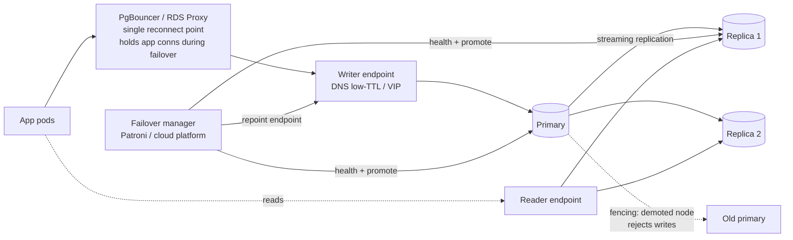

# 2026-08-20 — Database Failover and Connection Resilience

> The database failed over in 30 seconds; the outage lasted 25 minutes — because every application pod kept a pool full of dead connections pointed at the old primary's IP.

## Problem

The managed Postgres primary dies. The platform promotes a replica in ~30 seconds. And yet:

- App pods hold **pooled connections to the dead primary** — TCP doesn't announce death; queries hang until kernel timeouts measured in *minutes*
- Pods that reconnect **resolve cached DNS** to the old IP, or land on the demoted node and fail writes with "read-only transaction"
- The connection storm when 400 pods reconnect simultaneously staggers the freshly-promoted primary
- In-flight transactions died mid-commit — and some clients can't tell whether their `COMMIT` landed

Failover is two problems: the database-side promotion (mostly solved by managed platforms and Patroni) and the **client-side recovery** — which is yours, and which nobody load-tests.

## Constraints

- **RTO:** Application-observed recovery within ~1 minute of promotion, not 25
- **Correctness:** No writes accepted by a demoted node; ambiguous commits handled
- **Storm safety:** Reconnection must not re-kill the new primary
- **Testability:** Failover drills run in staging quarterly, not discovered in prod

## Architecture



Diagram source: [`diagrams/2026-08-20-database-failover.mmd`](../diagrams/2026-08-20-database-failover.mmd)

### What the platform gives you — and where it stops

Managed offerings (RDS Multi-AZ, Cloud SQL HA, Aurora) or Patroni self-hosted handle detection, promotion, and repointing a **stable endpoint** (DNS name or VIP). Aurora fails over in ~30s; Multi-AZ in 60–120s. That's the RTO of the *endpoint* — the application's RTO is that **plus** how long your pods take to notice, drop dead connections, re-resolve, and reconnect. Closing that gap is the client-side work:

```
TCP keepalives + timeouts     — dead connections detected in seconds, not kernel default
connect_timeout: 5            — don't hang forever on the dead IP
statement_timeout             — in-flight queries fail fast instead of blocking pool slots
pool max lifetime: 5–15 min   — connections recycle; stale routing self-heals
DNS: honor low TTL            — JVM especially: networkaddress.cache.ttl, not "cache forever"
```

The single highest-leverage component is a **proxy layer** (PgBouncer, RDS Proxy): the app holds connections to the proxy, the proxy handles the failover dance once, centrally — instead of 400 pods each discovering the topology change on their own schedule. It also absorbs the reconnection storm, which is the same thundering-herd shape as [2026-07-01](2026-07-01-thundering-herd-request-coalescing.md), and it's the pooler the serverless note ([2026-07-23](2026-07-23-serverless-cold-starts.md)) already wanted for other reasons.

### Split-brain and fencing

The nightmare scenario isn't downtime — it's **two nodes accepting writes**. A network partition makes the old primary unreachable to the failover manager but still reachable to some app pods; promotion happens; now two "primaries" diverge. Defenses, in the order they matter:

1. **Consensus-based failover** — Patroni stores leadership in etcd; a node that can't renew its lease demotes *itself* (this is leader election, [2026-06-28](2026-06-28-leader-election-raft.md))
2. **Fencing** — the demoted node is made *unable* to accept writes (killed, VIP removed, `default_transaction_read_only=on`) before the new primary opens
3. **App-level tripwire** — writes through the reader endpoint or to a demoted node fail with read-only errors; alert on them, they mean routing is stale

Related choice: `synchronous_commit`. Async replication means failover can lose the last moments of acknowledged writes (RPO > 0); synchronous replication makes RPO zero at a per-commit latency cost. Pay it for money tables; skip it for telemetry — Postgres lets you set it per transaction.

### The ambiguous commit

A connection dying between `COMMIT` sent and acknowledgment received leaves the client not knowing if the transaction landed. Retrying blindly double-writes; not retrying may lose the operation. This is exactly why write paths need **idempotency keys** ([2026-06-01](2026-06-01-idempotency-keys.md)) — the retry after failover becomes safe by construction. Failover is the production event that turns that pattern from theory into the thing that saved the books.

### Drills — the part that separates teams that recover from teams that discover

Everything above decays silently: a new service ships without keepalives, a JVM upgrade resets DNS caching, the proxy's config drifts. The only defense is **rehearsal**: trigger real failovers in staging (managed platforms have a reboot-with-failover button; Patroni has `switchover`) quarterly, measure *application-observed* recovery time, and treat regressions as bugs. Game-day discipline from [2026-07-29](2026-07-29-chaos-engineering.md), pointed at the database.

## Trade-offs

| Choice | Pros | Cons |
|--------|------|------|
| **Proxy layer (PgBouncer/RDS Proxy)** | One reconnect point; storm absorption | Extra hop; transaction-mode pooling limits (prepared stmts, LISTEN) |
| **Direct + tuned client pools** | No extra infra | 400 pods × per-service tuning discipline |
| **Synchronous replication** | RPO = 0 | Commit latency; stalls if sync standby dies |
| **Async replication** | Fast commits | Last acknowledged writes can vanish on failover |

## When to use

- ✅ Proxy layer + aggressive connect/statement timeouts on every Postgres-backed service
- ✅ Consensus-managed failover with fencing — never a cron script promoting replicas
- ✅ Quarterly failover drills measuring app-observed RTO; idempotency keys on write paths

- ❌ Don't trust default TCP/DNS behavior — kernel timeouts and JVM DNS caching are the 25-minute outage
- ❌ Don't allow any path where a demoted node still accepts writes — fence before promoting
- ❌ Don't claim an RTO you've never measured from the application's side

## References

- [Patroni — HA Postgres with etcd](https://patroni.readthedocs.io/)
- [AWS — RDS Proxy and failover behavior](https://docs.aws.amazon.com/AmazonRDS/latest/UserGuide/rds-proxy.html)
- [PostgreSQL — synchronous_commit and replication](https://www.postgresql.org/docs/current/warm-standby.html)

---

**Tags:** `#postgresql` `#failover` `#high-availability` `#pgbouncer` `#split-brain` `#operations`
