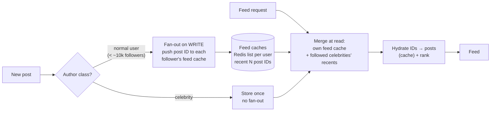

# 2026-08-21 — News Feed Design: Fan-Out on Write vs Read

> "Show me the latest posts from everyone I follow" is a join the database can't afford at scale — feeds are precomputed, and the design question is *when* and *for whom*.

## Problem

The naive feed query:

```sql
SELECT * FROM posts
WHERE author_id IN (SELECT followee_id FROM follows WHERE follower_id = $me)
ORDER BY created_at DESC LIMIT 50;
```

Works beautifully until it doesn't: a user following 2,000 accounts turns every feed load into a scatter across thousands of authors' posts, sorted and merged at read time. At millions of users opening the app each morning, the database melts on the *read* path — and feeds are ~99% reads.

Flip it around — precompute every follower's feed at post time — and the celebrity problem appears: one post from an account with 50M followers means **50M writes** ([2026-07-12](2026-07-12-hot-partitions-celebrity-problem.md) in its purest form).

## Constraints

- **Read latency:** Feed loads in < 100ms — it's the front door of the product
- **Fan-out cost:** A celebrity post must not trigger tens of millions of synchronous writes
- **Freshness:** New posts visible to followers within seconds
- **Storage:** Feed copies per user are bounded (recent window, not full history)

## Architecture



Diagram source: [`diagrams/2026-08-21-news-feed-design.mmd`](../diagrams/2026-08-21-news-feed-design.mmd)

### The two pure strategies

| | **Fan-out on write (push)** | **Fan-out on read (pull)** |
|--|--|--|
| Post time | Write post ID into every follower's feed list | Write once |
| Read time | One list read — O(1), fast | Query all followees, merge-sort — expensive |
| Celebrity post | 50M list writes — catastrophic | Cheap |
| Inactive followers | Wasted writes for users who never return | Zero waste |
| Freshness | Seconds (async workers) | Immediate |

Neither survives alone. Push dies on celebrities; pull dies on ordinary morning traffic.

### The hybrid — what Twitter/Instagram actually converged on

Classify authors by follower count:

- **Normal users (the vast majority):** fan-out on write. An async worker ([2026-08-13](2026-08-13-queue-based-autoscaling-keda.md) — queue depth is exactly the scaling signal) pushes the post ID into each follower's Redis feed list, capped at ~800 recent entries per user
- **Celebrities (tiny minority):** no fan-out. Their posts are stored once; at read time, the user's cached feed is **merged with the recent posts of the few celebrities they follow** — a handful of extra reads, bounded because nobody follows a million celebrities
- **Inactive users:** skip fan-out for accounts dormant for weeks; rebuild their feed via pull on their next visit — most registered users are inactive, and this deletes most of the write volume

Store **post IDs, not post bodies**, in feed lists — hydration happens at read time from a post cache, so an edit or delete doesn't require touching a million materialized copies.

### Fan-out mechanics worth getting right

- The fan-out worker paginates the follower list and checkpoints progress — a crash mid-celebrity must resume, not restart ([2026-08-04](2026-08-04-notification-fanout.md) hit the same shape)
- Fan-out is **idempotent**: feed lists are sets/sorted-sets keyed by post ID, so replays are harmless
- Cap and trim lists on every push (`LPUSH` + `LTRIM`) — the feed cache is a *window*, not an archive; history beyond it is served by the pull path
- A follow/unfollow doesn't rewrite history: new follows see the followee's *future* posts plus a one-time backfill merge at read

### Ranking — the second system hiding inside

Chronological is a merge; ranked feeds ("most relevant first") add a scoring pass at read time: candidate posts (from the merged window) → feature lookup (engagement counts, affinity, recency) → model score → order. The architectural consequence: ranking wants the candidate set *small* (hundreds), which the feed-window design already provides — and it pushes heavy signals (engagement counters) into precomputed stores, because scoring can't afford live aggregation. Full ranking pipelines are the recommendation-systems note's territory ([2026-09-04](2026-09-04-recommendation-systems.md)).

### Consistency expectations

Feeds are the canonical *eventually consistent* product surface: a post appearing 3 seconds late is invisible; a feed load taking 3 seconds is not. The one read-your-writes exception: **the author must see their own post immediately** — serve it from the author's own timeline locally rather than waiting for fan-out to loop back.

## Trade-offs

| Choice | Pros | Cons |
|--------|------|------|
| **Hybrid push/pull** | Survives both celebrities and read load | Two code paths; classification threshold to tune |
| **Pure push** | Simplest reads | Celebrity writes; wasted work on inactive users |
| **Pure pull** | No fan-out infra | Read-time merge cost; needs heavy caching anyway |
| **IDs in feed, hydrate at read** | Edits/deletes stay cheap | Extra hydration hop (cached, fine) |

## When to use

- ✅ Any follower-graph product: social feeds, activity streams, subscription inboxes
- ✅ The hybrid the moment follower-count distribution grows a long tail
- ✅ Inactive-user suppression — it's the cheapest 10× write reduction available

- ❌ Don't fan out post bodies — materialized copies make edits and deletes a migration
- ❌ Don't run celebrity fan-out synchronously in the post request — the author waits on 50M writes
- ❌ Don't promise strict chronological completeness — the design is windowed and eventual by construction

## References

- [Twitter — Timelines at scale (infrastructure talk)](https://www.infoq.com/presentations/Twitter-Timeline-Scalability/)
- [Instagram engineering — feed architecture posts](https://instagram-engineering.com/)
- [System Design Interview vol. 1 — news feed chapter (Alex Xu)](https://www.amazon.com/System-Design-Interview-insiders-Second/dp/B08CMF2CQF)

---

**Tags:** `#news-feed` `#fanout` `#social` `#redis` `#caching` `#system-design`
