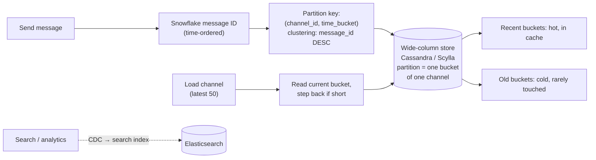

# 2026-08-24 — Chat Message Storage at Scale

> Messages are written once, read recently, and kept forever — a workload shape that punishes generic schemas and rewards designing the partition key around "one conversation, newest first."

## Problem

Chat storage in a single Postgres `messages` table works until:

- The table hits billions of rows; the index on `(channel_id, created_at)` no longer fits in RAM, and *every* channel's history load turns into disk seeks
- One viral public channel produces millions of messages — a hot partition by any naive sharding ([2026-07-12](2026-07-12-hot-partitions-celebrity-problem.md)), while millions of quiet DMs sit tiny
- The access pattern is brutally skewed: ~always "latest 50 messages of this conversation," then scroll-back pagination — but the schema serves it no better than random access
- Deletes and edits are rare; reads of *recent* data dominate; history is effectively cold archive that must still be fetchable

This is the workload Discord famously moved from MongoDB → Cassandra → ScyllaDB for; the lessons generalize.

## Constraints

- **Read pattern:** Latest-N per conversation in single-digit ms; older pages on demand
- **Write pattern:** Append-heavy, high volume, no cross-conversation transactions needed
- **Distribution:** Conversations spread evenly across nodes — including the viral ones
- **Ordering:** Stable, gap-tolerant per-conversation ordering (IDs, not wall clocks)

## Architecture



Diagram source: [`diagrams/2026-08-24-chat-message-storage.mmd`](../diagrams/2026-08-24-chat-message-storage.mmd)

### The schema — partition by conversation × time bucket

```sql
CREATE TABLE messages (
    channel_id   bigint,
    bucket       int,          -- e.g. 10-day windows since epoch
    message_id   bigint,       -- snowflake: time-ordered, unique
    author_id    bigint,
    content      text,
    PRIMARY KEY ((channel_id, bucket), message_id)
) WITH CLUSTERING ORDER BY (message_id DESC);
```

Every design decision is encoded in that key:

- **`channel_id` in the partition key** → one conversation's messages are colocated; "latest 50" is one partition read, already sorted on disk in `DESC` order — the query *is* the layout
- **`bucket` in the partition key** → the fix for unbounded partitions. Without it, a busy channel's partition grows forever (wide-column stores degrade badly past ~100MB/partition). Time-bucketing caps each partition at a window's worth of messages — same chunking instinct as [2026-07-21](2026-07-21-time-series-data-storage.md)
- **Snowflake `message_id` as clustering key** ([2026-07-17](2026-07-17-distributed-id-generation.md)) → time-ordered *and* unique, so ordering survives same-millisecond messages and pagination cursors are just "before this ID" ([2026-06-23](2026-06-23-api-pagination-cursor-vs-offset.md)) — no wall-clock ties, no offset drift

Reading history: start at the current bucket, and if it returns fewer than requested (quiet channel), step back a bucket. Discord's refinement: store the *last active bucket* per channel so sparse channels don't scan empty windows.

### Why a wide-column store fits (and what you give up)

The workload wants: linear write scaling (log-structured writes — appends are what LSM engines do best), per-partition ordered reads, tunable consistency, no cross-entity joins. That's Cassandra/Scylla's exact shape. The price: no ad-hoc queries (every access pattern needs its own table/key design), no transactions, and eventual consistency — all fine *for messages specifically*.

The corollary people miss: **don't put everything there.** Channel metadata, memberships, permissions stay relational — low volume, join-heavy, consistency-sensitive. The wide-column store holds exactly one thing: the message firehose. Search is likewise its own system — messages CDC into Elasticsearch ([2026-07-09](2026-07-09-change-data-capture-debezium.md)); nobody full-text-scans partitions.

### Edits, deletes, and read state

- **Edits/deletes** are low-volume UPDATE/tombstone operations — fine, but bulk deletion patterns (GDPR channel wipes, [2026-07-30](2026-07-30-gdpr-deletion-at-scale.md)) must respect tombstone mechanics: mass tombstones in one partition tank read performance until compaction. Bucket-level deletion (drop the whole window) is the clean path
- **Unread counts / read cursors** are a separate, tiny, hot table: `(user_id, channel_id) → last_read_message_id`. Computing "unread" is then an ID comparison, not a count query — snowflake ordering pays off again
- **Attachments** are object-storage pointers, never blobs in the message row ([2026-08-09](2026-08-09-resumable-file-uploads.md))

### Does it have to be Cassandra?

Below ~tens of millions of messages: **Postgres is fine** — `(channel_id, id DESC)` index, partition by month if needed, and revisit at real scale. The wide-column move earns its operational cost when write volume and history size outgrow what a primary + replicas can hold in cache. Discord's second migration (Cassandra → ScyllaDB) was about tail latencies from JVM GC pauses and repair pain — a reminder that the *operational* profile of the store matters as much as the data model.

## Trade-offs

| Choice | Pros | Cons |
|--------|------|------|
| **Scylla/Cassandra, bucketed partitions** | Linear write scale; reads = layout | Per-pattern schema design; eventual consistency; ops expertise |
| **Postgres partitioned** | Transactions, joins, familiar ops | Ceiling on write volume and hot-history cache |
| **DynamoDB (same model, managed)** | No cluster ops | Cost at chat volumes; item-size limits |
| **Everything in one store** | One system | Message firehose starves metadata workloads |

## When to use

- ✅ Conversation-shaped data at scale: chat, comments threads, activity logs per entity
- ✅ Partition = (entity, time bucket), clustering = time-ordered ID — the reusable template
- ✅ Snowflake IDs for anything needing distributed, sortable, tie-free ordering

- ❌ Don't leave partitions unbounded — the viral channel will find you
- ❌ Don't put metadata, permissions, or search into the message store — one job per system
- ❌ Don't reach for Cassandra before Postgres actually runs out — the ops bill is real

## References

- [Discord — How Discord stores billions of messages](https://discord.com/blog/how-discord-stores-billions-of-messages)
- [Discord — How Discord stores trillions of messages (ScyllaDB migration)](https://discord.com/blog/how-discord-stores-trillions-of-messages)
- [ScyllaDB — data modeling best practices](https://docs.scylladb.com/stable/data-modeling/)

---

**Tags:** `#chat` `#cassandra` `#scylladb` `#data-modeling` `#partitioning` `#wide-column`
