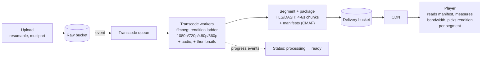

# 2026-08-26 — Video Streaming Pipeline: Upload to Playback

> Video isn't a file you serve — it's a file you *transform* into a ladder of renditions and chunks, so that a phone on 3G and a TV on fiber can both play the same upload smoothly.

## Problem

"Users upload videos, other users watch them." The naive version — store the MP4, serve it with range requests — fails on contact:

- A 4K upload buffers forever on mobile; there's **one bitrate**, take it or leave it
- Seeking requires downloading everything before the seek point (or byte-range guessing into a format not built for it)
- One codec/container combination won't play everywhere
- The origin serves every byte of every view — bandwidth costs scale with popularity, the exact opposite of what a CDN would give you

The industry answer is a pipeline: **transcode once into an adaptive ladder, chunk it, serve manifests + segments over HTTP through a CDN.**

## Constraints

- **Startup:** Playback begins in < 2s on any connection
- **Adaptivity:** Quality shifts with bandwidth mid-play, without stalls
- **Reach:** Plays on browsers, iOS, Android, TVs — no plugins
- **Cost:** Transcode compute and storage for N renditions; egress via CDN, not origin

## Architecture

Diagram source: [`diagrams/2026-08-26-video-streaming-pipeline.mmd`](../diagrams/2026-08-26-video-streaming-pipeline.mmd)

### Stage 1 — Ingest

The upload is the resumable multipart flow from [2026-08-09](2026-08-09-resumable-file-uploads.md), landing in a raw bucket. Completion emits an event → transcode queue. Everything downstream is async: the product shows "processing" until the pipeline reports ready — never make the uploader wait on transcoding.

### Stage 2 — Transcode into the ladder

One source becomes several **renditions** (resolution × bitrate pairs), e.g. 1080p@5Mbps / 720p@2.8 / 480p@1.4 / 360p@0.7, plus an audio track and thumbnail sprites for scrubbing. Operational notes:

- Transcoding is embarrassingly parallel *per rendition* and even per source-chunk — split the source, transcode chunks across workers, stitch: that's how 2-hour uploads finish in minutes
- It's also the classic queue-autoscaling workload ([2026-08-13](2026-08-13-queue-based-autoscaling-keda.md)): depth-scaled workers, spot/preemptible instances, scale to zero at night
- Ladder choice is a cost knob: per-title encoding (analyze content complexity, skip renditions that don't help — a static slideshow doesn't need 5Mbps) cuts storage and egress meaningfully at library scale

### Stage 3 — Segment and package

Each rendition splits into **4–6 second segments** with aligned keyframes across renditions (alignment is what makes mid-play quality switching seamless). Two manifest dialects — **HLS** (`.m3u8`, Apple's, universal) and **DASH** (`.mpd`, MPEG's) — describe the ladder and segment URLs; **CMAF** lets one set of fragmented-MP4 segments serve both, halving storage. Codec reality in 2026: H.264 as the compatibility floor, HEVC/AV1 renditions on top for the devices that decode them — AV1 saves ~30% bitrate but costs much more encode compute, worth it only for content with real view counts.

### Stage 4 — Deliver and adapt

Segments are static, immutable files — **the perfect CDN payload** ([2026-06-17](2026-06-17-cdn-edge-caching.md), `immutable` caching from [2026-08-10](2026-08-10-http-caching-etags.md)). The origin serves cache misses only; a popular video is ~100% edge-served.

The intelligence lives client-side (**ABR — adaptive bitrate**): the player measures download throughput and buffer level per segment, and requests the next segment from whichever rendition fits — start low for fast startup, climb as measurements come in, drop before the buffer empties. That's the whole trick of smooth playback on variable networks, and it's why the server stays dumb.

Access control without killing cacheability: **signed URLs/cookies with short expiry on manifests, longer on segments** — the CDN validates signatures at the edge; per-user DRM (Widevine/FairPlay) only where content licensing demands it.

### Live vs VOD

Same segment/manifest machinery, tighter loop: encoder pushes segments continuously, the manifest is a rolling window updated every segment, and latency is dominated by segment duration × buffer depth (standard HLS ≈ 10–30s behind live; LL-HLS/LL-DASH with sub-second partial segments gets to ~2–5s). The trade is latency vs stall-resilience — sports betting wants 2s; a conference stream is happier buffered.

## Trade-offs

| Choice | Pros | Cons |
|--------|------|------|
| **Build (ffmpeg + queue + CDN)** | Full control, cheapest at scale | Codec/device edge cases are a career |
| **Managed (Mux, Cloudflare Stream, MediaConvert)** | Pipeline expertise rented | Per-minute costs; less ladder control |
| **CMAF single-format** | One segment set for HLS+DASH | Legacy device stragglers |
| **AV1 renditions** | ~30% egress savings | Encode cost; decoder coverage check |

## When to use

- ✅ Any user-generated or catalog video beyond "a dozen MP4s" — the ladder+CDN model is the baseline
- ✅ Managed services until video is core business; the build threshold is high
- ✅ Per-title encoding and CMAF once the library and egress bill justify optimization

- ❌ Don't serve raw uploads with range requests and call it streaming — one bitrate, broken seeking
- ❌ Don't transcode synchronously in the upload path — queue it, report progress
- ❌ Don't put segments behind per-request auth at the origin — sign at the edge or lose the CDN

## References

- [Apple — HLS authoring specification](https://developer.apple.com/documentation/http-live-streaming)
- [Netflix — Per-title encode optimization](https://netflixtechblog.com/per-title-encode-optimization-7e99442b62a2)
- [ffmpeg — streaming guide](https://trac.ffmpeg.org/wiki/StreamingGuide)

---

**Tags:** `#video` `#streaming` `#hls` `#transcoding` `#cdn` `#abr`
