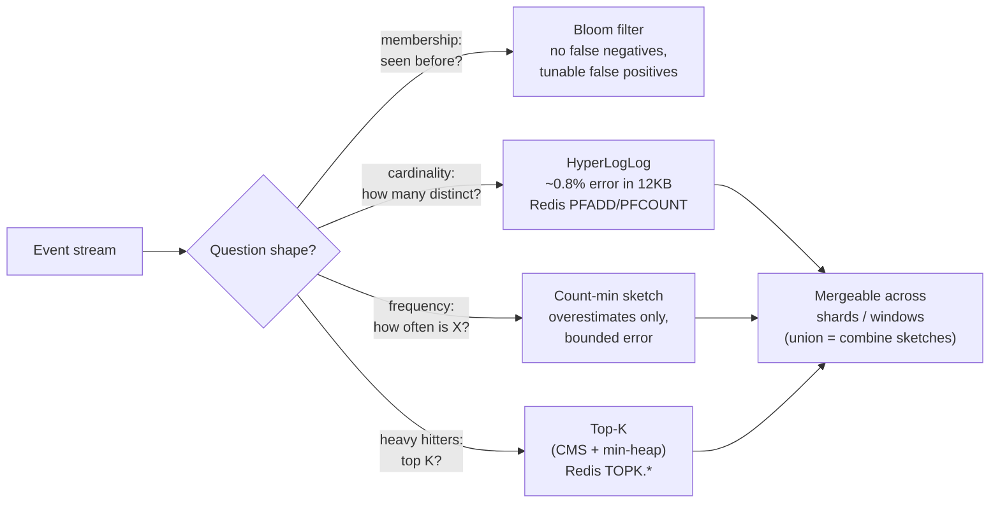

# 2026-08-28 — Probabilistic Data Structures: HyperLogLog, Count-Min Sketch, Top-K

> "How many unique visitors today?" answered exactly costs gigabytes of set storage; answered *within 1%* it costs 12KB — most counting problems at scale don't need the exact answer, and the discount for admitting that is enormous.

## Problem

Analytics-shaped questions arrive as the product grows:

- **Unique visitors** per page per day — a `Set<user_id>` per page is memory linear in traffic; across a million pages it's a memory catastrophe
- **"Trending now"** — the top 10 most-viewed items this hour, without maintaining a counter for every item in the catalog
- **"Is this URL in our crawl history?"** across 10 billion URLs — an exact index is terabytes
- Doing any of these with `SELECT COUNT(DISTINCT ...)` on the events table melts the warehouse *and* answers minutes late

The exact versions are all linear in cardinality. The probabilistic versions are constant or logarithmic — with a quantified, tunable error.

## Constraints

- **Memory:** Fixed and small (KBs–MBs) regardless of stream size
- **Speed:** Per-event update cost O(1) — usable inline on hot paths
- **Error:** Bounded and configurable (trade memory for accuracy explicitly)
- **Mergeability:** Sketches from shards/windows combine without raw data — this is the superpower

## Architecture



Diagram source: [`diagrams/2026-08-28-probabilistic-data-structures.mmd`](../diagrams/2026-08-28-probabilistic-data-structures.mmd)

### HyperLogLog — count distinct in 12KB

The intuition: hash every element; the *longest run of leading zeros* seen is a cardinality estimate (seeing a hash with 20 leading zeros suggests you've seen ~2²⁰ distinct values). HLL keeps that observation across 16k buckets and averages harmonically — landing at **~0.81% standard error in 12KB, regardless of whether you count thousands or billions**.

Redis ships it natively, which makes the production pattern trivial:

```
PFADD  uv:page:42:2026-08-28  user_9137        # per event, O(1)
PFCOUNT uv:page:42:2026-08-28                  # distinct today, ±0.8%
PFMERGE uv:page:42:aug  uv:page:42:2026-08-*   # month = union of days
```

`PFMERGE` is the quietly killer feature: daily sketches roll up to weeks/months **without recounting**, and per-shard sketches union across a fleet — try that with exact `COUNT(DISTINCT)`. Warehouses have the same trick (`APPROX_COUNT_DISTINCT` in BigQuery/Snowflake/Postgres via extension) — reach for it before the exact version, not after the melt.

### Count-min sketch — frequencies without per-key counters

A 2D array of counters; each item increments one counter per row (chosen by that row's hash); reads take the **minimum** across rows. Collisions only inflate counts, so estimates **overestimate, never underestimate** — with error bounded by table width and confidence by depth. A few hundred KB tracks frequencies over unbounded key spaces.

Where it earns its keep: rate-limit signals over raw IPs/keys too numerous for exact counters, spotting heavy hitters in a stream before deciding what deserves a real counter, and feeding Top-K.

### Top-K — "trending" as a data structure

CMS tells you *how often*; a small min-heap beside it keeps the K items whose estimated counts are highest — the **heavy hitters** — in constant memory. RedisBloom packages this as `TOPK.ADD` / `TOPK.LIST`: a trending-videos widget over millions of candidates in a few KB, updated inline per view event. Window it (one Top-K per hour, rotate) rather than decaying one structure forever.

### Bloom filters — membership, revisited

Covered as cache-penetration armor in [2026-06-07](2026-06-07-bloom-filter-cache-penetration.md); in the analytics toolbox the same structure answers "have we crawled/sent/seen this before?" over billions of items. The **cuckoo filter** variant adds deletion support at similar cost — relevant when "seen" items can expire. The invariant to design around: false positives exist (tunable), false *negatives* don't — so a "no" is trustworthy, a "yes" gets verified downstream if the action is destructive.

### Where these run in a real system

Inline on stream consumers (each Kafka consumer updates local sketches, merged periodically — mergeability makes this trivially shardable), in Redis for shared live dashboards, and inside every serious warehouse's `APPROX_*` functions. The rule for choosing: **exact where money or correctness is at stake** (billing = ledger, [2026-08-03](2026-08-03-double-entry-ledgers.md)), **approximate where a human glances at a number** — dashboards, trending, capacity signals, abuse heuristics. Nobody can act on the difference between 1,048,231 and 1,051,900 unique visitors; everyone notices the gigabytes saved.

## Trade-offs

| Structure | Answers | Cost | Error shape |
|-----------|---------|------|-------------|
| **HyperLogLog** | distinct count | 12KB fixed | ±~1%, symmetric |
| **Count-min sketch** | item frequency | ~100s KB | overestimate only |
| **Top-K (CMS+heap)** | heavy hitters | KBs | may miss borderline items |
| **Bloom / cuckoo filter** | membership | bits per item | false positives only |
| **Exact (sets/counters)** | everything | linear in cardinality | none — and that's the bill |

## When to use

- ✅ Unique counts, trending lists, seen-before checks at scale — default to sketches
- ✅ `PFMERGE`-style rollups across time windows and shards instead of recount jobs
- ✅ Warehouse `APPROX_COUNT_DISTINCT` for exploratory analytics — it's 10–100× cheaper

- ❌ Don't bill, reconcile, or enforce quotas with hard legal meaning on approximate counts
- ❌ Don't treat a Bloom "yes" as truth before destructive actions — verify the positives
- ❌ Don't build exact per-key counters over unbounded key spaces "temporarily" — that's the memory catastrophe on a delay

## References

- [Flajolet et al. — HyperLogLog paper](https://algo.inria.fr/flajolet/Publications/FlFuGaMe07.pdf)
- [Redis — probabilistic data structures (HLL, TopK, CMS, Bloom)](https://redis.io/docs/latest/develop/data-types/probabilistic/)
- [Cormode & Muthukrishnan — Count-min sketch](http://dimacs.rutgers.edu/~graham/pubs/papers/cm-full.pdf)

---

**Tags:** `#probabilistic` `#hyperloglog` `#count-min-sketch` `#topk` `#analytics` `#redis`
