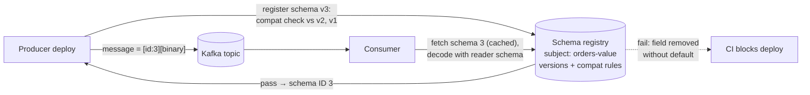

# 2026-08-31 — Event Schema Evolution and Schema Registries

> An event published today will be read by a consumer deployed last month and replayed by one written next year — schema evolution is API versioning ([2026-07-10](2026-07-10-api-versioning-strategies.md)) with a harder constraint: the old messages never go away.

## Problem

Kafka topics full of JSON "just work" until:

- A producer renames `userId` → `user_id`; three consumers start silently dropping events (no error — the field is just `undefined`)
- A "harmless" type change (`amount` string → number) poisons a downstream aggregation for a week before anyone notices
- Replaying last year's topic ([2026-06-18](2026-06-18-event-sourcing.md) makes this routine) crashes the new consumer on messages shaped by three schema generations ago
- Nobody can answer "what fields does `order.completed` have?" without reading producer source code

REST APIs get away with informal evolution because old requests vanish after the response. **Events are stored** — every schema that ever produced a message is live forever, and the contract needs enforcement machinery, not convention.

## Constraints

- **Safety:** Incompatible schema changes rejected *before* deployment, not discovered downstream
- **Longevity:** Consumers can read every message version present in retained/replayable topics
- **Efficiency:** Compact wire format — schema metadata not repeated per message
- **Discoverability:** Schemas versioned, documented, and queryable in one place

## Architecture



Diagram source: [`diagrams/2026-08-31-schema-evolution-registry.mmd`](../diagrams/2026-08-31-schema-evolution-registry.mmd)

### The registry mechanics

Producers serialize with a registered schema and prepend its **ID** (5 bytes) to each message — the schema itself never travels per-message, which is also why Avro/Protobuf messages are a fraction of their JSON size. Consumers resolve IDs against the registry (cached after first fetch) and decode. The registry's real job happens at **registration time**: a new version must pass the subject's compatibility rule or it's rejected — moving the explosion from a consumer at 3am to a CI failure at 3pm.

### Compatibility — the vocabulary that decisions hang on

| Mode | Guarantees | Meaning in practice |
|------|-----------|---------------------|
| **Backward** | New *readers* handle old *messages* | Consumers upgrade first; safe for replay |
| **Forward** | Old readers handle new messages | Producers upgrade first |
| **Full** | Both | The sane default for shared topics |
| **Transitive** variants | Checked against *all* prior versions, not just the latest | The one you actually want — non-transitive lets incompatibility sneak in across two steps |

What the rules cash out to for Avro:

```
Safe:    add a field WITH a default · remove a field that HAD a default ·
         widen types (int → long) · add enum symbol (with fallback)
Unsafe:  rename (it's a remove + add — use aliases instead) ·
         change types · remove a required field · reuse a deleted field's name
```

Protobuf's version of the same discipline: field *numbers* are the contract — never reuse or renumber, `reserve` deleted numbers, everything optional-with-defaults. JSON Schema can play too, but validation is structurally weaker (open content models make "compatible" slippery) — teams choosing JSON for readability usually pay in enforcement.

### The two-generals problem of breaking changes

Sometimes the model genuinely changes shape. The registry can't fix that; process does:

1. **Expand–contract, event edition** ([2026-07-05](2026-07-05-zero-downtime-migrations.md) applied to topics): producer dual-writes old + new fields (or old + new topic `orders.v2`), consumers migrate at their own pace, contract when consumer lag on the old shape hits zero
2. **Upcasters** for replay: a translation layer that lifts stored v1/v2 events to the current model at read time — the event-sourcing community's standard answer to "the past is immutable but the model isn't"
3. Never "fix" history by rewriting stored events — that breaks the audit property that made the log valuable ([2026-08-17](2026-08-17-audit-logging.md))

### Governance that makes it stick

The registry only helps if it's the *paved road*: schema definitions live in a shared repo with code review (a schema change is an API change — review it like one), CI runs the compatibility check against the live registry before merge, and topic creation without a registered schema is disabled (`confluent.value.schema.validation=true` server-side, or the equivalent gate in the platform layer). Data contracts — declared owners, SLAs on schema stability, and deprecation windows per subject — are the organizational wrapper that stops "who owns `order.completed`?" from being archaeology.

## Trade-offs

| Choice | Pros | Cons |
|--------|------|------|
| **Avro + registry** | Best evolution semantics; compact; Kafka-native ecosystem | Reader/writer schema model has a learning curve |
| **Protobuf + registry** | Great codegen, gRPC synergy ([2026-07-16](2026-07-16-grpc-vs-rest-graphql.md)) | Evolution rules live in field-number discipline |
| **JSON Schema + registry** | Human-readable payloads | Weakest compat checking; larger messages |
| **Raw JSON, no registry** | Zero setup | Every failure mode in this note, scheduled |

## When to use

- ✅ A registry with **full transitive** compatibility on any topic with >1 team or replay/retention beyond days
- ✅ Compatibility checks in CI — the whole point is failing before production
- ✅ Expand–contract + upcasters for genuine model changes; aliases over renames

- ❌ Don't rename or retype fields in place — it's a breaking change wearing a refactor's clothes
- ❌ Don't run non-transitive compatibility — two "compatible" steps compose into a break
- ❌ Don't let "internal" topics skip the registry — today's internal topic is next quarter's integration point

## References

- [Confluent — Schema evolution and compatibility](https://docs.confluent.io/platform/current/schema-registry/fundamentals/schema-evolution.html)
- [Avro — specification: schema resolution](https://avro.apache.org/docs/current/specification/#schema-resolution)
- [Protobuf — dos and don'ts of field numbering](https://protobuf.dev/best-practices/dos-donts/)

---

**Tags:** `#schema-registry` `#avro` `#protobuf` `#kafka` `#data-contracts` `#evolution`
