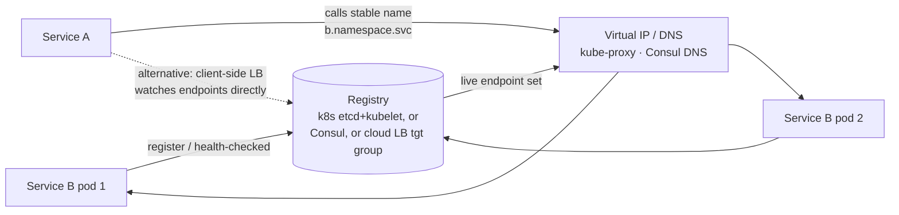

# 2026-09-02 — Service Discovery

> Hardcoded hostnames die the first time a service scales, moves, or fails over — discovery is the machinery that turns "call the payment service" into an address that's correct *right now*.

## Problem

Service A calls service B at `http://10.2.3.4:8080` (from a config file). Then:

- B autoscales from 3 to 12 instances — A still calls the original 3
- An instance crashes; A keeps sending it traffic until a human edits config
- Deploys move B to new IPs entirely; every consumer needs a coordinated config change
- Multi-environment drift: staging config points at prod B *once*, and it's a very bad day

Static addressing assumes a static world. The moment instances are cattle — autoscaled, rescheduled, replaced — "where is B?" needs a live answer, and the follow-up "which instances of B are *healthy*?" is the part that actually prevents outages.

## Constraints

- **Freshness:** New/dead instances reflected in seconds
- **Health-awareness:** Traffic only to instances passing checks ([2026-06-11](2026-06-11-health-checks-readiness-liveness.md))
- **Resilience:** Discovery itself must not become the SPOF that takes everything down
- **Low friction:** Services shouldn't need SDKs and ceremony just to find each other

## Architecture

Diagram source: [`diagrams/2026-09-02-service-discovery.mmd`](../diagrams/2026-09-02-service-discovery.mmd)

### The two halves: registration and resolution

**Registration** — how the registry learns about instances:

- **Self-registration:** instance announces itself on boot, heartbeats to stay listed (Consul agent, Eureka client). Works anywhere; couples services to the registry SDK
- **Platform registration (the modern default):** the orchestrator already knows every pod's lifecycle — Kubernetes populates `Endpoints`/`EndpointSlice` from pod status + **readiness probes** automatically. Zero app code; registration is a side effect of being scheduled

The readiness-probe link is load-bearing: a pod failing readiness is *removed from discovery* — that's the mechanism behind graceful deploys, brownout protection, and "don't route to the pod still warming its cache."

**Resolution** — how callers use it:

| Pattern | How | Trade |
|---------|-----|-------|
| **DNS name** (`b.ns.svc.cluster.local`) | Caller resolves per-lookup | Universal, zero SDK — but DNS caching/TTL staleness ([2026-08-20](2026-08-20-database-failover.md) showed the JVM version of this bite) |
| **Virtual IP** (k8s Service/kube-proxy) | Stable VIP, kernel-level spread to live endpoints | The k8s default; connection-level, not request-level balancing |
| **Client-side LB** | Caller watches endpoint set, picks per request (gRPC resolvers) | Best balancing for long-lived HTTP/2 ([2026-07-16](2026-07-16-grpc-vs-rest-graphql.md)) — gRPC to a VIP pins to one pod; per-request picking fixes it |
| **Sidecar/mesh** | Proxy handles discovery + LB + retries ([2026-06-24](2026-06-24-service-mesh-sidecar.md)) | All of the above outsourced; mesh operational cost |

### Inside Kubernetes: mostly a solved problem — three sharp edges

For in-cluster traffic, `Service` + readiness probes is the answer and needs no further architecture. The edges that still cut:

1. **Long-lived connections defeat VIP balancing** — gRPC/HTTP2 clients open one connection and keep it; kube-proxy balances *connections*, not requests, so one pod gets everything. Fix: client-side LB (`round_robin` gRPC config + headless Service) or a mesh
2. **DNS staleness during rollouts** — clients caching resolutions past the TTL keep hitting terminated pods; honor TTLs and keep connection max-lifetimes finite
3. **Cross-cluster / cross-environment** is where the built-ins end — that's where Consul (multi-DC by design), cloud service registries, or mesh federation enter

### Outside Kubernetes (VMs, hybrid, multi-runtime)

Consul is the reference: agents on each node run local health checks, the catalog is raft-replicated ([2026-06-28](2026-06-28-leader-election-raft.md)), consumers resolve via Consul DNS or watch the HTTP API. The same role is played by cloud-native equivalents (AWS Cloud Map; or simply ALB/NLB target groups with health checks, which is discovery wearing a load balancer costume — [2026-07-07](2026-07-07-load-balancing-strategies.md)).

### Discovery failure is total failure — design for it

The registry sits on every call path, so its failure modes are everyone's:

- **Stale-on-unavailable beats empty:** a caller that can't reach discovery should keep using its **last known good endpoint set** — serving on slightly-stale addresses beats failing every request because the catalog hiccupped (Envoy and Consul both default this way)
- Registry quorum loss must degrade reads, not stop them
- Cache TTLs are the freshness/resilience dial: seconds-fresh means registry load and sensitivity; minutes-stale means slower failover — pick per service criticality

## Trade-offs

| Choice | Pros | Cons |
|--------|------|------|
| **K8s Services (platform)** | Free, automatic, probe-integrated | In-cluster only; connection-level LB |
| **Consul** | Multi-DC, VM+container, rich health model | A raft cluster to operate |
| **Client-side LB (gRPC)** | Per-request balancing, no extra hops | Per-language resolver logic |
| **Mesh sidecars** | Discovery+LB+retries+mTLS unified | The mesh tax ([2026-06-24](2026-06-24-service-mesh-sidecar.md)) |

## When to use

- ✅ Platform-native discovery (k8s Services + readiness) as the default — add nothing until it falls short
- ✅ Client-side LB or mesh the moment gRPC/HTTP2 traffic skews to one pod
- ✅ Last-known-good caching in every discovery client — the registry will hiccup

- ❌ Don't hardcode instance addresses anywhere an autoscaler can reach
- ❌ Don't let liveness/readiness confusion route traffic to warming or dying pods — the probe *is* the registration
- ❌ Don't build a custom registry — this problem has been solved three different mature ways

## References

- [Kubernetes — Services and EndpointSlices](https://kubernetes.io/docs/concepts/services-networking/service/)
- [Consul — architecture and consensus](https://developer.hashicorp.com/consul/docs/architecture)
- [gRPC — load balancing and name resolution](https://grpc.io/blog/grpc-load-balancing/)

---

**Tags:** `#service-discovery` `#kubernetes` `#consul` `#dns` `#load-balancing` `#microservices`
