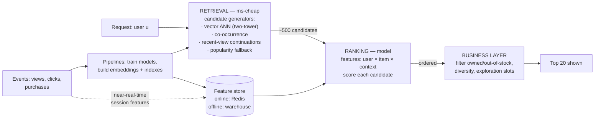

# 2026-09-04 — Recommendation System Architecture

> "You might also like" is not one model — it's a funnel: cheap retrieval narrows millions of items to hundreds, expensive ranking orders the hundreds, and business rules get the final word.

## Problem

The product wants personalized recommendations. The naive attempts each fail structurally:

- **Score every item per user with a model:** a catalog of 10M items × 50ms model inference = the request never returns. Scoring everything is off the table at any scale
- **Precompute "top items" globally:** everyone sees the same bestsellers — popularity is not personalization, and new/niche items never surface
- **Pure "customers also bought" co-occurrence:** works until the user or item is new — the **cold-start problem** — and reinforces whatever was already popular
- The system that finally works in the offline evaluation then can't serve at p99 < 100ms, because nobody designed the *serving* path

The industry-converged shape is a **multi-stage funnel** — because no single model is both cheap enough to scan the catalog and smart enough to rank well.

## Constraints

- **Latency:** End-to-end recommendation response < 100ms at p99
- **Scale:** Catalog of millions; scoring budget of hundreds per request
- **Freshness:** "You just viewed X" reflected within minutes, not tomorrow's batch
- **Control:** Business rules (stock, region, diversity, "don't recommend what they own") applied last, deterministically

## Architecture

Diagram source: [`diagrams/2026-09-04-recommendation-systems.mmd`](../diagrams/2026-09-04-recommendation-systems.mmd)

### Stage 1 — Retrieval: from millions to hundreds

Multiple cheap **candidate generators** run in parallel, each contributing a slice:

- **Embedding retrieval:** a two-tower model learns user and item vectors such that affinity ≈ dot product; serving is then approximate nearest-neighbor search in the item index — exactly the HNSW machinery from [2026-07-28](2026-07-28-vector-search-embeddings.md), reused for personalization
- **Co-occurrence / item-to-item:** "viewers of X also viewed Y," precomputed in batch — dumb, robust, explainable
- **Session continuations:** recent views/cart contents mapped to similar items — the freshness carrier
- **Popularity by segment:** the fallback that always has an answer — which is also the **cold-start answer** for brand-new users (popularity + context like region/device until behavior accumulates) and new items (content-based embeddings from title/image, so they're retrievable before anyone has clicked them)

Union the slices, dedupe → ~500 candidates. Diversity of generators matters more than perfection of any one: each covers another's blind spot.

### Stage 2 — Ranking: the expensive model, on a budget

A learned model (GBDT or neural) scores each candidate with features spanning user (history aggregates), item (CTR, price, age), user×item (embedding similarity, category affinity), and context (time, device, entry surface). Two architectural consequences dominate:

- **The feature store** is why ranking can be fast: features are precomputed — batch pipelines fill the offline store (warehouse) for training and sync the *online* store (Redis-class, single-digit-ms multigets) for serving. The discipline it enforces: **the same feature definition serves training and serving** — most "the model is great offline, useless online" incidents are train/serve skew, i.e. the two paths computing "user's 7-day view count" differently
- **Scoring is batched:** one model call with 500 rows, not 500 calls — this is the N+1 lesson ([2026-07-18](2026-07-18-n-plus-one-queries-dataloader.md)) applied to inference

### Stage 3 — Business layer: rules beat scores

The final reorder is deterministic and product-owned: drop out-of-stock/owned/region-blocked items, enforce diversity (not five near-identical items), inject **exploration** (a slot or two of lower-confidence candidates — the feedback-loop antidote: a system trained only on what it previously showed converges on a filter bubble of its own making), and apply merchandising pins. Keeping this *outside* the model keeps "why did we recommend this" answerable and fixable in an afternoon.

### The loop underneath

Impressions and interactions flow back as events ([2026-07-13](2026-07-13-batch-vs-stream-processing.md) — batch retrains nightly; streams update session features in near-real-time). Model quality ships like code: offline metrics gate candidates, but the real verdict is an A/B test with guardrails ([2026-08-14](2026-08-14-ab-testing-experimentation.md)) — recommender "wins" that tank long-term retention behind a CTR bump are a genre. And *log the features at scoring time*: training tomorrow's model on today's decisions requires knowing what the model actually saw.

### Build honestly small first

A respectable v1 is co-occurrence + popularity + a rules layer — no ML infrastructure, explainable, often within striking distance of the fancy version. Add embedding retrieval when the catalog outgrows co-occurrence coverage; add learned ranking when candidate quality stops being the bottleneck. Each funnel stage is droppable downward.

## Trade-offs

| Choice | Pros | Cons |
|--------|------|------|
| **Multi-stage funnel** | Meets latency at catalog scale; stages evolve independently | Three systems to own |
| **Single heavy model over everything** | Conceptually clean | Can't serve; retrain-everything coupling |
| **Co-occurrence + rules only** | Cheap, explainable, fast to ship | Ceiling on personalization; popularity bias |
| **Feature store** | Kills train/serve skew; feature reuse | Real infrastructure; ownership needed |

## When to use

- ✅ The funnel shape for any "pick K items for this user from many" — recs, search ranking, feed ranking ([2026-08-21](2026-08-21-news-feed-design.md)'s ranking pass is this same funnel)
- ✅ Cold-start answered by content embeddings + segment popularity, not hoped away
- ✅ Feature logging at scoring time and A/B guardrails before believing any offline metric

- ❌ Don't score the catalog per request — retrieval exists because that's impossible
- ❌ Don't compute features two ways for training and serving — skew is the silent model-killer
- ❌ Don't ship a recommender without exploration slots — it will overfit to its own past output

## References

- [YouTube — Deep neural networks for recommendations (the two-stage paper)](https://research.google/pubs/pub45530/)
- [Eugene Yan — System design for recommendations and search](https://eugeneyan.com/writing/system-design-for-discovery/)
- [Feast — feature store concepts](https://docs.feast.dev/getting-started/concepts)

---

**Tags:** `#recommendations` `#machine-learning` `#feature-store` `#embeddings` `#ranking` `#personalization`
